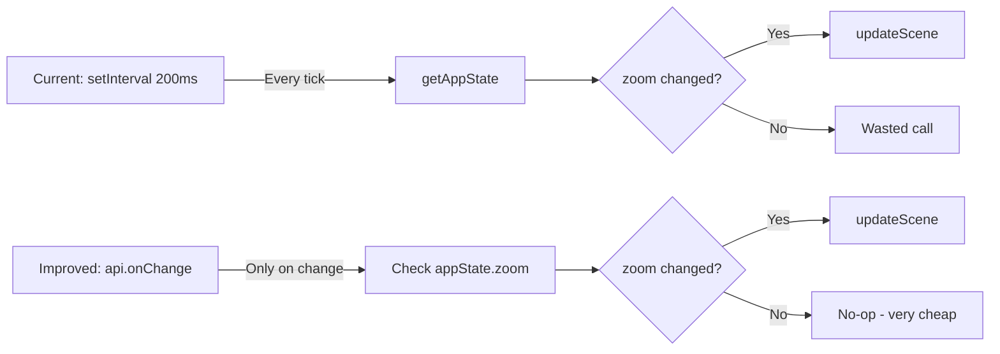
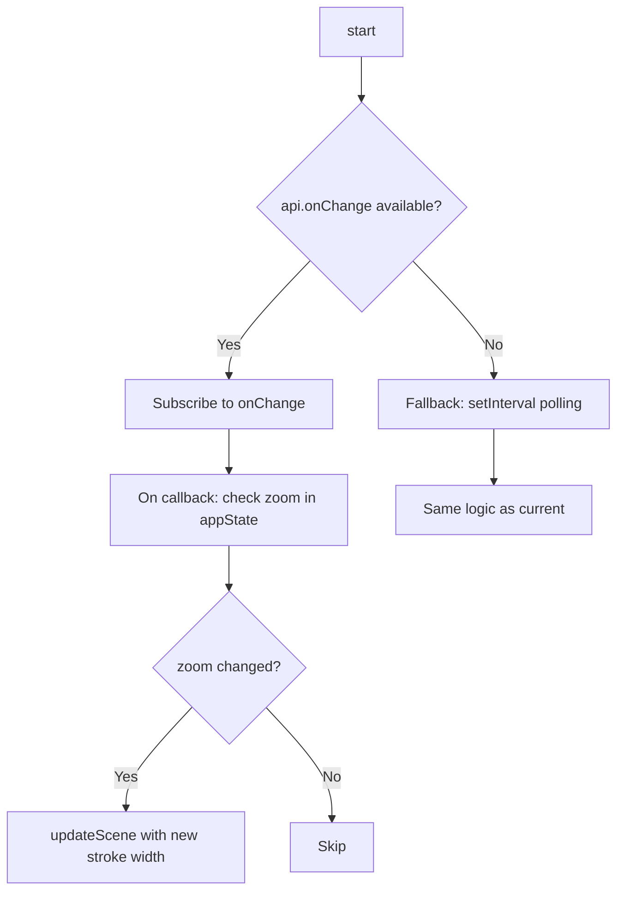

# Analysis & Improvement Plan: Embedded Excalidraw Scripts

## Current Implementation Summary

The plugin embeds two scripts in [`excalidrawScripts.ts`](obsidian-plugin/excalidrawScripts.ts:1):

### Script 1: [`ZoomAdaptiveStroke`](obsidian-plugin/excalidrawScripts.ts:25)
- **Mechanism**: `setInterval` polling at configurable interval (default 200ms)
- **On each tick**: reads `appState.zoom.value`, compares to `lastZoom`, calls `updateScene({ appState: { currentItemStrokeWidth: base / zoom } })` if changed
- **One-time**: disables `currentItemStreamline` and `currentItemSmoothing` via `updateScene`
- **Settings**: `baseStrokeWidth` (0.6), `pollIntervalMs` (200)

### Script 2: [`RightClickEraser`](obsidian-plugin/excalidrawScripts.ts:106)
- **Mechanism**: DOM event listeners (`pointerdown`, `pointermove`, `pointerup`, `pointercancel`, `contextmenu`) in capture phase
- **Logic**: Detects right-click/S Pen button in freedraw mode → switches to eraser → restores on release
- **Dispatches synthetic `pointerdown`** with `button: 0` to start the eraser stroke

### Manager: [`ExcalidrawScriptManager`](obsidian-plugin/excalidrawScripts.ts:277)
- Per-leaf `Map<string, LeafScripts>` tracking
- `activateForLeaf()` / `deactivateForLeaf()` / `deactivateAll()` / `updateSettings()`

### Integration: [`activateScriptsForLeaf()`](obsidian-plugin/main.ts:1067)
- Exponential backoff retry (500ms → 1s → 2s → 4s) for API acquisition
- Container discovery: `.excalidraw-wrapper` → `.excalidraw` → `[class*="excalidraw"]` → `containerEl`

---

## Issues & Improvement Opportunities

### 1. 🔴 Polling is Wasteful — Replace with Event-Driven Zoom Detection

**Problem**: `ZoomAdaptiveStroke` polls `getAppState()` every 200ms via `setInterval`. This means ~5 API calls/second even when the user isn't zooming. With multiple split views, this multiplies.

**Solution**: Use `api.onChange()` (already available and used by [`collabManager.ts`](obsidian-plugin/collabManager.ts:728)) to detect zoom changes event-driven. The `onChange` callback receives `appState` which includes `zoom.value`.



**Implementation**:
- Primary: Subscribe via `api.onChange()` — extract `zoom.value` from the `appState` parameter
- Fallback: Keep `setInterval` polling for older Excalidraw versions where `onChange` is unavailable (same pattern as collab manager)
- The `onChange` callback fires on *any* scene change (elements, appState, files), so the zoom comparison (`currentZoom !== lastZoom`) is still needed to avoid unnecessary `updateScene` calls — but the comparison itself is trivially cheap

**Impact**: Eliminates ~5 wasted `getAppState()` calls/second per leaf. The `onChange` callback is already being dispatched by Excalidraw internally — we're just piggybacking on it.

### 2. 🟡 Smoothing/Streamline Reset Gets Overridden

**Problem**: The script sets `currentItemStreamline: 0` and `currentItemSmoothing: 0` once via a `smoothingApplied` flag. But if the user manually changes these values in Excalidraw's UI, the script won't re-enforce them. Conversely, if the user *wants* smoothing for a specific drawing, there's no way to opt out per-drawing.

**Options**:
- **A) Add a setting toggle** for "Disable smoothing/streamline" separate from the zoom-adaptive stroke width. Some users may want adaptive stroke but still want smoothing.
- **B) Re-enforce on every zoom change** (current behavior only applies once). This ensures consistency but is more opinionated.
- **C) Keep current behavior** (apply once, user can override). Document this clearly.

**Recommendation**: Option A — separate the smoothing toggle from the zoom-adaptive toggle. They serve different purposes.

### 3. 🟡 `updateScene` Called Twice on First Zoom Change

**Problem**: On the first tick where zoom changes, the script calls `updateScene` twice:
1. Once for smoothing/streamline (lines 52-58)
2. Once for stroke width (lines 67-69)

These could be batched into a single `updateScene` call.

**Fix**: Combine both into one call when `!smoothingApplied && currentZoom !== lastZoom`:
```typescript
this.api.updateScene({
  appState: {
    currentItemStrokeWidth: adaptedWidth,
    currentItemStreamline: 0,
    currentItemSmoothing: 0,
  },
});
```

### 4. 🟡 `updateSettings()` Doesn't Handle Re-enabling Scripts

**Problem**: In [`ExcalidrawScriptManager.updateSettings()`](obsidian-plugin/excalidrawScripts.ts:329), if a script was disabled and then re-enabled, the comment says "enabling a previously disabled script requires re-activation via activateForLeaf". This means toggling a script off→on in settings doesn't take effect until the user switches to a different leaf and back.

**Fix**: `updateSettings()` should accept the `api` and `container` parameters (or store them) so it can create new script instances when a previously disabled script is re-enabled.

### 5. 🟢 RightClickEraser: `isFreeDraw()` Called on Every Pointer Event

**Problem**: [`isFreeDraw()`](obsidian-plugin/excalidrawScripts.ts:165) calls `api.getAppState()` and checks `activeTool.type` on every `pointermove` event. While this is fast, it's called very frequently during drawing.

**Optimization**: Cache the active tool state. Subscribe to tool changes via `onChange` (which includes `appState.activeTool`) and maintain a local `isCurrentlyFreeDraw` boolean. The pointer event handlers then just check the cached boolean instead of calling `getAppState()`.

### 6. 🟢 No Interaction Guard with Collab System

**Problem**: During active collab sessions, `updateScene({ appState: { currentItemStrokeWidth } })` is local-only (appState isn't synced). This is correct behavior. However, the `onChange` callback from the collab system and the zoom-adaptive script could theoretically create a feedback loop: collab applies remote scene → triggers `onChange` → zoom-adaptive checks zoom → calls `updateScene` → triggers another `onChange`.

**Current mitigation**: The zoom comparison (`currentZoom !== lastZoom`) prevents unnecessary `updateScene` calls, which breaks the loop. This is sufficient, but worth documenting.

### 7. 🟢 Memory Leak Risk in `ExcalidrawScriptManager`

**Problem**: If a leaf is closed without triggering `deactivateForLeaf()` (e.g., Obsidian crashes, or the leaf change event is missed), the `Map` entry persists with stale references.

**Fix**: Add a periodic cleanup that checks if leaf IDs still exist in the workspace. Or use `WeakRef` for the API reference so it can be garbage collected.

### 8. 🟢 Container Discovery Could Be More Robust

**Problem**: [`activateScriptsForLeaf()`](obsidian-plugin/main.ts:1097) searches for `.excalidraw-wrapper` → `.excalidraw` → `[class*="excalidraw"]`. The collab manager's [`findExcalidrawCanvas()`](obsidian-plugin/collabManager.ts) uses 5 selectors + iframe search. The script activation uses fewer selectors.

**Fix**: Unify container discovery into a shared utility function used by both the script manager and the collab manager.

---

## Proposed Changes

### Phase 1: Event-Driven Zoom Detection (High Impact)

**Files to modify:**
- [`excalidrawScripts.ts`](obsidian-plugin/excalidrawScripts.ts) — Refactor `ZoomAdaptiveStroke` to use `onChange` with polling fallback

**Changes to `ZoomAdaptiveStroke`:**



- Constructor accepts `api: ExcalidrawAPI` (already does)
- `start()` checks `typeof api.onChange === 'function'`
  - If yes: subscribe, store unsubscribe function
  - If no: fall back to current `setInterval` approach
- `stop()` calls unsubscribe or clearInterval as appropriate
- Batch smoothing + stroke width into single `updateScene` call

### Phase 2: Separate Smoothing Toggle (Medium Impact)

**Files to modify:**
- [`settings.ts`](obsidian-plugin/settings.ts) — Add `disableSmoothing: boolean` setting
- [`excalidrawScripts.ts`](obsidian-plugin/excalidrawScripts.ts) — Make smoothing conditional on new setting
- [`ScriptSettings`](obsidian-plugin/excalidrawScripts.ts:10) interface — Add `disableSmoothing` field

### Phase 3: Settings Hot-Reload Fix (Medium Impact)

**Files to modify:**
- [`excalidrawScripts.ts`](obsidian-plugin/excalidrawScripts.ts) — Store `api` and `container` refs in `LeafScripts`, allow `updateSettings()` to create new instances

### Phase 4: RightClickEraser Tool Caching (Low Impact)

**Files to modify:**
- [`excalidrawScripts.ts`](obsidian-plugin/excalidrawScripts.ts) — Add `onChange` subscription to cache `activeTool.type`, replace `isFreeDraw()` API calls with cached check

### Phase 5: Shared Container Discovery Utility (Low Impact)

**Files to modify:**
- New utility function (could live in `excalidrawScripts.ts` or a shared `utils.ts`)
- [`main.ts`](obsidian-plugin/main.ts) — Use shared utility in `activateScriptsForLeaf()`
- [`collabManager.ts`](obsidian-plugin/collabManager.ts) — Use shared utility in `findExcalidrawCanvas()`

---

## Implementation Todo List

- [ ] Refactor `ZoomAdaptiveStroke` to use `api.onChange()` as primary detection, with `setInterval` fallback
- [ ] Batch smoothing + stroke width into single `updateScene` call on first zoom change
- [ ] Add `disableSmoothing` as a separate setting toggle (independent from zoom-adaptive)
- [ ] Fix `updateSettings()` to handle re-enabling previously disabled scripts without requiring leaf switch
- [ ] Cache `activeTool.type` in `RightClickEraser` via `onChange` subscription to avoid `getAppState()` on every pointer event
- [ ] Extract shared container discovery utility from `collabManager.ts` and `main.ts`
- [ ] Add stale leaf cleanup logic to `ExcalidrawScriptManager`

---

## Risk Assessment

| Change | Risk | Mitigation |
|--------|------|------------|
| Event-driven zoom detection | `onChange` fires very frequently — must be cheap | Zoom comparison is O(1), no allocations |
| Smoothing toggle separation | Settings migration for existing users | Default `disableSmoothing: true` matches current behavior |
| Settings hot-reload | Could cause double-start if not guarded | `deactivateForLeaf` before re-creating |
| Tool caching in RightClickEraser | Stale cache if `onChange` subscription fails | Fall back to direct `getAppState()` check |
| Shared container discovery | Refactoring risk across two modules | Keep existing selectors, just unify into one function |
