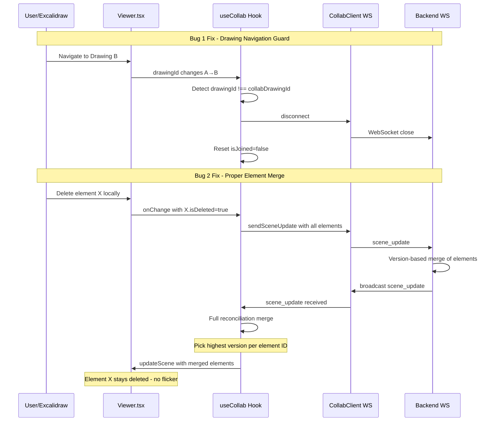

# Live Collab Bugfixes Plan

## Bug Analysis

### Bug 1: Collab session receives data from wrong drawings

**Root Cause:** The [`handleExcalidrawChange`](frontend/src/Viewer.tsx:142) callback fires on *every* Excalidraw `onChange` event and sends scene updates to the collab session whenever `collab.isJoined && collab.isConnected` is true — but it does **not** check whether the current drawing (`id`) is the same drawing the collab session was started for.

```typescript
// Viewer.tsx:142-156
const handleExcalidrawChange = useCallback((elements, appState) => {
  // ...theme update...
  
  // Send scene updates to collab session if joined
  if (collab.isJoined && collab.isConnected) {
    collab.sendSceneUpdate(elements as ExcalidrawElement[])  // ← No drawing ID check!
  }
}, [collab.isJoined, collab.isConnected, collab.sendSceneUpdate])
```

When a user navigates to a different drawing (via arrow keys, present mode, or browser), the `Viewer` component re-renders with a new `id` from `useParams()`. However:

1. The `useCollab` hook receives the new `drawingId` and calls `refreshStatus()` which checks if the *new* drawing has a collab session — it likely doesn't, so `isCollabActive` becomes `false`. But `isJoined` and `isConnected` remain `true` because the WebSocket connection to the *old* session is still alive.
2. The `useCollab` hook does **not** auto-disconnect when `drawingId` changes.
3. The `Excalidraw` component has `key={id}`, so it remounts with the new drawing's data. The `onChange` fires with the new drawing's elements, and since `isJoined` is still `true`, those elements get sent to the old collab session.

**Additionally:** The `useCollab` hook's cleanup effect (line 327-334) only runs on unmount, not on `drawingId` change. There's no effect that watches `drawingId` and disconnects when it changes.

### Bug 2: Element deletion flickering (need to delete twice)

**Root Cause:** The merge logic in the [`scene_update` handler](frontend/src/hooks/useCollab.ts:141) does not handle deleted elements correctly.

```typescript
// useCollab.ts:158-173
const merged = currentElements.map((el) => {
  const incoming = incomingMap.get(el.id);
  if (incoming && incoming.version > el.version) {
    return incoming;
  }
  return el;  // ← Keeps local element even if it was deleted remotely
});

// Add any new elements that don't exist locally
for (const [id, el] of incomingMap) {
  if (!currentElements.find((e) => e.id === id)) {
    merged.push(el);
  }
}
```

The problem is a **race condition between local deletion and the debounced scene update**:

1. User deletes an element locally → Excalidraw removes it from the scene → `onChange` fires with elements *without* the deleted one
2. The `sendSceneUpdate` is **debounced** (100ms in `collabClient.ts:123`). The pending update still contains the old elements.
3. Before the debounced update fires, the server may broadcast a scene update from another client (or even the same client's previous update) that still contains the element.
4. The merge logic in `scene_update` handler iterates `currentElements` — but the deleted element is no longer in `currentElements`, so it's not in the merged array. However, the `incomingMap` loop at line 167 adds it back because it doesn't exist locally anymore!
5. This causes the element to **reappear** (flicker). On the next `onChange`, the element is sent again without the deleted element, and eventually it stabilizes.

**But there's a deeper issue:** Excalidraw marks deleted elements with `isDeleted: true` rather than removing them from the array. The current merge logic doesn't account for this. When a user "deletes" an element:
- Excalidraw sets `isDeleted: true` and increments the `version`
- The local `onChange` fires with the element having `isDeleted: true`
- The debounced `sendSceneUpdate` sends all elements including the one with `isDeleted: true`
- Meanwhile, an incoming `scene_update` from the server may have the element with `isDeleted: false` and a *lower* version
- The merge correctly picks the higher version... BUT the debounce delay means the old state (without `isDeleted`) might arrive from the server *after* the local delete, causing a flicker

The core issue is that the merge only considers elements present in `currentElements` and adds missing ones from incoming. It should use a **full reconciliation** approach that considers all elements from both sides and picks the highest version.

---

## Fix Design

### Fix 1: Drawing-scoped collab session

**Approach:** Track which `drawingId` the collab session was joined for, and auto-disconnect when navigating away.

#### Changes in `useCollab.ts`:

1. **Add a `collabDrawingId` ref** that stores the drawing ID when `joinSession` is called
2. **Add an effect that watches `drawingId`** — if it changes and doesn't match `collabDrawingId`, automatically call `leaveSession()`
3. **Guard `sendSceneUpdate`** — only send if `drawingId === collabDrawingId`

```
Flow:
  User joins collab on drawing A
  → collabDrawingId = A
  
  User navigates to drawing B
  → drawingId changes to B
  → effect detects mismatch → auto-disconnect from session
  → isJoined = false, WebSocket closed
  → onChange for drawing B does NOT send to collab
```

#### Changes in `Viewer.tsx`:

1. **Guard `handleExcalidrawChange`** — add `drawingId` to the dependency check (belt-and-suspenders with the hook fix)

### Fix 2: Proper element merge with deletion support

**Approach:** Replace the naive merge with a full reconciliation that handles `isDeleted` and uses version-based conflict resolution across ALL elements from both sides.

#### Changes in `useCollab.ts` scene_update handler:

Replace the current merge logic with:

```typescript
// Build a map of ALL elements from both local and incoming
const allElements = new Map<string, ExcalidrawElement>();

// Start with current local elements
for (const el of currentElements) {
  allElements.set(el.id, el);
}

// Merge incoming: use incoming if version is higher or equal
for (const el of msg.elements as ExcalidrawElement[]) {
  const existing = allElements.get(el.id);
  if (!existing || el.version >= existing.version) {
    allElements.set(el.id, el);
  }
}

const merged = Array.from(allElements.values());
api.updateScene({ elements: merged });
```

This approach:
- Keeps ALL elements (including `isDeleted: true` ones) — Excalidraw handles filtering internally
- Uses `>=` for version comparison so that incoming updates with the same version (but potentially different `isDeleted` state) are applied
- Handles the case where an element exists locally but not in the incoming update (keeps local)
- Handles the case where an element exists in incoming but not locally (adds it)

#### Changes in `collabClient.ts`:

Consider reducing the debounce or making it smarter — but the merge fix above should be sufficient to prevent flickering even with the debounce.

#### Changes in backend `collab.rs` `update_scene`:

The backend currently does a **full replacement** of `current_elements` on every `scene_update`. This means if Client A sends an update that doesn't include a deleted element, and Client B's update still has it, the server state oscillates. 

**Improvement:** The backend should also do version-based merging of elements rather than full replacement. This ensures the server always has the most up-to-date version of each element.

---

## Implementation Steps

### Step 1: Fix element merge logic in `useCollab.ts`
- Replace the `scene_update` handler merge logic with full reconciliation
- Use version-based conflict resolution across all elements
- Handle `isDeleted` elements properly by keeping them in the array

### Step 2: Fix backend scene merge in `collab.rs`
- Change `update_scene` to merge incoming elements with existing ones using version comparison
- This prevents the server from losing deletion state when different clients send updates

### Step 3: Add drawing-scoped collab protection in `useCollab.ts`
- Add `collabDrawingId` ref to track which drawing the session is for
- Add effect to auto-disconnect when `drawingId` changes away from the collab drawing
- Guard `sendSceneUpdate` to only send when on the correct drawing

### Step 4: Add guard in `Viewer.tsx` handleExcalidrawChange
- Add a secondary check that the current drawing ID matches the collab drawing
- This is a belt-and-suspenders approach alongside the hook fix

### Step 5: Test both fixes
- Test element deletion in collab mode — should not flicker
- Test navigating between drawings while in collab — should auto-disconnect and not leak data

---

## Architecture Diagram


