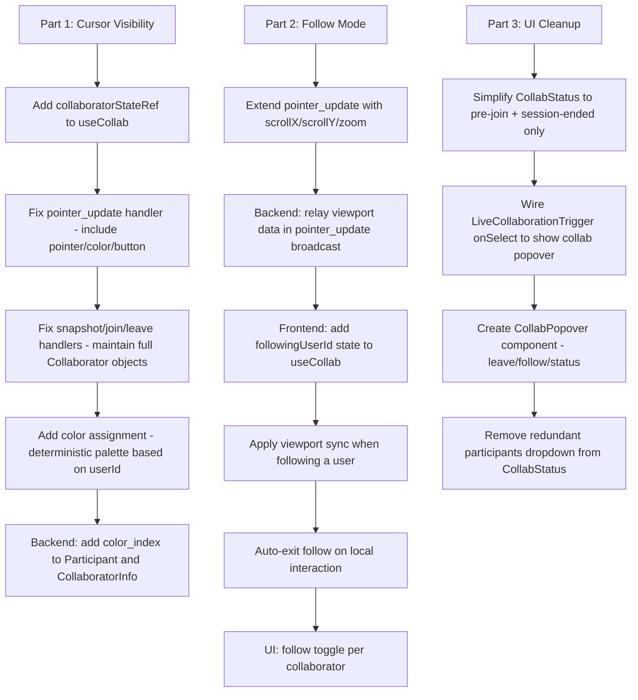

# Live Collab: Cursor Visibility, Follow Mode & UI Improvements

## Problem Statement

Currently, when users join a live collaboration session:
1. **No cursor visibility** — Other users' cursors are not shown on the canvas, even though pointer data is already being sent via WebSocket
2. **No follow mode** — There's no way to follow another user's viewport (see what they see)
3. **Redundant UI** — Our custom `CollabStatus` banner overlaps with Excalidraw's built-in collaboration UI (user badges + "Share" button rendered via `LiveCollaborationTrigger`)

## Analysis of Current State

### What Already Works
- `pointer_update` messages are sent from client → server → other clients via WebSocket
- The `Collaborator` map is passed to `updateScene({ collaborators })` on join/leave events
- `LiveCollaborationTrigger` is rendered in `renderTopRightUI` showing the collab icon
- `isCollaborating={true}` is set, which enables Excalidraw's native collab mode

### What's Missing
The `Collaborator` objects in the map only contain `{ username }`. Excalidraw's `Collaborator` type supports much more:

```typescript
type Collaborator = {
  pointer?: { x: number; y: number; tool: 'pointer' | 'laser' };
  button?: 'up' | 'down';
  selectedElementIds?: Record<string, boolean>;
  username?: string | null;
  userState?: 'active' | 'away' | 'idle';
  color?: { background: string; stroke: string };
  avatarUrl?: string;
  id?: string;
};
```

**Key insight**: Excalidraw **natively renders cursors** when `pointer` data is present in the collaborator map. It also shows colored user badges in the top-right corner. We just need to populate the `Collaborator` objects correctly.

### Current UI Overlap
When joined, two UI elements compete for the top-right area:
1. **Excalidraw's native collab UI** — User avatar badges + "You" indicator (rendered because `isCollaborating={true}` and collaborators map is populated)
2. **Our `CollabStatus` badge** — "Live · N users" with a close button and participants dropdown, positioned `top: 12px; right: 12px`

## Architecture Plan

### Part 1: Fix Cursor Visibility (Main Goal)

The cursor data is already flowing through WebSocket but is **not being passed to Excalidraw's collaborator map**. The fix is straightforward:

#### Changes to `useCollab.ts` — pointer_update handler

**Current** (broken):
```typescript
client.on('pointer_update', (msg) => {
  // Only updates the collaborator map with { username } — no pointer data!
  collabMap.set(msg.userId, { username: msg.name });
  api.updateScene({ collaborators: collabMap });
});
```

**Fixed**: Build a proper `Collaborator` object with `pointer`, `button`, `username`, and `color`:

```typescript
client.on('pointer_update', (msg) => {
  // Update the full collaborator state including pointer position
  collaboratorStateRef.current.set(msg.userId, {
    ...collaboratorStateRef.current.get(msg.userId),
    pointer: { x: msg.x, y: msg.y, tool: 'pointer' },
    button: msg.button as 'up' | 'down',
    username: msg.name,
    color: getCollaboratorColor(msg.userId),
    userState: 'active',
    id: msg.userId,
  });
  api.updateScene({ collaborators: collaboratorStateRef.current });
});
```

#### Collaborator State Management

Instead of rebuilding the collaborator map from scratch on every event, maintain a persistent `Map<string, Collaborator>` ref that accumulates state:

- **`collaboratorStateRef`** — A `useRef<Map<string, Collaborator>>` that persists across renders
- On `pointer_update`: Update the specific user's pointer/button/userState
- On `user_joined`: Add new user with username + color
- On `user_left`: Remove user from map
- On `snapshot`: Initialize map from collaborator list

#### Color Assignment

Assign deterministic colors to each user based on their user ID. Use a predefined palette (same as excalidraw.com uses):

```typescript
const COLLAB_COLORS = [
  { background: '#FF6B6B33', stroke: '#FF6B6B' },  // Red
  { background: '#4ECDC433', stroke: '#4ECDC4' },  // Teal
  { background: '#45B7D133', stroke: '#45B7D1' },  // Blue
  { background: '#96CEB433', stroke: '#96CEB4' },  // Green
  { background: '#FFEAA733', stroke: '#FFEAA7' },  // Yellow
  { background: '#DDA0DD33', stroke: '#DDA0DD' },  // Plum
  { background: '#98D8C833', stroke: '#98D8C8' },  // Mint
  { background: '#F7DC6F33', stroke: '#F7DC6F' },  // Gold
];

function getCollaboratorColor(userId: string) {
  const hash = userId.split('').reduce((a, c) => a + c.charCodeAt(0), 0);
  return COLLAB_COLORS[hash % COLLAB_COLORS.length];
}
```

#### Backend Changes — Add `color` to Participant

To ensure color consistency across all clients, assign colors server-side:

- Add `color_index: u8` to `Participant` struct
- Assign `color_index` based on join order (0, 1, 2, ...)
- Include `color_index` in `CollaboratorInfo` sent to clients
- Include `color_index` in `pointer_update` broadcast

This way all clients see the same color for the same user.

### Part 2: Follow Mode (View Tracking)

When a user clicks on another collaborator's avatar/name, their viewport should follow that user's movements.

#### Approach: Viewport Sync via `pointer_update`

1. **Add `scrollX`, `scrollY`, `zoom` to pointer_update messages** — The followed user's viewport state
2. **Follow state in `useCollab`** — `followingUserId: string | null`
3. **When following**: On each `pointer_update` from the followed user, call `excalidrawAPI.updateScene({ appState: { scrollX, scrollY, zoom } })` to sync the viewport
4. **Exit follow mode**: On any local pointer/scroll interaction, or by clicking the followed user again

#### WebSocket Protocol Changes

**Client → Server** (extend `pointer_update`):
```typescript
{ type: 'pointer_update', x, y, button, scrollX, scrollY, zoom }
```

**Server → Client** (extend `pointer_update` broadcast):
```json
{ "type": "pointer_update", "x": 100, "y": 200, "button": "up",
  "userId": "abc", "name": "Alice",
  "scrollX": -500, "scrollY": -300, "zoom": 1.2 }
```

#### Frontend Follow Mode Implementation

```typescript
// In useCollab hook
const [followingUserId, setFollowingUserId] = useState<string | null>(null);

// In pointer_update handler:
if (followingUserId === msg.userId && msg.scrollX !== undefined) {
  api.updateScene({
    appState: {
      scrollX: msg.scrollX,
      scrollY: msg.scrollY,
      zoom: { value: msg.zoom },
    },
  });
}
```

#### Follow Mode UI

- Clicking a collaborator avatar in Excalidraw's native badge bar → toggle follow mode
- Visual indicator: colored border around the canvas or a small "Following Alice" toast
- Auto-exit on local interaction (scroll, pan, zoom)

### Part 3: UI Improvements — Remove Redundant Banner

#### Analysis: What Excalidraw Provides Natively

When `isCollaborating={true}` and the collaborators map is populated:
- **User avatars/badges** appear in the top-right area (colored circles with initials)
- **"You" indicator** shows the current user
- **Clicking a user badge** could trigger follow mode (we wire this up)
- **`LiveCollaborationTrigger`** shows the collab icon with participant count

#### What Our Custom `CollabStatus` Currently Does

| Feature | CollabStatus | Excalidraw Native | Action |
|---------|-------------|-------------------|--------|
| Show "Live" indicator | ✅ Green dot + "Live · N users" | ❌ No "Live" text | Keep minimal indicator |
| Show participant list | ✅ Dropdown on click | ✅ Avatar badges | Use native badges |
| Join button | ✅ "Join" button | ❌ | Keep — needed before joining |
| Leave button | ✅ "✕" close button | ❌ | Keep — needed to exit |
| Join dialog with name input | ✅ Modal dialog | ❌ | Keep — needed for name entry |
| Session ended notification | ✅ Modal dialog | ❌ | Keep — needed for session end |

#### Proposed UI Changes

1. **Before joining** (not yet in session): Keep the current `CollabStatus` badge with "Live Session · N users" and "Join" button — Excalidraw has no native UI for this
2. **Join dialog**: Keep the name input modal — this is custom functionality
3. **After joining**: **Remove** the "Live · N users" badge and participants dropdown. Instead:
   - Excalidraw's native user badges handle participant display
   - Add a small "Leave" button integrated into the `LiveCollaborationTrigger` area or as a minimal floating button
   - The `LiveCollaborationTrigger` `onSelect` callback opens a small popover with: Leave button, Follow mode toggles, connection status
4. **Session ended**: Keep the modal notification

#### Revised `CollabStatus` Component

Simplify to only handle:
- Pre-join state (join banner + join dialog)
- Session ended notification

The in-session UI moves to the `LiveCollaborationTrigger` `onSelect` handler in `Viewer.tsx`.

#### `LiveCollaborationTrigger` onSelect Popover

When the user clicks the collab trigger button, show a popover with:
- Connection status (green dot)
- "Leave Session" button
- List of participants with "Follow" toggle per user
- Current user's display name

## Implementation Flow



## Detailed File Changes

### Backend Changes

#### `backend/src/collab.rs`
- Add `color_index: u8` to `Participant` struct
- Add `color_index: u8` to `CollaboratorInfo` struct
- Assign `color_index` on join (based on next available index)
- Extend `PointerUpdate` server message with optional `scroll_x`, `scroll_y`, `zoom` fields
- Extend `PointerUpdate` client message with optional `scroll_x`, `scroll_y`, `zoom` fields

#### `backend/src/ws.rs`
- Pass through the new viewport fields in `handle_client_message` for `PointerUpdate`

### Frontend Changes

#### `frontend/src/types/index.ts`
- Extend `ClientMessage` pointer_update with `scrollX?`, `scrollY?`, `zoom?`
- Extend `ServerMessage` pointer_update with `scrollX?`, `scrollY?`, `zoom?`, `colorIndex?`
- Add `colorIndex` to `CollaboratorInfo`

#### `frontend/src/utils/collabClient.ts`
- Extend `sendPointerUpdate` to accept and send viewport data
- Add viewport fields to the pointer_update message

#### `frontend/src/hooks/useCollab.ts`
- Add `collaboratorStateRef` — persistent `Map<string, Collaborator>` for Excalidraw
- Add `COLLAB_COLORS` palette and `getCollaboratorColor` helper
- Fix `pointer_update` handler to populate full `Collaborator` object with pointer position
- Fix `snapshot`, `user_joined`, `user_left` handlers to maintain collaborator state properly
- Add `followingUserId` state and `setFollowingUser` / `clearFollowingUser` methods
- Apply viewport sync in `pointer_update` handler when following
- Extend `sendPointerUpdate` to include viewport data from `excalidrawAPI.getAppState()`
- Export new follow-related state and methods

#### `frontend/src/CollabStatus.tsx`
- Remove the "joined" state UI (badge with participants dropdown)
- Keep: pre-join banner, join dialog, session ended notification
- Simplify component significantly

#### `frontend/src/Viewer.tsx`
- Update `LiveCollaborationTrigger` `onSelect` to open a collab popover
- Create inline collab popover with: leave button, follow toggles, connection status
- Pass `handlePointerUpdate` to include viewport data (scrollX, scrollY, zoom)
- Wire follow mode: auto-exit on local scroll/pointer interaction

#### `frontend/src/CollabPopover.tsx` (new file)
- Small popover component shown when clicking the collab trigger
- Shows: connection status, participant list with follow toggles, leave button
- Each participant row: colored dot + name + "Follow" button
- Following state: highlighted row, "Following..." indicator

## Edge Cases & Considerations

1. **Follow mode + local edits**: When following, the user can still draw/edit. Only viewport position is synced. If the user scrolls/pans manually, follow mode exits.
2. **Followed user disconnects**: Auto-exit follow mode, show brief toast notification.
3. **Color consistency**: Colors are assigned by `color_index` from the server, ensuring all clients see the same colors for the same users.
4. **Performance**: Pointer updates are already throttled at 50ms. Viewport sync uses the same channel — no additional messages needed.
5. **Mobile**: The collab popover should be responsive. On mobile, it could be a bottom sheet instead of a dropdown.
6. **Idle detection**: Set `userState: 'idle'` after 60s of no pointer movement, `'away'` after 5min. Excalidraw dims idle user cursors automatically.
