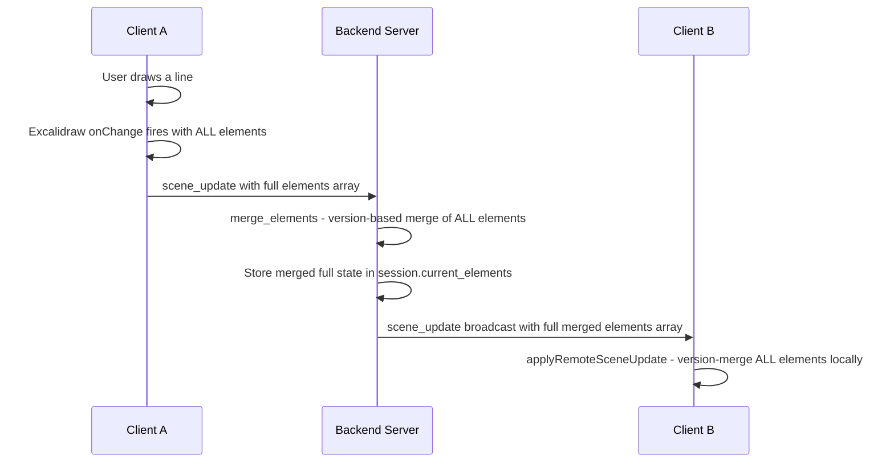
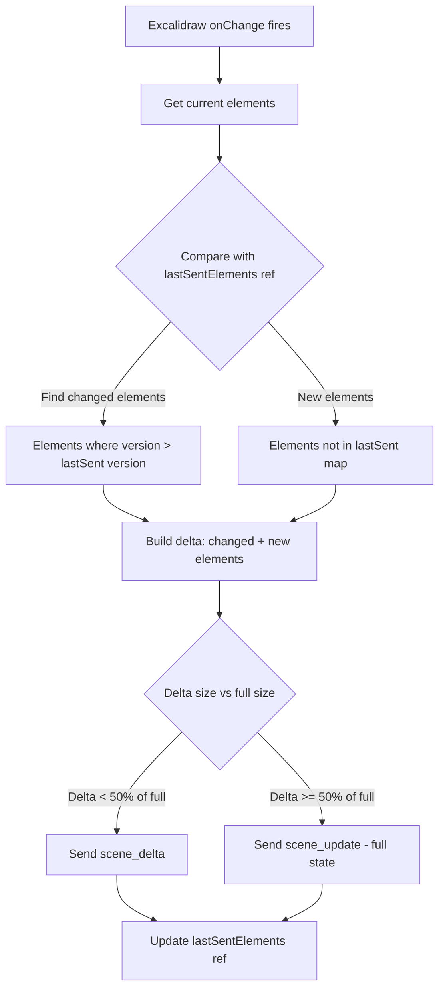
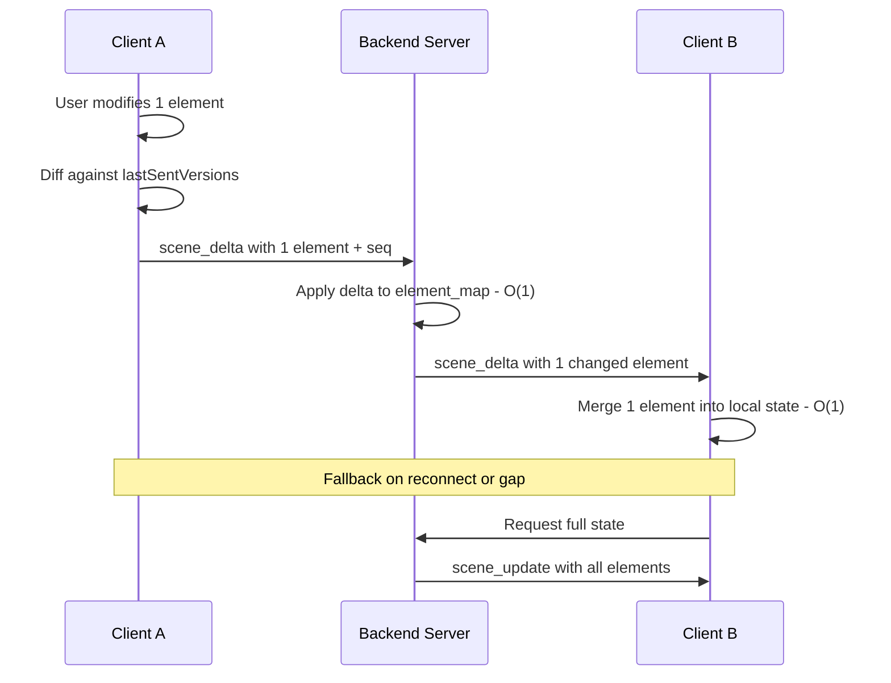

# Collab Performance Analysis: Delta Updates

## Current Architecture — Full-State Sync

The current collaboration system uses a **full-state broadcast** model. Every time any element changes, the **entire elements array** is sent over the wire.

### Data Flow (Current)



### Where the Bottlenecks Are

#### 1. **Frontend → Backend: Full elements array on every change** (`collabClient.ts:114-131`)

[`sendSceneUpdate()`](frontend/src/utils/collabClient.ts:114) receives the **entire** `elements[]` array from Excalidraw's `onChange` callback and sends it as JSON over WebSocket. For a drawing with 500 elements, this means serializing and transmitting ~100-500 KB of JSON **every 100ms** (the debounce interval at [`SCENE_UPDATE_DEBOUNCE_MS = 100`](frontend/src/utils/collabClient.ts:7)).

- **Problem**: Even if only 1 element changed, all 500 are serialized and sent.
- **Impact**: High bandwidth usage, WebSocket backpressure, increased latency.

#### 2. **Backend: Full merge on every update** (`collab.rs:395-418`)

[`update_scene()`](backend/src/collab.rs:395) receives the full elements array, then calls [`merge_elements()`](backend/src/collab.rs:423) which:
- Builds a `HashMap` of **all** current elements by ID
- Iterates over **all** incoming elements for version comparison
- Reconstructs the **full** merged array
- Clones the merged result into `session.current_elements`
- Broadcasts the **full** merged state

This is O(n) on every update where n = total elements, and holds a **write lock** on the sessions `RwLock` for the entire duration.

#### 3. **Backend → Clients: Full state broadcast** (`collab.rs:411-415`)

The [`ServerMessage::SceneUpdate`](backend/src/collab.rs:48-51) broadcasts the **entire merged elements array** to all participants. With 5 participants and 500 elements, that's ~2.5 MB of JSON per single-element change.

#### 4. **Client-side merge on receive** (`useCollab.ts:232-258`)

[`applyRemoteSceneUpdate()`](frontend/src/hooks/useCollab.ts:232) iterates over **all** local elements and **all** remote elements to merge them. This triggers Excalidraw's `updateScene()` with the full array, causing a re-render.

### Quantified Impact

| Scenario | Elements | Payload Size (est.) | Per-second bandwidth (5 users, 100ms debounce) |
|----------|----------|--------------------|-------------------------------------------------|
| Small drawing | 50 | ~10 KB | ~500 KB/s per client |
| Medium drawing | 200 | ~50 KB | ~2.5 MB/s per client |
| Large drawing | 1000 | ~250 KB | ~12.5 MB/s per client |
| Complex with files | 500 + images | ~500 KB+ | ~25 MB/s per client |

> Note: The `files` object (embedded images) is NOT sent in scene_update — only in the initial snapshot. This is good. But elements alone can be very large with complex paths.

---

## Proposed Solution: Delta Updates

### Core Idea

Instead of sending the full elements array, send only the **elements that changed** since the last sync. The backend maintains the authoritative full state and applies deltas incrementally.

### New Message Types

```typescript
// Client -> Server: only changed elements
type ClientMessage =
  | { type: 'scene_delta'; elements: ExcalidrawElement[] }  // only changed/new elements
  | { type: 'scene_update'; elements: ExcalidrawElement[] } // full state (fallback/initial)
  | ...existing types...

// Server -> Client: only changed elements
type ServerMessage =
  | { type: 'scene_delta'; elements: ExcalidrawElement[]; from: string }  // only changed
  | { type: 'scene_update'; elements: ExcalidrawElement[]; from: string } // full state (fallback)
  | ...existing types...
```

### Delta Detection Strategy (Frontend)



### Implementation Plan

#### Step 1: Frontend — Track element versions for delta computation

In [`collabClient.ts`](frontend/src/utils/collabClient.ts), add a `Map<string, number>` tracking the last-sent version of each element. On each [`sendSceneUpdate()`](frontend/src/utils/collabClient.ts:114) call:

1. Compare each element's `version` against the stored version
2. Collect only elements where `version` has increased or element is new
3. Send `scene_delta` with only the changed elements
4. Fall back to `scene_update` (full state) if delta is too large (>50% of elements) or on reconnect

#### Step 2: Backend — Handle delta messages efficiently

In [`collab.rs`](backend/src/collab.rs):

- Add `ClientMessage::SceneDelta { elements }` variant
- For `scene_delta`: apply only the incoming elements to `current_elements` using the existing version-based merge logic, but skip building a full HashMap — use an indexed lookup instead
- Broadcast `ServerMessage::SceneDelta` with only the changed elements (not the full state)
- Keep `scene_update` as a fallback for full-state sync

#### Step 3: Backend — Optimize merge for deltas

Replace the current O(n) [`merge_elements()`](backend/src/collab.rs:423) with an indexed structure:

```rust
// In CollabSession, replace:
//   current_elements: serde_json::Value
// With:
//   element_map: HashMap<String, serde_json::Value>  // id -> element
//   element_order: Vec<String>                        // insertion order
```

This avoids rebuilding the HashMap on every update. Delta merges become O(k) where k = number of changed elements.

#### Step 4: Frontend — Apply delta updates efficiently

In [`useCollab.ts`](frontend/src/hooks/useCollab.ts), handle `scene_delta`:

- For `scene_delta`: merge only the received elements into the local state (same version-based logic, but only iterate over the delta)
- For `scene_update`: full merge as today (fallback)

#### Step 5: Sequence number for consistency

Add a monotonically increasing sequence number to detect missed deltas:

- Server increments a `seq` counter on each scene change
- Each `scene_delta` includes the `seq` and `base_seq` (the seq the delta was computed against)
- If a client detects a gap in `seq`, it requests a full state resync

### Revised Data Flow



### Expected Improvements

| Metric | Current (Full State) | With Deltas |
|--------|---------------------|-------------|
| Typical payload size | 50-500 KB | 0.5-5 KB |
| Backend merge complexity | O(n) per update | O(k) per delta, k << n |
| Write lock duration | Long - full merge | Short - delta apply |
| Bandwidth per user | 2.5 MB/s | ~50 KB/s |
| Excalidraw re-render scope | Full scene | Incremental |

### Risk Mitigation

| Risk | Mitigation |
|------|-----------|
| Missed deltas causing state divergence | Sequence numbers + automatic full-state resync on gap detection |
| Delta computation overhead on client | Simple version comparison is O(n) but very fast in JS; can be optimized with a dirty-tracking Map |
| Backward compatibility | Keep `scene_update` as fallback; old clients still work |
| Element deletion | Already handled via `isDeleted` flag + version bump in Excalidraw |
| Complex merge conflicts | Server remains authoritative; version-based merge unchanged |

### Additional Optimizations (Future)

1. **Binary encoding**: Replace JSON with MessagePack or CBOR for further size reduction
2. **Compression**: Enable WebSocket per-message deflate (already supported by most browsers)
3. **Batched deltas**: Accumulate multiple small deltas server-side and send as one batch
4. **Element-level subscriptions**: Only send deltas for elements in the client's viewport

---

## Implementation Checklist

- [ ] Add `lastSentVersions` Map to `CollabClient` for delta tracking
- [ ] Implement `sendSceneDelta()` in `CollabClient` with fallback logic
- [ ] Add `ClientMessage::SceneDelta` variant in backend `collab.rs`
- [ ] Refactor `CollabSession.current_elements` to use `HashMap + Vec` instead of `serde_json::Value`
- [ ] Implement delta-aware `update_scene_delta()` in `SessionManager`
- [ ] Add `ServerMessage::SceneDelta` variant and broadcast only changed elements
- [ ] Add sequence numbers to delta messages (both client and server)
- [ ] Handle `scene_delta` in `useCollab.ts` with efficient local merge
- [ ] Implement gap detection and full-state resync request
- [ ] Add `scene_delta` type to `frontend/src/types/index.ts`
- [ ] Update `ws.rs` to handle the new `SceneDelta` client message
- [ ] Test with large drawings (500+ elements) to validate bandwidth reduction
- [ ] Test reconnection scenarios to validate fallback to full state
