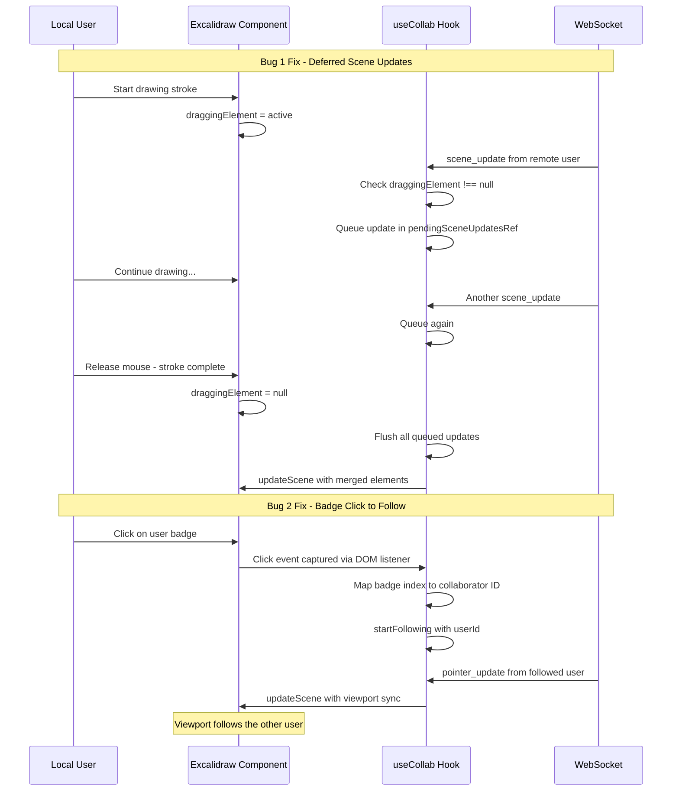

# Live Collab Bugfixes: Drawing Interruption & User Badge Follow Mode

## Bug 1: Drawing Stops After a While During Live Collab

### Symptom
When drawing with the pen tool in a live collab session, the stroke abruptly stops after some time. The user must release and re-press the left mouse button to continue drawing.

### Root Cause Analysis

The issue is in the [`scene_update` handler](frontend/src/hooks/useCollab.ts:247) in `useCollab.ts`. When a remote user sends a scene update, the handler calls:

```typescript
api.updateScene({ elements: merged });
```

This **replaces the entire element array** in Excalidraw while the local user is actively drawing. Excalidraw internally tracks the in-progress stroke via `appState.draggingElement`. When `updateScene` is called with a new elements array, it can:

1. **Reset the internal drawing state** — Excalidraw may interpret the scene replacement as an external change that invalidates the current drag operation
2. **Replace the in-progress element** with a stale version — The merged array may contain an older version of the element currently being drawn, causing Excalidraw to lose track of the active stroke
3. **Trigger a re-render** that interrupts the pointer capture — The React re-render caused by `updateScene` can break the pointer event chain

This happens periodically because scene updates arrive every ~100ms (the debounce interval in [`collabClient.ts:7`](frontend/src/utils/collabClient.ts:7)) from other users, or even from the local user's own updates being echoed back (though the backend filters self-echoes for scene_update, the timing of debounced sends can still cause issues).

### Fix Strategy

**Defer remote scene updates while the user is actively drawing.** Check `appState.draggingElement` before applying incoming scene updates:

1. **Check if user is actively drawing**: Use `excalidrawAPI.getAppState().draggingElement` to detect if a stroke is in progress
2. **Queue updates during active drawing**: If `draggingElement !== null`, buffer the incoming scene update instead of applying it immediately
3. **Apply queued updates when drawing ends**: When `draggingElement` becomes `null` (stroke completed), apply all buffered updates at once
4. **Detection mechanism**: Use the `onPointerUpdate` callback — when `button` transitions from `down` to `up`, flush the queue. Alternatively, poll `draggingElement` on a short interval.

#### Implementation Details

In [`useCollab.ts`](frontend/src/hooks/useCollab.ts):

```typescript
// Add a ref to queue scene updates during active drawing
const pendingSceneUpdatesRef = useRef<ExcalidrawElement[][]>([]);
const isDrawingRef = useRef(false);

// In the scene_update handler:
client.on('scene_update', (msg) => {
  const api = excalidrawAPIRef.current;
  if (!api) return;

  const appState = api.getAppState();
  
  // If user is actively drawing, queue the update
  if (appState.draggingElement || appState.resizingElement) {
    pendingSceneUpdatesRef.current.push(msg.elements);
    return;
  }

  // Otherwise apply immediately
  applySceneUpdate(api, msg.elements);
});
```

In [`Viewer.tsx`](frontend/src/Viewer.tsx:160) — extend `handlePointerUpdate` to flush queued updates when drawing ends:

```typescript
const handlePointerUpdate = useCallback((payload) => {
  // ... existing logic ...
  
  // When button goes up, flush any pending scene updates
  if (payload.button === 'up') {
    collab.flushPendingSceneUpdates();
  }
}, [...]);
```

Additionally, add a **safety interval** that checks periodically (e.g., every 500ms) if `draggingElement` is null and flushes the queue, in case the `up` event is missed.

---

## Bug 2: User Badges Should Activate Follow Mode on Click

### Symptom
The colored user badges rendered by Excalidraw in the top-right corner (when `isCollaborating={true}`) do not activate follow mode when clicked. The user expects clicking a badge to start following that user's viewport.

### Root Cause Analysis

Excalidraw v0.17.6's `Collaborator` type does **not** include any follow-mode API or click callback:

```typescript
// From @excalidraw/excalidraw/types/types.d.ts
type Collaborator = {
  pointer?: CollaboratorPointer;
  button?: 'up' | 'down';
  selectedElementIds?: Record<string, boolean>;
  username?: string | null;
  userState?: UserIdleState;
  color?: { background: string; stroke: string };
  avatarUrl?: string;
  id?: string;
};
```

The native user badges are rendered internally by Excalidraw and there is **no prop or callback** to intercept clicks on them. The follow mode on excalidraw.com is implemented in their own application layer, not in the library.

### Fix Strategy

Since we cannot intercept clicks on Excalidraw's native user badges, we need to **overlay our own clickable user badges** on top of or instead of the native ones. Two approaches:

#### Approach A: CSS Overlay on Native Badges (Recommended)

Detect the native badge DOM elements and overlay invisible click targets on top of them. This preserves the native look while adding click functionality.

1. **Find the native badge container**: Excalidraw renders collaborator avatars in a container with a known CSS class. Use a `MutationObserver` or `useEffect` with DOM queries to find these elements.
2. **Attach click handlers**: For each badge, add a click event listener that maps the badge to a collaborator ID and calls `startFollowing(userId)`.
3. **Visual feedback**: When following, add a highlight ring around the followed user's badge via CSS.

#### Approach B: Custom Badge Rendering (Alternative)

Replace the native badges entirely with our own custom-rendered badges that support click-to-follow. This gives full control but requires reimplementing the badge UI.

1. **Hide native badges**: Use CSS to hide Excalidraw's built-in collaborator avatars
2. **Render custom badges**: Create a `CollabBadges` component positioned in the same area
3. **Wire click handlers**: Each badge click toggles follow mode for that user

#### Chosen Approach: A (CSS Overlay)

Approach A is preferred because:
- It preserves Excalidraw's native badge styling and animations
- Less code to maintain
- Automatically adapts if Excalidraw updates the badge design

#### Implementation Details

In [`Viewer.tsx`](frontend/src/Viewer.tsx), add a `useEffect` that observes the Excalidraw DOM for collaborator badge elements:

```typescript
// After Excalidraw renders, find the collaborator badge container
useEffect(() => {
  if (!collab.isJoined) return;
  
  const container = document.querySelector('.excalidraw');
  if (!container) return;

  const handleBadgeClick = (e: Event) => {
    // Find the clicked badge element
    const badge = (e.target as HTMLElement).closest('[data-testid*="avatar"]') 
      || (e.target as HTMLElement).closest('.UserList__collaborator');
    if (!badge) return;
    
    // Map badge to collaborator ID
    // The badges are rendered in the same order as the collaborators map
    const badges = container.querySelectorAll('.UserList__collaborator');
    const index = Array.from(badges).indexOf(badge as Element);
    
    // Get the collaborator at this index
    const collabEntries = Array.from(collaboratorMapRef.current.entries());
    if (index >= 0 && index < collabEntries.length) {
      const [userId] = collabEntries[index];
      if (collab.followingUserId === userId) {
        collab.stopFollowing();
      } else {
        collab.startFollowing(userId);
      }
    }
  };

  container.addEventListener('click', handleBadgeClick);
  return () => container.removeEventListener('click', handleBadgeClick);
}, [collab.isJoined, collab.followingUserId]);
```

**Note**: The exact CSS class names for the badge elements need to be verified by inspecting the rendered DOM. Common class names in Excalidraw include `.UserList`, `.UserList__collaborator`, or elements with `data-testid` attributes.

Additionally, add a **visual follow indicator** — when following a user, add a CSS class or style to highlight their badge:

```typescript
// Add a style tag that highlights the followed user's badge
useEffect(() => {
  if (!collab.followingUserId) return;
  
  // Find the badge for the followed user and add a highlight
  const style = document.createElement('style');
  style.textContent = `
    .UserList__collaborator:nth-child(${followedIndex + 1}) {
      outline: 2px solid #4CAF50;
      outline-offset: 2px;
      border-radius: 50%;
    }
  `;
  document.head.appendChild(style);
  return () => style.remove();
}, [collab.followingUserId]);
```

---

## Implementation Steps

### Step 1: Fix drawing interruption — Queue scene updates during active drawing
- Add `pendingSceneUpdatesRef` to [`useCollab.ts`](frontend/src/hooks/useCollab.ts)
- Modify `scene_update` handler to check `draggingElement`/`resizingElement` before applying
- Add `flushPendingSceneUpdates` method to the hook's return value
- Add safety interval to flush queue when drawing state clears

### Step 2: Flush queued updates on pointer up
- Modify [`handlePointerUpdate`](frontend/src/Viewer.tsx:160) in `Viewer.tsx` to call `flushPendingSceneUpdates` on `button === 'up'`
- Ensure the flush applies all queued updates merged together (not one by one)

### Step 3: Inspect Excalidraw DOM for badge class names
- Launch the app in a browser with collab active
- Inspect the rendered DOM to find the exact CSS selectors for collaborator badges
- Document the selectors for use in the click handler

### Step 4: Add click-to-follow on user badges
- Add a `useEffect` in `Viewer.tsx` that attaches click handlers to Excalidraw's native badge elements
- Map badge clicks to collaborator IDs using the collaborator map order
- Toggle follow mode on click

### Step 5: Add visual follow indicator on badges
- When following a user, add a CSS highlight to their badge element
- Remove highlight when follow mode is stopped

### Step 6: Test both fixes
- Test drawing with pen tool during active collab — stroke should not be interrupted
- Test clicking user badges — should toggle follow mode
- Test follow mode visual indicator on badges

---

## Architecture Diagram



## Files to Modify

| File | Changes |
|------|---------|
| [`frontend/src/hooks/useCollab.ts`](frontend/src/hooks/useCollab.ts) | Add pending scene update queue, check draggingElement, add flushPendingSceneUpdates method |
| [`frontend/src/Viewer.tsx`](frontend/src/Viewer.tsx) | Call flushPendingSceneUpdates on pointer up, add badge click handler useEffect, add follow indicator CSS |
| [`frontend/src/utils/collabClient.ts`](frontend/src/utils/collabClient.ts) | No changes needed |
| [`backend/src/ws.rs`](backend/src/ws.rs) | No changes needed |
| [`backend/src/collab.rs`](backend/src/collab.rs) | No changes needed |
