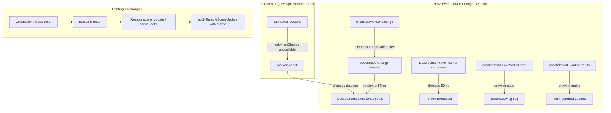
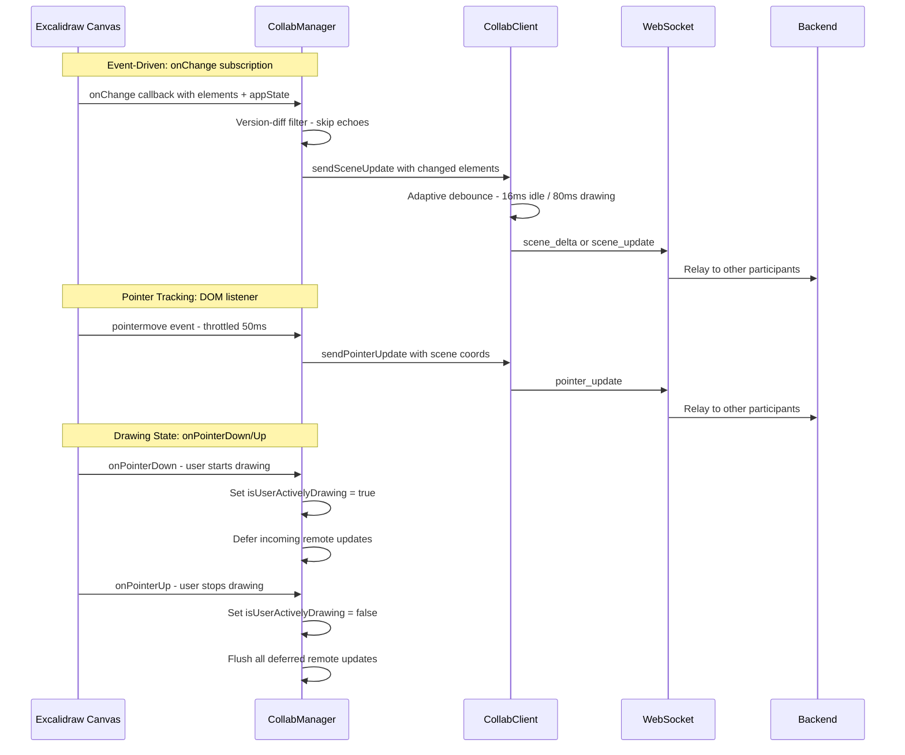

# Event-Driven Collab Optimization — Replacing Polling with Native Excalidraw API Hooks

## 1. Problem Analysis

### Current Architecture (Inefficient)

The Obsidian plugin's live collaboration uses **polling-based change detection** in [`collabManager.ts`](obsidian-plugin/collabManager.ts:496):

```
Every 250ms (configurable):
  1. Call getSceneElements() → get ALL elements
  2. Compare every element.version to lastKnownVersions map
  3. If changes found → send via WebSocket
```

**Problems with this approach:**

| Issue | Impact |
|-------|--------|
| **Wasted CPU cycles** | 4 polls/sec even when nothing changes — iterates ALL elements each time |
| **Latency** | Up to 250ms delay before a local change is detected and sent |
| **No pointer tracking** | Host cursor is invisible to other participants |
| **Expensive API access** | Each poll calls `ea.setView('active')` + `getSceneElements()` |
| **Echo suppression is fragile** | Uses `isApplyingRemoteUpdate` flag + 100ms cooldown timer to avoid echoing remote changes back |
| **No appState tracking** | Theme changes, viewport changes, etc. are not detected |
| **Memory overhead** | Maintains a full `lastKnownVersions` Map of all element IDs |

### How the Frontend Does It (Efficient)

The frontend [`Viewer.tsx`](frontend/src/Viewer.tsx:883) uses Excalidraw's **native event callbacks**:

```tsx
<Excalidraw
  onChange={handleExcalidrawChange}        // ← fires on EVERY scene change
  onPointerUpdate={handlePointerUpdate}    // ← fires on EVERY pointer move
/>
```

This is **zero-latency, zero-waste** — the callback fires only when something actually changes, and it receives the changed data directly.

## 2. Key Discovery: Excalidraw Imperative API Has Event Subscriptions

The Excalidraw `excalidrawAPI` ref (obtained via `ea.getExcalidrawAPI()` in Obsidian) exposes **imperative event subscription methods**:

| Method | Signature | Returns |
|--------|-----------|---------|
| `onChange` | `(callback: (elements, appState, files) => void) => () => void` | Unsubscribe function |
| `onPointerDown` | `(callback: (activeTool, pointerDownState, event) => void) => () => void` | Unsubscribe function |
| `onPointerUp` | `(callback: (activeTool, pointerDownState, event) => void) => () => void` | Unsubscribe function |

**This means we can subscribe to scene changes from the imperative API without needing to pass React props!**

The original plan in [`plans/obsidian-native-collab.md`](plans/obsidian-native-collab.md:35) stated:
> *"The Excalidraw Obsidian plugin does not expose the React onChange prop to external plugins."*

This was correct about the **React prop**, but missed that the **imperative API** (`excalidrawAPI.onChange()`) provides the same functionality as a subscribable event. This is the key insight that changes everything.

## 3. Proposed Architecture: Event-Driven with Adaptive Fallback



### 3.1 Strategy Overview

| Concern | Current | Proposed |
|---------|---------|----------|
| **Scene change detection** | Poll every 250ms | `excalidrawAPI.onChange()` subscription — instant, zero-waste |
| **Pointer tracking** | Not supported | DOM `pointermove` listener on Excalidraw canvas element, throttled to 50ms |
| **Drawing state detection** | Poll `getAppState()` every 250ms | `onPointerDown` / `onPointerUp` subscriptions |
| **Echo suppression** | Flag + 100ms cooldown timer | Version-based: compare incoming element versions, skip if already known |
| **Fallback** | N/A | Lightweight 2s heartbeat poll if `onChange` is unavailable |
| **Debouncing outgoing updates** | 100ms in CollabClient | Smart debounce: 50ms during active drawing, 16ms for single-element changes |

## 4. Detailed Design

### 4.1 Event-Driven Change Detection

Replace [`startChangeDetection()`](obsidian-plugin/collabManager.ts:496) and [`detectAndSendChanges()`](obsidian-plugin/collabManager.ts:513) with:

```typescript
// NEW: Event-driven change detection
private onChangeUnsubscribe: (() => void) | null = null;
private onPointerDownUnsubscribe: (() => void) | null = null;
private onPointerUpUnsubscribe: (() => void) | null = null;
private pointerMoveCleanup: (() => void) | null = null;

private startChangeDetection(): void {
  const api = this.getAPI();
  if (!api) return;

  // Strategy 1: Use excalidrawAPI.onChange() if available (preferred)
  if (typeof (api as any).onChange === 'function') {
    this.startEventDrivenDetection(api);
  } else {
    // Strategy 2: Fallback to polling (but at reduced frequency)
    this.startPollingDetection();
  }
}

private startEventDrivenDetection(api: ExcalidrawAPI): void {
  console.log('ExcaliShare Collab: Using event-driven change detection (onChange API)');

  // Subscribe to scene changes
  this.onChangeUnsubscribe = (api as any).onChange(
    (elements: ExcalidrawElement[], appState: Record<string, unknown>, files: Record<string, unknown>) => {
      this.handleLocalSceneChange(elements, appState);
    }
  );

  // Subscribe to pointer down (track drawing state)
  if (typeof (api as any).onPointerDown === 'function') {
    this.onPointerDownUnsubscribe = (api as any).onPointerDown(
      (activeTool: unknown, pointerDownState: unknown, event: PointerEvent) => {
        this.isUserActivelyDrawing = true;
      }
    );
  }

  // Subscribe to pointer up (flush deferred updates)
  if (typeof (api as any).onPointerUp === 'function') {
    this.onPointerUpUnsubscribe = (api as any).onPointerUp(
      (activeTool: unknown, pointerDownState: unknown, event: PointerEvent) => {
        this.isUserActivelyDrawing = false;
        // Flush any deferred remote updates now that drawing ended
        this.flushPendingRemoteUpdates();
      }
    );
  }

  // Set up pointer tracking via DOM listener
  this.startPointerTracking();
}
```

### 4.2 Smart Change Handler with Version Diffing

The `onChange` callback fires on EVERY change (including remote updates we applied). We need efficient echo suppression:

```typescript
private handleLocalSceneChange(
  elements: ExcalidrawElement[],
  appState: Record<string, unknown>
): void {
  // Skip if we're in the middle of applying a remote update
  if (this.isApplyingRemoteUpdate) return;
  if (!this.client?.isConnected) return;

  // Fast version-diff: only collect elements whose version exceeds our tracking
  const changedElements: ExcalidrawElement[] = [];
  for (const el of elements) {
    if (!el.id) continue;
    const lastVersion = this.lastKnownVersions.get(el.id) ?? -1;
    if (el.version > lastVersion) {
      changedElements.push(el);
      this.lastKnownVersions.set(el.id, el.version);
    }
  }

  if (changedElements.length === 0) return;

  // Send only changed elements (delta) — the CollabClient handles
  // debouncing and delta vs full-state decisions
  this.client.sendSceneUpdate(elements);
}
```

**Key optimization**: The `onChange` callback already gives us the full elements array. We don't need to call `getSceneElements()` at all — saving an expensive API call per change.

### 4.3 Pointer Tracking via DOM Event Listener

Since `onPointerUpdate` is only available as a React prop (not on the imperative API), we use a DOM-level approach:

```typescript
private startPointerTracking(): void {
  // Find the Excalidraw canvas element in the DOM
  const canvasEl = this.findExcalidrawCanvas();
  if (!canvasEl) {
    console.log('ExcaliShare Collab: Canvas element not found, pointer tracking disabled');
    return;
  }

  let lastSendTime = 0;
  const THROTTLE_MS = 50; // Same as frontend

  const handlePointerMove = (event: PointerEvent) => {
    const now = Date.now();
    if (now - lastSendTime < THROTTLE_MS) return;
    lastSendTime = now;

    if (!this.client?.isConnected) return;

    // Convert screen coordinates to Excalidraw scene coordinates
    const api = this.getAPI();
    if (!api?.getAppState) return;

    const appState = api.getAppState() as {
      scrollX: number;
      scrollY: number;
      zoom: { value: number };
      offsetLeft: number;
      offsetTop: number;
    };

    const zoom = appState.zoom?.value || 1;
    const rect = canvasEl.getBoundingClientRect();
    const sceneX = (event.clientX - rect.left) / zoom - appState.scrollX;
    const sceneY = (event.clientY - rect.top) / zoom - appState.scrollY;

    const button = event.buttons > 0 ? 'down' : 'up';

    this.client.sendPointerUpdate(sceneX, sceneY, button, 'pointer',
      appState.scrollX, appState.scrollY, zoom);
  };

  canvasEl.addEventListener('pointermove', handlePointerMove, { passive: true });
  this.pointerMoveCleanup = () => {
    canvasEl.removeEventListener('pointermove', handlePointerMove);
  };
}

private findExcalidrawCanvas(): HTMLElement | null {
  // The Excalidraw canvas is rendered inside the active leaf's view
  // Look for the interactive canvas element
  const activeLeaf = (this as any).app?.workspace?.activeLeaf;
  if (!activeLeaf?.view?.containerEl) return null;

  return activeLeaf.view.containerEl.querySelector(
    '.excalidraw__canvas[data-testid="excalidraw-canvas"]'
  ) || activeLeaf.view.containerEl.querySelector('.excalidraw__canvas');
}
```

### 4.4 Improved Echo Suppression

Replace the fragile flag + cooldown timer with a **version-based approach**:

```typescript
// Track versions we've applied from remote updates
private remoteAppliedVersions: Map<string, number> = new Map();

private applyRemoteSceneUpdate(remoteElements: ExcalidrawElement[]): void {
  const api = this.getAPI();
  if (!api) return;

  // Track which versions we're applying (for echo suppression)
  for (const el of remoteElements) {
    if (el.id) {
      this.remoteAppliedVersions.set(el.id, el.version);
      this.lastKnownVersions.set(el.id, el.version);
    }
  }

  // Merge and apply (same logic as before)
  // ...

  this.isApplyingRemoteUpdate = true;
  try {
    api.updateScene({ elements: merged });
  } finally {
    // Use requestAnimationFrame to clear the flag after React has processed
    requestAnimationFrame(() => {
      this.isApplyingRemoteUpdate = false;
    });
  }
}

// In handleLocalSceneChange, enhanced echo check:
private isEchoedRemoteChange(el: ExcalidrawElement): boolean {
  const remoteVersion = this.remoteAppliedVersions.get(el.id);
  if (remoteVersion !== undefined && el.version <= remoteVersion) {
    return true; // This is an echo of a remote update we applied
  }
  // Clean up old entries
  if (remoteVersion !== undefined && el.version > remoteVersion) {
    this.remoteAppliedVersions.delete(el.id);
  }
  return false;
}
```

### 4.5 Adaptive Debouncing in CollabClient

Improve the outgoing update debouncing to be context-aware:

```typescript
// In collabClient.ts
private static readonly DEBOUNCE_ACTIVE_DRAWING_MS = 80;  // During active drawing
private static readonly DEBOUNCE_IDLE_MS = 16;             // Single changes (idle)
private static readonly DEBOUNCE_BATCH_MS = 50;            // Multiple rapid changes

sendSceneUpdate(elements: ExcalidrawElement[], isDrawing: boolean = false): void {
  // ... existing delta computation ...

  // Adaptive debounce based on context
  const debounceMs = isDrawing
    ? CollabClient.DEBOUNCE_ACTIVE_DRAWING_MS
    : changedElements.length > 3
      ? CollabClient.DEBOUNCE_BATCH_MS
      : CollabClient.DEBOUNCE_IDLE_MS;

  this.pendingSceneUpdate = msg;
  if (this.sceneUpdateTimer) {
    clearTimeout(this.sceneUpdateTimer);
  }
  this.sceneUpdateTimer = setTimeout(() => {
    this.sceneUpdateTimer = null;
    if (this.pendingSceneUpdate) {
      this._send(this.pendingSceneUpdate);
      this.pendingSceneUpdate = null;
    }
  }, debounceMs);
}
```

### 4.6 Fallback: Lightweight Heartbeat Poll

If `excalidrawAPI.onChange` is not available (older Excalidraw versions), fall back to a **much lighter** poll:

```typescript
private startPollingDetection(): void {
  console.log('ExcaliShare Collab: onChange API not available, using heartbeat polling (2000ms)');

  // Poll at 2s instead of 250ms — just a safety net
  this.pollTimer = setInterval(() => {
    this.detectAndSendChanges();
  }, 2000);
}
```

### 4.7 Cleanup

Proper cleanup of all subscriptions:

```typescript
private stopChangeDetection(): void {
  // Unsubscribe from Excalidraw events
  if (this.onChangeUnsubscribe) {
    this.onChangeUnsubscribe();
    this.onChangeUnsubscribe = null;
  }
  if (this.onPointerDownUnsubscribe) {
    this.onPointerDownUnsubscribe();
    this.onPointerDownUnsubscribe = null;
  }
  if (this.onPointerUpUnsubscribe) {
    this.onPointerUpUnsubscribe();
    this.onPointerUpUnsubscribe = null;
  }
  if (this.pointerMoveCleanup) {
    this.pointerMoveCleanup();
    this.pointerMoveCleanup = null;
  }

  // Clear fallback poll timer
  if (this.pollTimer) {
    clearInterval(this.pollTimer);
    this.pollTimer = null;
  }

  // Clear version tracking
  this.remoteAppliedVersions.clear();
}
```

## 5. Performance Comparison

| Metric | Current (Polling) | Proposed (Event-Driven) |
|--------|-------------------|------------------------|
| **Change detection latency** | 0-250ms (avg 125ms) | ~0ms (instant callback) |
| **CPU usage when idle** | 4 calls/sec to getSceneElements + version comparison | Zero — no work until onChange fires |
| **CPU usage during drawing** | Same 4 calls/sec | Only fires when elements actually change |
| **Pointer tracking** | Not supported | 50ms-throttled DOM events |
| **API calls per cycle** | `getSceneElements()` + `getAppState()` | None — data comes in callback args |
| **Echo suppression reliability** | Fragile (timing-based) | Robust (version-based) |
| **Memory** | `lastKnownVersions` Map | Same + small `remoteAppliedVersions` Map |
| **Network efficiency** | May miss rapid changes between polls | Captures every change, debounced before send |

## 6. Architecture Diagram



## 7. Risk Assessment & Mitigations

### Risk 1: `excalidrawAPI.onChange` Not Available in Obsidian Context

**Likelihood**: Low — the Obsidian Excalidraw plugin wraps the same React component, and `ea.getExcalidrawAPI()` returns the actual React ref.

**Mitigation**: Runtime feature detection with graceful fallback to polling:
```typescript
if (typeof (api as any).onChange === 'function') {
  // Use event-driven
} else {
  // Fall back to polling
}
```

### Risk 2: onChange Fires Too Frequently

**Likelihood**: Medium — Excalidraw fires onChange on every frame during drawing.

**Mitigation**: 
- The version-diff filter ensures we only process actual changes
- The adaptive debounce in CollabClient batches rapid updates
- During active drawing (`isUserActivelyDrawing`), use longer debounce (80ms)

### Risk 3: DOM Canvas Element Not Found for Pointer Tracking

**Likelihood**: Low-Medium — depends on Excalidraw's DOM structure.

**Mitigation**: 
- Multiple CSS selector fallbacks
- Retry with MutationObserver if not found initially
- Pointer tracking is a nice-to-have, not critical

### Risk 4: onChange Callback Receives Stale Data After updateScene

**Likelihood**: Low — React batches state updates, but the callback should receive the latest state.

**Mitigation**: The `isApplyingRemoteUpdate` flag + `requestAnimationFrame` timing ensures we skip the echo callback.

## 8. Implementation Plan

### Phase 1: Core Event-Driven Detection
1. Add `onChange` subscription to `CollabManager` with feature detection
2. Add `onPointerDown` / `onPointerUp` subscriptions for drawing state
3. Implement version-based echo suppression (replace cooldown timer)
4. Add proper cleanup/unsubscribe in `stopChangeDetection()` and `leave()`

### Phase 2: Pointer Tracking
5. Implement DOM-based pointer tracking with canvas element discovery
6. Add coordinate conversion (screen → scene coordinates)
7. Add throttled `pointer_update` sending via CollabClient
8. Add `sendPointerUpdate` method to CollabClient if not already present

### Phase 3: Adaptive Debouncing
9. Implement context-aware debouncing in CollabClient (idle vs drawing)
10. Pass `isDrawing` state from CollabManager to CollabClient

### Phase 4: Fallback & Settings Cleanup
11. Implement lightweight heartbeat poll as fallback (2s interval)
12. Remove `collabPollIntervalMs` setting (no longer user-configurable — event-driven is always better)
13. Add logging to indicate which detection strategy is active

### Phase 5: Testing & Validation
14. Test with Obsidian + Excalidraw plugin to verify `onChange` API availability
15. Test echo suppression under rapid local + remote changes
16. Test pointer tracking accuracy (coordinate conversion)
17. Test fallback behavior when `onChange` is not available
18. Performance profiling: compare CPU usage idle vs active drawing

## 9. Files to Modify

| File | Changes |
|------|---------|
| [`obsidian-plugin/collabManager.ts`](obsidian-plugin/collabManager.ts) | Replace polling with onChange subscription, add pointer tracking, improve echo suppression |
| [`obsidian-plugin/collabClient.ts`](obsidian-plugin/collabClient.ts) | Add adaptive debouncing, add `sendPointerUpdate` method |
| [`obsidian-plugin/collabTypes.ts`](obsidian-plugin/collabTypes.ts) | Extend `ExcalidrawAPI` interface with `onChange`, `onPointerDown`, `onPointerUp` |
| [`obsidian-plugin/settings.ts`](obsidian-plugin/settings.ts) | Remove `collabPollIntervalMs` setting (or keep as fallback-only) |

### No Backend Changes Required
The WebSocket protocol already supports `pointer_update` messages from any client. The Obsidian plugin will simply start sending them.
