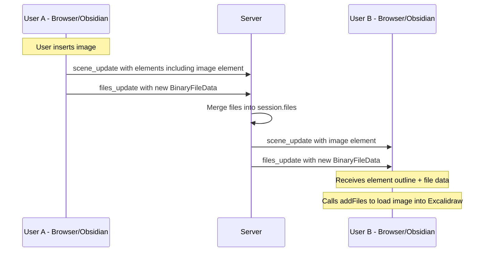
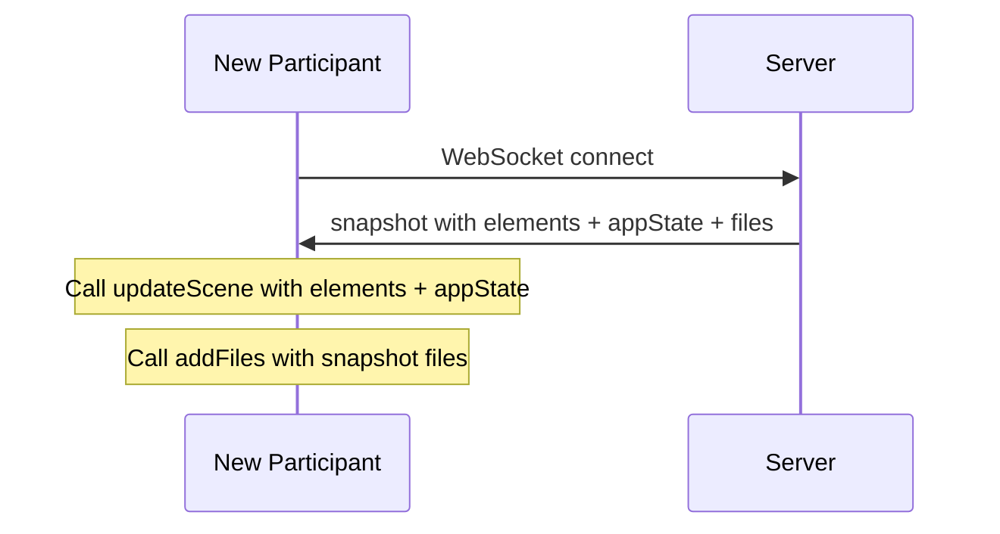

# Plan: Image/File Synchronization in Live Collaboration

## Problem

When a participant inserts an image during a live collab session (from either Obsidian or the browser), other participants see the **image element outline** (rectangle placeholder) but the **actual image data (binary file)** is never loaded. This is because the collaboration protocol currently only syncs `elements` — it completely ignores `files` (the `BinaryFiles` map containing base64-encoded image data).

## Root Cause Analysis

The issue exists at **every layer** of the collab stack:

### 1. Protocol Gap — No `files_update` message type

**Client → Server messages** (`ClientMessage` enum) only support:
- `scene_update` — sends `elements` only
- `scene_delta` — sends `elements` only  
- `pointer_update` — cursor position
- `set_name` — display name

There is **no message type** for sending file/image data.

**Relevant code:**
- Backend: [`ClientMessage`](backend/src/collab.rs:16) — no files field
- Frontend: [`ClientMessage`](frontend/src/types/index.ts:50) — no files field
- Plugin: [`ClientMessage`](obsidian-plugin/collabTypes.ts:22) — no files field

### 2. Server — Files are stored but never updated

The `CollabSession` struct has a [`files`](backend/src/collab.rs:139) field that stores the initial files from when the session was created. But [`update_scene()`](backend/src/collab.rs:620) and [`update_scene_delta()`](backend/src/collab.rs:681) only process `elements` — they never touch `session.files`.

### 3. Frontend — Files not captured from onChange, not sent, not received

- [`handleExcalidrawChange`](frontend/src/Viewer.tsx:200) receives `(elements, appState)` but **ignores the third `files` parameter** that Excalidraw's `onChange` callback provides
- [`sendSceneUpdate`](frontend/src/utils/collabClient.ts:125) only accepts and sends `elements`
- [`snapshot` handler](frontend/src/hooks/useCollab.ts:397) receives `msg.files` but **never passes them to Excalidraw** via `addFiles()`
- [`full_sync` handler](frontend/src/hooks/useCollab.ts:462) also ignores `msg.files`

### 4. Plugin — Same gaps

- [`onChange` callback](obsidian-plugin/collabManager.ts:664) receives `_files` parameter but **ignores it** (prefixed with underscore)
- [`handleSnapshot`](obsidian-plugin/collabManager.ts:387) receives `msg.files` but **never applies them** to Excalidraw
- [`sendSceneUpdate`](obsidian-plugin/collabClient.ts:154) only sends `elements`

## Solution Design

### New Message Type: `files_update`

Add a new WebSocket message type specifically for file data synchronization:

```
Client → Server: { type: "files_update", files: { [fileId]: BinaryFileData } }
Server → Client: { type: "files_update", files: { [fileId]: BinaryFileData }, from: string }
```

Files are sent **separately from elements** because:
1. Files are large (base64 images can be several MB each)
2. Files are immutable — once created, they never change (only new files are added)
3. Sending files with every scene_update would be extremely wasteful
4. Delta tracking is simple: only send files the server doesn't already have

### Architecture



### File Sync on Join (Snapshot)

When a new participant joins, the snapshot already includes `files`. The fix is to actually **use** those files:



## Implementation Steps

### Step 1: Backend — Add `files_update` message type

**File: `backend/src/collab.rs`**

1. Add `FilesUpdate` variant to `ClientMessage`:
   ```rust
   FilesUpdate {
       files: serde_json::Value,  // { fileId: BinaryFileData }
   },
   ```

2. Add `FilesUpdate` variant to `ServerMessage`:
   ```rust
   FilesUpdate {
       files: serde_json::Value,
       from: String,
   },
   ```

3. Add `update_files()` method to `SessionManager`:
   - Merge incoming files into `session.files` (additive only — files are immutable)
   - Only broadcast files that are actually new (not already in session.files)
   - Mark persistent sessions as dirty

### Step 2: Backend — Wire up WebSocket handler

**File: `backend/src/ws.rs`**

Add handling for `ClientMessage::FilesUpdate` in `handle_client_message()`:
```rust
ClientMessage::FilesUpdate { files } => {
    session_manager.update_files(session_id, user_id, files).await;
}
```

### Step 3: Frontend — Capture and send files

**File: `frontend/src/Viewer.tsx`**

Update `handleExcalidrawChange` to accept the third `files` parameter:
```typescript
const handleExcalidrawChange = useCallback(
  (elements: readonly ExcalidrawElement[], appState: { theme?: Theme }, files: BinaryFiles) => {
    // ... existing theme logic ...
    if (collab.isJoined && collab.isConnected) {
      collab.sendSceneUpdate(elements as ExcalidrawElement[])
      collab.sendFilesUpdate(files)  // NEW
    }
  }, [...]
)
```

**File: `frontend/src/types/index.ts`**

Add `files_update` to `ClientMessage` and `ServerMessage` types.

**File: `frontend/src/utils/collabClient.ts`**

Add `sendFilesUpdate(files)` method:
- Track which file IDs have already been sent (Set)
- Only send new files (delta)
- Debounce to batch multiple file additions

**File: `frontend/src/hooks/useCollab.ts`**

1. Add `sendFilesUpdate` to the hook's return value
2. Handle incoming `files_update` messages — call `excalidrawAPI.addFiles()` 
3. Fix `snapshot` handler to call `addFiles()` with `msg.files`
4. Fix `full_sync` handler to call `addFiles()` with `msg.files`

### Step 4: Plugin — Capture and send files

**File: `obsidian-plugin/collabTypes.ts`**

Add `files_update` to `ClientMessage` and `ServerMessage` types.

**File: `obsidian-plugin/collabClient.ts`**

Add `sendFilesUpdate(files)` method with delta tracking.

**File: `obsidian-plugin/collabManager.ts`**

1. In `startEventDrivenDetection()`: use the `_files` parameter from `onChange` callback
2. Add `handleLocalFilesChange(files)` method — detect new files and send via `sendFilesUpdate`
3. Track known file IDs to avoid re-sending
4. Handle incoming `files_update` messages — apply to Excalidraw via `updateScene` or direct API
5. Fix `handleSnapshot()` to apply `msg.files` to Excalidraw

### Step 5: Plugin — Handle files in snapshot for Obsidian

The Obsidian Excalidraw plugin API may not have `addFiles()` directly. Need to check if `updateScene` can accept files, or if we need to use the Excalidraw plugin's own file management API. The plugin's `ExcalidrawAPI` interface already has `getFiles()` — we may need to add files through the Obsidian Excalidraw plugin's specific API.

## Key Design Decisions

### 1. Separate message type vs. embedding files in scene_update

**Decision: Separate `files_update` message**

Rationale:
- Files are large and immutable — no need to resend them with every element change
- Simple delta tracking: just track which file IDs have been sent
- Avoids bloating the frequent scene_update messages
- Files can be sent independently of element updates

### 2. Server-side file storage

**Decision: Merge into `session.files` (additive only)**

Rationale:
- Files in Excalidraw are immutable once created (same ID = same content)
- Simple merge: just add new keys to the files map
- Server becomes the authoritative source of all files for the session
- New joiners get all files via snapshot

### 3. Delta tracking for files

**Decision: Track sent file IDs client-side**

Each client maintains a `Set<string>` of file IDs it has already sent. On each `onChange`, compare current files against this set and only send new ones. This is efficient because:
- Files are never modified, only added
- File IDs are stable (content-addressed hashes in Excalidraw)
- No version numbers needed (unlike elements)

### 4. Message size considerations

Images can be large (several MB as base64). Considerations:
- The WebSocket already has a 5 MB message size limit
- Each `files_update` should only contain **new** files (delta)
- If a single image exceeds the WS limit, it will fail — this is an existing limitation
- For very large images, we could consider chunking in the future, but this is out of scope

## Files to Modify

| File | Changes |
|------|---------|
| `backend/src/collab.rs` | Add `FilesUpdate` to `ClientMessage` and `ServerMessage`, add `update_files()` method |
| `backend/src/ws.rs` | Handle `ClientMessage::FilesUpdate` in message handler |
| `frontend/src/types/index.ts` | Add `files_update` to message type unions |
| `frontend/src/utils/collabClient.ts` | Add `sendFilesUpdate()` method with delta tracking |
| `frontend/src/hooks/useCollab.ts` | Add `sendFilesUpdate` to hook, handle incoming `files_update`, fix snapshot/full_sync file handling |
| `frontend/src/Viewer.tsx` | Pass `files` from `onChange` to collab, wire up `sendFilesUpdate` |
| `obsidian-plugin/collabTypes.ts` | Add `files_update` to message type unions |
| `obsidian-plugin/collabClient.ts` | Add `sendFilesUpdate()` method with delta tracking |
| `obsidian-plugin/collabManager.ts` | Capture files from `onChange`, handle incoming `files_update`, fix snapshot file handling |

## Risk Assessment

- **WebSocket message size**: Large images may exceed the 5 MB WS limit. Mitigation: log a warning if files_update is too large; consider splitting into per-file messages if needed.
- **Memory usage**: Server stores all files in memory for the session duration. This is already the case (files are loaded from the drawing JSON on session start). Adding more files during the session increases memory usage proportionally.
- **Race conditions**: A `scene_update` with an image element may arrive before the corresponding `files_update`. The image will show as a placeholder until the file data arrives. This is acceptable — Excalidraw handles missing files gracefully by showing a placeholder.
