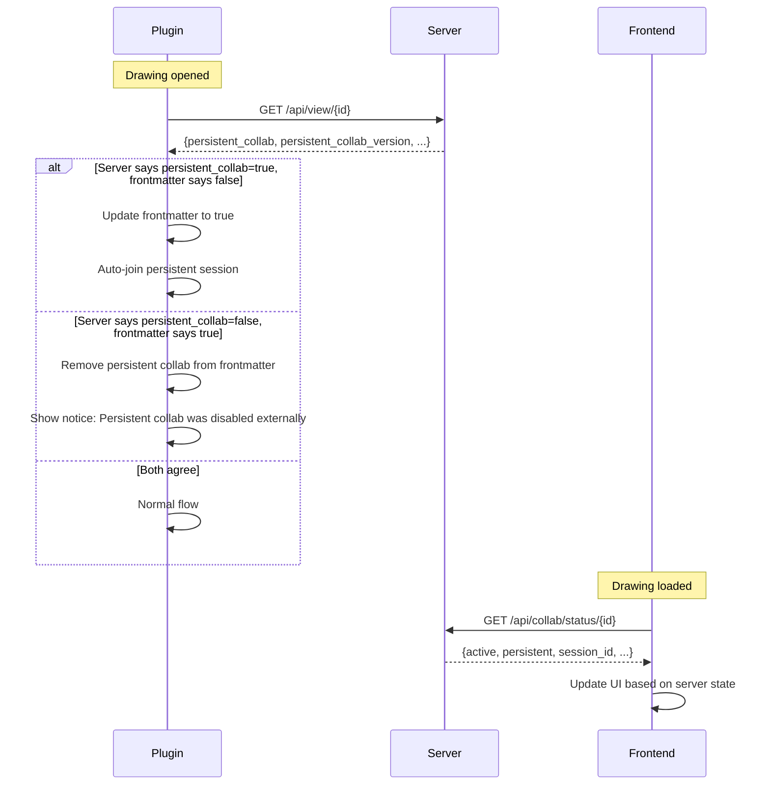

# Collaboration State Synchronization Plan

## Problem Statement

The collaboration state (especially persistent collab) can become **out of sync** between the server, frontend, and multiple Obsidian plugin instances. The root cause is that the plugin relies on **local frontmatter** (`excalishare-persistent-collab`) as the source of truth, but this frontmatter is:

1. **Not synced across devices** — If Device A enables persistent collab, Device B's frontmatter still says `false` (unless the vault is synced AND the file is re-opened)
2. **Lost on Obsidian restart** — The frontmatter persists in the file, but the plugin's in-memory state (`activeCollabSessionId`, `activeCollabDrawingId`, `collabManager`) is reset
3. **Not validated against the server** — The plugin never checks if the server's persistent collab state matches the local frontmatter

## Out-of-Sync Scenarios

### Scenario 1: Multi-Device Persistent Collab Drift
- **Device A** enables persistent collab → frontmatter updated, server updated
- **Device B** opens the same drawing → frontmatter says `false` (vault not synced yet or different vault)
- **Result**: Device B's toolbar shows "Enable Persistent Collab" even though it's already enabled on the server

### Scenario 2: Obsidian Restart with Active Persistent Collab
- User enables persistent collab, Obsidian restarts
- Frontmatter still has `excalishare-persistent-collab: true` ✓
- But `activeCollabSessionId` and `activeCollabDrawingId` are `null` (in-memory state lost)
- `syncPersistentCollabOnOpen()` runs and tries to auto-join, but only if `collabJoinFromObsidian` is enabled
- **Result**: Toolbar shows "published" status instead of "collabActive" until the file is re-opened

### Scenario 3: Server-Side Disable Not Reflected in Plugin
- Admin disables persistent collab via the admin panel or another plugin instance
- The current plugin instance still has `excalishare-persistent-collab: true` in frontmatter
- **Result**: Plugin thinks persistent collab is enabled, tries to sync/join, gets errors

### Scenario 4: Server-Side Enable Not Reflected in Plugin
- Persistent collab enabled from another device or the admin panel
- Local frontmatter doesn't have `excalishare-persistent-collab`
- **Result**: Plugin doesn't auto-sync or auto-join the persistent session

### Scenario 5: Live Collab Session Ended Externally
- Host starts a live collab session from Device A
- Device A crashes or loses connection
- Session times out on the server
- Device A restarts — `activeCollabSessionId` is null, but the toolbar might not reflect the correct state

### Scenario 6: Frontend Shows Stale Persistent Collab Badge
- Frontend's `DrawingsBrowser` shows "🔄 Live" badge based on the public drawings list
- If persistent collab is disabled, the badge persists until the next API poll (10s interval in `useCollab`, but `DrawingsBrowser` only fetches on mount)

## Root Cause Analysis

The fundamental issue is a **split-brain architecture**:

```
┌─────────────────────────────────────────────────────────────┐
│                    SERVER (Source of Truth)                   │
│  _persistent_collab: true/false in drawing JSON              │
│  SessionManager: active sessions, persistent_drawings set    │
└─────────────────────────────────────────────────────────────┘
        ▲                                          ▲
        │ (no sync)                                │ (polls /api/collab/status every 10s)
        │                                          │
┌───────┴──────────┐                    ┌──────────┴──────────┐
│  PLUGIN (Device A)│                    │  FRONTEND (Browser)  │
│  frontmatter:     │                    │  useCollab hook:     │
│  excalishare-     │                    │  isPersistentCollab  │
│  persistent-collab│                    │  (from status API)   │
│  (LOCAL ONLY)     │                    │                      │
└──────────────────┘                    └─────────────────────┘
        ▲
        │ (no sync)
        │
┌───────┴──────────┐
│  PLUGIN (Device B)│
│  frontmatter:     │
│  (DIFFERENT!)     │
└──────────────────┘
```

## Solution: Server-as-Source-of-Truth with Reconciliation

### Design Principle
**The server is always the source of truth.** The plugin should:
1. **Query the server** for the actual persistent collab state when opening a drawing
2. **Reconcile** local frontmatter with server state (update frontmatter if mismatched)
3. **Never trust frontmatter alone** for persistent collab decisions

### Architecture After Fix



## Implementation Plan

### Phase 1: Backend — Expose Persistent Collab State Consistently

#### 1.1 Enhance `/api/collab/status/{drawing_id}` Response
Currently returns `persistent: bool` from the in-memory `persistent_drawings` set. This is already correct since the set is populated from disk on startup and updated on enable/disable. **No changes needed here.**

#### 1.2 Ensure `/api/view/{id}` Always Returns Persistent Collab Info
Currently already returns `persistent_collab: true` and `persistent_collab_version` when enabled. **No changes needed here.**

#### 1.3 Ensure `/api/public/drawings` Returns Persistent Collab Flag
Currently already returns `persistent_collab` in the public list. **No changes needed here.**

**Conclusion: The backend already exposes all necessary state. The problem is entirely on the plugin side.**

### Phase 2: Plugin — Server State Reconciliation on File Open

This is the core fix. When a drawing is opened, the plugin should reconcile its local frontmatter with the server's actual state.

#### 2.1 New Method: `reconcileServerState(file, drawingId)`

Add a new method that runs **every time** a published drawing is opened (not just for persistent collab drawings). This replaces the current `isPersistentCollabEnabled(file)` check with a server query.

**Location**: [`main.ts`](obsidian-plugin/main.ts)

```typescript
/**
 * Reconcile local frontmatter with server state for a published drawing.
 * Ensures persistent collab state, password protection, etc. are in sync.
 * Called every time a published drawing is opened/focused.
 */
private async reconcileServerState(file: TFile, drawingId: string): Promise<void> {
  try {
    const response = await requestUrl({
      url: `${this.settings.baseUrl}/api/view/${drawingId}`,
      method: 'GET',
      throw: false,
    });

    if (response.status === 404) {
      // Drawing was deleted from server — clear frontmatter
      await this.app.fileManager.processFrontMatter(file, (fm: any) => {
        delete fm['excalishare-id'];
        delete fm['excalishare-persistent-collab'];
        delete fm['excalishare-last-sync-version'];
      });
      new Notice('Drawing was deleted from server. Unpublished locally.');
      this.refreshActiveToolbar();
      return;
    }

    if (response.status >= 400) return; // Network error, skip

    const serverData = response.json;
    const serverPersistent = serverData.persistent_collab === true;
    const localPersistent = this.isPersistentCollabEnabled(file);

    // Reconcile persistent collab state
    if (serverPersistent && !localPersistent) {
      // Server has persistent collab enabled, but local doesn't know
      await this.app.fileManager.processFrontMatter(file, (fm: any) => {
        fm['excalishare-persistent-collab'] = true;
        fm['excalishare-last-sync-version'] = serverData.persistent_collab_version ?? 0;
      });
      console.log(`ExcaliShare: Reconciled persistent collab state for ${file.path} (server=true, local=false)`);
      this.refreshActiveToolbar();
    } else if (!serverPersistent && localPersistent) {
      // Server says persistent collab is disabled, but local thinks it's enabled
      await this.app.fileManager.processFrontMatter(file, (fm: any) => {
        delete fm['excalishare-persistent-collab'];
        delete fm['excalishare-last-sync-version'];
      });
      this._persistentSyncedFiles.delete(file.path);
      console.log(`ExcaliShare: Reconciled persistent collab state for ${file.path} (server=false, local=true)`);
      new Notice('Persistent collaboration was disabled externally.');
      this.refreshActiveToolbar();
    }
  } catch (error) {
    console.warn('ExcaliShare: Failed to reconcile server state', error);
  }
}
```

#### 2.2 Integrate Reconciliation into File Open Flow

Modify the `handleActiveLeafChange` flow to call `reconcileServerState` for every published drawing:

**In [`main.ts`](obsidian-plugin/main.ts:656)** — replace the current persistent collab check:

```typescript
// BEFORE:
const publishedId = this.getPublishedId(file);
if (publishedId && this.isPersistentCollabEnabled(file)) {
  this.syncPersistentCollabOnOpen(file, publishedId);
}

// AFTER:
const publishedId = this.getPublishedId(file);
if (publishedId) {
  // Reconcile local state with server, then sync if persistent collab
  this.reconcileServerState(file, publishedId).then(() => {
    if (this.isPersistentCollabEnabled(file)) {
      this.syncPersistentCollabOnOpen(file, publishedId);
    }
  });
}
```

#### 2.3 Deduplicate Reconciliation Calls

Since `handleActiveLeafChange` fires frequently (on every tab switch), add a debounce/dedup mechanism:

```typescript
private _reconcileInFlight: Set<string> = new Set();

private async reconcileServerState(file: TFile, drawingId: string): Promise<void> {
  // Deduplicate: skip if already reconciling this drawing
  if (this._reconcileInFlight.has(drawingId)) return;
  this._reconcileInFlight.add(drawingId);
  
  try {
    // ... reconciliation logic ...
  } finally {
    this._reconcileInFlight.delete(drawingId);
  }
}
```

Additionally, add a per-session cache to avoid hitting the server on every tab switch:

```typescript
/** Cache of last reconciled state per drawing ID, to avoid redundant server calls */
private _reconcileCache: Map<string, { timestamp: number; persistent: boolean }> = new Map();
private static RECONCILE_CACHE_TTL = 30_000; // 30 seconds

private async reconcileServerState(file: TFile, drawingId: string): Promise<void> {
  // Check cache — skip if recently reconciled
  const cached = this._reconcileCache.get(drawingId);
  if (cached && Date.now() - cached.timestamp < ExcaliSharePlugin.RECONCILE_CACHE_TTL) {
    return;
  }
  // ... rest of reconciliation ...
  // Update cache after successful reconciliation
  this._reconcileCache.set(drawingId, { timestamp: Date.now(), persistent: serverPersistent });
}
```

#### 2.4 Modify `syncPersistentCollabOnOpen` to Use Server Data

Currently `syncPersistentCollabOnOpen` fetches `/api/view/{id}` again. Since `reconcileServerState` already fetches it, we should avoid the double fetch. Two options:

**Option A (Simpler)**: Pass the server data from reconciliation to sync:
```typescript
private async reconcileServerState(file: TFile, drawingId: string): Promise<void> {
  // ... fetch and reconcile ...
  // If persistent collab is enabled, trigger sync with the data we already have
  if (serverPersistent) {
    this.syncPersistentCollabWithData(file, drawingId, serverData);
  }
}
```

**Option B (Keep separate)**: Let `syncPersistentCollabOnOpen` continue to fetch independently (simpler code, slightly more network usage). Since the server response is small and the TTL cache prevents rapid re-fetches, this is acceptable.

**Recommendation**: Option A — merge the two methods to avoid the double fetch.

#### 2.5 Handle Drawing Deletion Detection

When `reconcileServerState` gets a 404, the drawing was deleted from the server. The plugin should:
1. Clear `excalishare-id` from frontmatter
2. Clear persistent collab frontmatter
3. Update toolbar to "unpublished" state
4. Show a notice to the user

### Phase 3: Plugin — Periodic Background Reconciliation

For long-running sessions where the user doesn't switch tabs, add a periodic background check:

#### 3.1 Background Reconciliation Timer

```typescript
private _backgroundReconcileInterval: ReturnType<typeof setInterval> | null = null;

// In onload():
this._backgroundReconcileInterval = setInterval(() => {
  this.backgroundReconcile();
}, 60_000); // Every 60 seconds

private async backgroundReconcile(): Promise<void> {
  const file = this.app.workspace.getActiveFile();
  if (!file || !this.isExcalidrawFile(file)) return;
  const publishedId = this.getPublishedId(file);
  if (!publishedId) return;
  
  // Force cache invalidation for background reconcile
  this._reconcileCache.delete(publishedId);
  await this.reconcileServerState(file, publishedId);
}
```

### Phase 4: Plugin — Robust Collab Session State Recovery

#### 4.1 Recover Active Collab State on File Open

When a file is opened and the plugin detects an active collab session on the server (via `/api/collab/status/{id}`), it should restore `activeCollabSessionId` and `activeCollabDrawingId` even if they were lost (e.g., after Obsidian restart).

This is already partially handled in `syncPersistentCollabOnOpen` (lines 1879-1900), but only for persistent collab. Extend it to also handle regular collab sessions:

```typescript
// In reconcileServerState, after fetching server data:
// Also check collab status to restore session tracking
const statusRes = await requestUrl({
  url: `${this.settings.baseUrl}/api/collab/status/${drawingId}`,
  method: 'GET',
  throw: false,
});
if (statusRes.status < 400) {
  const status = statusRes.json;
  if (status.active && status.session_id) {
    // Restore session tracking if we lost it (e.g., after restart)
    if (!this.activeCollabSessionId) {
      this.activeCollabSessionId = status.session_id;
      this.activeCollabDrawingId = drawingId;
      this.refreshActiveToolbar();
    }
  } else if (this.activeCollabSessionId && this.activeCollabDrawingId === drawingId) {
    // Session ended on server but we still think it's active
    this.cleanupCollabState();
    this.refreshActiveToolbar();
  }
}
```

### Phase 5: Frontend — Minor Improvements

#### 5.1 DrawingsBrowser Periodic Refresh
The `DrawingsBrowser` currently only fetches the drawings list on mount. Add a periodic refresh or a manual refresh button so the persistent collab badges stay current.

#### 5.2 No Other Frontend Changes Needed
The frontend already uses the server as source of truth via `/api/collab/status/{id}` polling every 10 seconds. The `useCollab` hook correctly handles persistent collab activation. No structural changes needed.

### Phase 6: Edge Case Handling

#### 6.1 Vault Sync Conflict Resolution
If two devices have conflicting frontmatter (one says persistent=true, other says false), the reconciliation will fix it on next file open since the server is the source of truth.

#### 6.2 Offline Mode
If the server is unreachable, the plugin should:
- Keep the current frontmatter state (don't clear it)
- Skip reconciliation silently (already handled by the try/catch)
- Retry on next file open or background reconcile

#### 6.3 Race Conditions
- `reconcileServerState` uses a dedup set (`_reconcileInFlight`) to prevent concurrent reconciliations for the same drawing
- The reconcile cache TTL (30s) prevents rapid re-fetches on tab switching

## Summary of Changes

### Backend
- **No changes needed** — the server already exposes all necessary state

### Plugin (`obsidian-plugin/main.ts`)
1. **New method**: `reconcileServerState(file, drawingId)` — queries server, reconciles frontmatter
2. **New field**: `_reconcileInFlight: Set<string>` — dedup guard
3. **New field**: `_reconcileCache: Map<string, {...}>` — TTL cache for reconciliation
4. **New field**: `_backgroundReconcileInterval` — periodic background check
5. **Modified**: `handleActiveLeafChange` flow — call `reconcileServerState` for all published drawings
6. **Modified**: `syncPersistentCollabOnOpen` — merge with reconciliation to avoid double fetch
7. **Modified**: `onunload` — clean up background interval
8. **Handle 404**: Clear frontmatter when drawing is deleted from server

### Frontend (`frontend/src/DrawingsBrowser.tsx`)
1. **Optional**: Add periodic refresh or manual refresh button for drawings list

## File Changes Summary

| File | Change Type | Description |
|------|-------------|-------------|
| [`obsidian-plugin/main.ts`](obsidian-plugin/main.ts) | Modified | Add reconciliation logic, background sync, session recovery |
| [`frontend/src/DrawingsBrowser.tsx`](frontend/src/DrawingsBrowser.tsx) | Modified (optional) | Add periodic refresh for persistent collab badges |

## Risk Assessment

- **Low risk**: All changes are additive — no existing behavior is removed
- **Network overhead**: One extra API call per file open (cached for 30s), one background call per 60s
- **Backward compatible**: Frontmatter changes are non-breaking; old plugin versions just ignore the reconciliation
