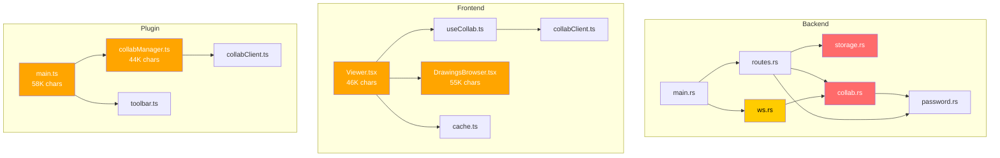

# ExcaliShare — Deep Analysis: Performance, Bugs & Security

## Executive Summary

After thorough analysis of all three components (backend, frontend, plugin) and infrastructure, I identified **12 security issues** (3 critical, 4 high, 5 medium), **8 bugs** (2 high, 6 medium), and **15 performance concerns** (4 high, 11 medium). The project is well-architected overall, but has several areas that need attention before production hardening.

---

## 🔴 SECURITY

### CRITICAL

#### S1. Password Transmitted in WebSocket URL Query Parameter
- **Location**: [`collabClient.ts:40-43`](frontend/src/utils/collabClient.ts:40), [`ws.rs:16-21`](backend/src/ws.rs:16), [`collabClient.ts:62-65`](obsidian-plugin/collabClient.ts:62)
- **Issue**: The collab session password is sent as a URL query parameter (`?password=...`) in the WebSocket upgrade request. Query parameters are logged in server access logs, browser history, proxy logs, and potentially CDN/WAF logs. Even over TLS, the URL is visible in many intermediate systems.
- **Impact**: Password leakage via logs, browser history, and network infrastructure.
- **Fix**: Send the password in the first WebSocket message after connection, or use a short-lived token from the `/api/collab/verify-password` endpoint that can be passed as the query parameter instead.

#### S2. Drawing Password Sent in URL Fragment — Leaks via Referrer
- **Location**: [`main.ts:1164-1167`](obsidian-plugin/main.ts:1164)
- **Issue**: When publishing a password-protected drawing, the password is appended to the share URL as `#key=<password>`. While URL fragments are not sent to the server, they ARE visible in `document.referrer` if the user navigates away, and in browser history. The fragment is also read in [`Viewer.tsx:143-144`](frontend/src/Viewer.tsx:143).
- **Impact**: Password exposure via browser history, referrer headers, and clipboard sharing.
- **Fix**: Use a time-limited access token instead of the raw password. Or at minimum, strip the fragment from the URL after reading it (using `history.replaceState`).

#### S3. `list()` Reads Every JSON File for Metadata — DoS Vector
- **Location**: [`storage.rs:101-151`](backend/src/storage.rs:101)
- **Issue**: The `list()` method reads and parses the FULL content of every `.json` file in the data directory to extract `_source_path` and `_password_hash`. For large drawings (up to 50 MB each), this means listing 100 drawings could read 5 GB of data into memory.
- **Impact**: Memory exhaustion and CPU spike on `/api/drawings` and `/api/public/drawings` endpoints. An attacker could upload many large drawings and then repeatedly call the public list endpoint.
- **Fix**: Store metadata in a separate sidecar file (e.g., `<id>.meta.json`) or use a lightweight index file. Alternatively, read only the first N bytes of each file to extract metadata fields.

### HIGH

#### S4. No Rate Limiting on WebSocket Connections
- **Location**: [`main.rs:152-157`](backend/src/main.rs:152)
- **Issue**: The WebSocket route (`/ws/collab/{session_id}`) has no rate limiting. An attacker could open hundreds of WebSocket connections rapidly, exhausting server resources.
- **Impact**: Resource exhaustion, denial of service for legitimate collab users.
- **Fix**: Add rate limiting to the WebSocket route, or implement connection-level throttling per IP.

#### S5. No Rate Limiting on Password Verification
- **Location**: [`routes.rs:412-430`](backend/src/routes.rs:412)
- **Issue**: The `/api/collab/verify-password` endpoint has no specific rate limiting beyond the general public rate limit of 120 req/sec. This allows brute-force password attacks at high speed.
- **Impact**: Collab session passwords can be brute-forced.
- **Fix**: Add a stricter rate limit (e.g., 5 req/sec per IP) specifically for password verification endpoints. Also consider adding exponential backoff or account lockout.

#### S6. `update_scene` Holds Write Lock During Full Broadcast
- **Location**: [`collab.rs:479-526`](backend/src/collab.rs:479)
- **Issue**: The `update_scene` method acquires a write lock on all sessions, then performs element merging AND broadcasts the full scene. The broadcast includes serializing the entire element array. This blocks ALL other session operations (joins, leaves, pointer updates, other scene updates) for the duration.
- **Impact**: Under high collab load, this creates a bottleneck. With large drawings, serialization time could be significant.
- **Fix**: Minimize the write lock scope — compute the merged elements and release the lock before broadcasting. Or use a per-session lock instead of a global lock.

#### S7. Admin API Key Stored in `sessionStorage`
- **Location**: [`AdminPage.tsx:18`](frontend/src/AdminPage.tsx:18)
- **Issue**: The admin API key is stored in `sessionStorage`. While better than `localStorage`, it's still accessible to any JavaScript running on the page (XSS). The same API key is used for all protected operations including delete.
- **Impact**: If any XSS vulnerability exists, the API key is compromised.
- **Fix**: Consider using HTTP-only cookies for admin authentication, or implement a separate admin session token with limited scope.

### MEDIUM

#### S8. Constant-Time Comparison Leaks Key Length
- **Location**: [`auth.rs:33`](backend/src/auth.rs:33)
- **Issue**: The auth middleware checks `token.len() == key.len()` before the constant-time comparison. This leaks the API key length via timing. The code comments acknowledge this as an "acceptable trade-off," but it reduces the effective entropy.
- **Impact**: Attacker can determine API key length, reducing brute-force search space.
- **Fix**: Pad both values to the same length before comparison, or use HMAC-based comparison.

#### S9. No CSRF Protection on State-Changing Endpoints
- **Location**: [`main.rs:171-174`](backend/src/main.rs:171)
- **Issue**: While CORS is configured, there's no CSRF token validation. CORS only protects against cross-origin requests from browsers — it doesn't protect against same-origin attacks or non-browser clients.
- **Impact**: Low risk since API key auth is required, but defense-in-depth is missing.
- **Fix**: Add CSRF tokens for the admin panel, or use `SameSite` cookie attributes if switching to cookie-based auth.

#### S10. WebSocket Message Size Check After Full Parse
- **Location**: [`ws.rs:165`](backend/src/ws.rs:165)
- **Issue**: The 5 MB size check happens on the text string AFTER the WebSocket frame has already been received and allocated in memory. The actual protection against oversized frames should happen at the WebSocket layer.
- **Impact**: A malicious client can still force the server to allocate up to the WebSocket frame limit in memory before the check kicks in.
- **Fix**: Configure axum's WebSocket max frame size at the protocol level.

#### S11. `rand_index` Uses Weak Randomness
- **Location**: [`ws.rs:31-38`](backend/src/ws.rs:31)
- **Issue**: The `rand_index` function uses `SystemTime::now().subsec_nanos() % max` for generating random default names. This is predictable and biased.
- **Impact**: Low — only affects default display names, not security-critical.
- **Fix**: Use `rand::thread_rng()` which is already a dependency.

#### S12. No Input Sanitization on Display Names
- **Location**: [`ws.rs:61-67`](backend/src/ws.rs:61), [`collab.rs:686-698`](backend/src/collab.rs:686)
- **Issue**: Display names are truncated to 50 chars but not sanitized for HTML/script content. These names are rendered in the frontend UI.
- **Impact**: Potential stored XSS if names are rendered with `dangerouslySetInnerHTML` or similar. React's default escaping mitigates this for the frontend, but the Obsidian plugin's DOM manipulation may be vulnerable.
- **Fix**: Sanitize display names server-side (strip HTML tags, control characters).

---

## 🟡 BUGS

### HIGH

#### B1. UUID Collision Fallback Generates Full-Length ID
- **Location**: [`routes.rs:156-168`](backend/src/routes.rs:156)
- **Issue**: When a new drawing ID collides (extremely rare), the fallback generates a full 32-character UUID instead of a 16-character truncated one. This inconsistency could cause issues with ID validation or display.
  ```rust
  // Normal: 16 chars
  let new_id = Uuid::new_v4().to_string().replace('-', "").chars().take(16).collect();
  // Fallback: 32 chars (no truncation!)
  Uuid::new_v4().to_string().replace('-', "")
  ```
- **Fix**: Apply the same `.chars().take(16).collect()` truncation to the fallback ID.

#### B2. `loadDrawingsList` Dependency Array Missing `loadingDrawings`
- **Location**: [`Viewer.tsx:468-481`](frontend/src/Viewer.tsx:468)
- **Issue**: The `loadDrawingsList` callback has `loadingDrawings` removed from its dependency array (with a comment acknowledging this). This means the guard `if (loadingDrawings) return` captures a stale closure value, potentially allowing duplicate concurrent fetches.
- **Fix**: Use a ref for `loadingDrawings` to avoid the stale closure issue while keeping the dependency array clean.

### MEDIUM

#### B3. Drawings List Fetched Redundantly in Multiple Places
- **Location**: [`Viewer.tsx:80-92`](frontend/src/Viewer.tsx:80), [`Viewer.tsx:402-414`](frontend/src/Viewer.tsx:402), [`Viewer.tsx:419-429`](frontend/src/Viewer.tsx:419), [`Viewer.tsx:437-449`](frontend/src/Viewer.tsx:437)
- **Issue**: The drawings list is fetched from `/api/public/drawings` in at least 5 different places with identical logic. Each keyboard shortcut handler independently fetches the list.
- **Fix**: Centralize into a single fetch function with deduplication.

#### B4. `useMediaQuery` Hook Duplicated
- **Location**: [`Viewer.tsx:13-32`](frontend/src/Viewer.tsx:13), [`DrawingsBrowser.tsx:4-23`](frontend/src/DrawingsBrowser.tsx:4)
- **Issue**: The `useMediaQuery` hook is copy-pasted identically in two components.
- **Fix**: Extract to a shared `hooks/useMediaQuery.ts` file.

#### B5. `created_at` Uses File System Creation Time — Unreliable
- **Location**: [`storage.rs:115-117`](backend/src/storage.rs:115)
- **Issue**: `metadata.created()` returns `UNIX_EPOCH` on many Linux filesystems (ext4 only supports birth time since kernel 4.11 with statx). The fallback to `UNIX_EPOCH` means all drawings could show as created on 1970-01-01.
- **Fix**: Store the creation timestamp inside the JSON file as `_created_at` metadata, similar to `_source_path`.

#### B6. `handleExcalidrawChange` Dependency on Collab State Causes Re-renders
- **Location**: [`Viewer.tsx:213-227`](frontend/src/Viewer.tsx:213)
- **Issue**: The `handleExcalidrawChange` callback depends on `collab.isJoined`, `collab.isConnected`, and `collab.sendSceneUpdate`. Every time collab state changes, this callback is recreated, which may cause Excalidraw to re-render.
- **Fix**: Use refs for the collab state values inside the callback to avoid dependency changes.

#### B7. `spinKeyframes` CSS Injected as String — Not Cleaned Up
- **Location**: [`Viewer.tsx:35-40`](frontend/src/Viewer.tsx:35), [`DrawingsBrowser.tsx:25-30`](frontend/src/DrawingsBrowser.tsx:25)
- **Issue**: The `@keyframes spin` CSS is defined as a string constant but it's unclear how it's injected. If injected via `<style>` tags, they may accumulate on re-renders.
- **Fix**: Move to `index.css` or use a proper CSS-in-JS solution.

#### B8. `color_index` Wraps at 255 — Only 8 Colors Defined
- **Location**: [`collab.rs:407`](backend/src/collab.rs:407)
- **Issue**: `next_color_index` uses `wrapping_add(1)` on a `u8`, so it wraps at 255. But only 8 colors are defined in the frontend. After 8 participants, colors repeat (which is fine), but the index keeps incrementing unnecessarily.
- **Fix**: Use modulo 8 instead of wrapping u8 to keep indices small and meaningful.

---

## ⚡ PERFORMANCE

### HIGH

#### P1. Full Scene Broadcast on Every `update_scene` — O(n) per Update
- **Location**: [`collab.rs:518-523`](backend/src/collab.rs:518)
- **Issue**: Even though delta updates exist (`update_scene_delta`), the `update_scene` path still broadcasts the ENTIRE element array to all clients. For a drawing with 1000 elements and 10 participants, every edit sends 1000 elements × 10 clients = 10,000 element transmissions.
- **Impact**: Bandwidth explosion with large drawings and multiple participants.
- **Fix**: Always broadcast only the changed elements (delta). The full scene should only be sent on initial snapshot or explicit resync.

#### P2. `list()` Reads Full File Content for Every Drawing
- **Location**: [`storage.rs:119-138`](backend/src/storage.rs:119)
- **Issue**: (Also a security issue — S3). Every call to list drawings reads and parses the complete JSON content of every file. A 50 MB drawing file is fully loaded just to check if `_source_path` and `_password_hash` exist.
- **Impact**: O(total_data_size) memory and CPU for every list request.
- **Fix**: Use a metadata index or sidecar files.

#### P3. Global `RwLock` on All Sessions — Contention Under Load
- **Location**: [`collab.rs:211`](backend/src/collab.rs:211)
- **Issue**: `SessionManager` uses a single `RwLock<HashMap<String, CollabSession>>` for ALL sessions. Every scene update, pointer update, join, or leave acquires this lock. With multiple concurrent sessions, this creates contention.
- **Impact**: Latency increases linearly with the number of active sessions.
- **Fix**: Use a `DashMap` or per-session `RwLock` (wrap each session in its own `Arc<RwLock<CollabSession>>`).

#### P4. `Viewer.tsx` and `DrawingsBrowser.tsx` Are Monolithic
- **Location**: [`Viewer.tsx`](frontend/src/Viewer.tsx) (46K chars), [`DrawingsBrowser.tsx`](frontend/src/DrawingsBrowser.tsx) (55K chars)
- **Issue**: These files are extremely large single components with many responsibilities. This hurts code splitting, tree shaking, and developer productivity.
- **Impact**: Larger bundle size, harder to maintain, more re-renders.
- **Fix**: Split into smaller components (e.g., `ViewerToolbar`, `ViewerKeyboardHandler`, `PresentMode`, `EditMode`, `TreeView`, `SearchPanel`).

### MEDIUM

#### P5. `elements_as_array()` Clones All Elements on Every Call
- **Location**: [`collab.rs:164-171`](backend/src/collab.rs:164)
- **Issue**: `elements_as_array()` creates a new `Vec` by cloning every element from the HashMap. This is called on every scene update broadcast and every snapshot.
- **Fix**: Consider caching the serialized array and invalidating on changes.

#### P6. `estimateSize` in Cache Serializes Entire Drawing
- **Location**: [`cache.ts:15-22`](frontend/src/utils/cache.ts:15)
- **Issue**: `JSON.stringify(data).length * 2` serializes the entire drawing to a string just to estimate its size. For a 10 MB drawing, this creates a temporary 10 MB string.
- **Fix**: Use a rough estimate based on element count and file count, or cache the size from the server response's `Content-Length`.

#### P7. MutationObserver on `document.body` with `subtree: true`
- **Location**: [`Viewer.tsx:740`](frontend/src/Viewer.tsx:740)
- **Issue**: A MutationObserver watches the entire document body with `subtree: true` to detect toolbar injection opportunities. This fires on every DOM mutation anywhere in the page.
- **Fix**: Observe a more specific container (e.g., `.excalidraw` container) once it exists.

#### P8. Collab Status Polling Every 10 Seconds
- **Location**: [`useCollab.ts:190-194`](frontend/src/hooks/useCollab.ts:190)
- **Issue**: The frontend polls `/api/collab/status/{drawingId}` every 10 seconds even when no collab session is active. For a page with many viewers, this creates unnecessary load.
- **Fix**: Use exponential backoff (start at 10s, increase to 60s if no session found). Or use Server-Sent Events for push-based status updates.

#### P9. `structuredClone` in Cache `get()` — Deep Copy on Every Read
- **Location**: [`cache.ts:32`](frontend/src/utils/cache.ts:32)
- **Issue**: Every cache read creates a deep clone of the entire drawing data via `structuredClone`. For large drawings, this is expensive.
- **Fix**: Return the cached data directly (immutable reference) and only clone when the caller needs to mutate it.

#### P10. Inline Styles Object Recreated on Every Render
- **Location**: Multiple components (pattern: `const styles: Record<string, React.CSSProperties> = { ... }`)
- **Issue**: Style objects defined inside component functions are recreated on every render, causing unnecessary object allocations.
- **Fix**: Move style objects outside the component function or use `useMemo`.

#### P11. `blobToBase64` Uses String Concatenation in Loop
- **Location**: [`main.ts:86-93`](obsidian-plugin/main.ts:86)
- **Issue**: The `blobToBase64` function builds a binary string by concatenating characters in a loop (`binary += String.fromCharCode(bytes[i])`). String concatenation in a loop is O(n²) in some JS engines.
- **Fix**: Use `Uint8Array` directly with `btoa` or use `arrayBufferToBase64` from Obsidian API (which is already imported).

#### P12. No Compression on WebSocket Messages
- **Location**: [`ws.rs`](backend/src/ws.rs), [`collabClient.ts`](frontend/src/utils/collabClient.ts)
- **Issue**: WebSocket messages (which can be large scene updates) are sent uncompressed. The HTTP layer has `CompressionLayer` but WebSocket frames bypass it.
- **Fix**: Enable WebSocket per-message deflate compression in axum's WebSocket configuration.

#### P13. `handleKeyDown` Closure Captures `showOverlay` State
- **Location**: [`Viewer.tsx:338-466`](frontend/src/Viewer.tsx:338)
- **Issue**: The keyboard handler effect depends on `showOverlay`, `drawingsList`, `id`, `loadingDrawings`, `navigate`, and `loading`. Every time any of these change, the event listener is removed and re-added.
- **Fix**: Use refs for the state values accessed inside the handler to reduce effect re-runs.

#### P14. Toolbar Injection Uses Multiple Timers + MutationObserver
- **Location**: [`Viewer.tsx:711-747`](frontend/src/Viewer.tsx:711)
- **Issue**: Mobile toolbar injection uses `requestAnimationFrame` + 4 `setTimeout` calls + a `MutationObserver` as a belt-and-suspenders approach. This is wasteful.
- **Fix**: Use only the MutationObserver with a single initial check.

#### P15. `element_order` Vec Grows Unbounded — No Cleanup of Deleted Elements
- **Location**: [`collab.rs:134`](backend/src/collab.rs:134)
- **Issue**: `element_order` tracks insertion order but never removes entries for deleted elements. Over a long session with many create/delete cycles, this vector grows without bound.
- **Fix**: Periodically compact `element_order` by removing IDs that are marked as deleted in `element_map`.

---

## Architecture Diagram — Issue Hotspots



**Legend**: 🔴 Red = Critical issues, 🟠 Orange = High issues, 🟡 Yellow = Medium issues

---

## Prioritized Improvement Plan

### Phase 1: Critical Security Fixes
1. **Fix password in WebSocket URL** (S1) — Move to first-message or token-based auth
2. **Fix password in URL fragment** (S2) — Strip fragment after reading, or use tokens
3. **Fix `list()` full-file reads** (S3/P2) — Add metadata sidecar files
4. **Add WebSocket rate limiting** (S4) — Per-IP connection throttling
5. **Add password brute-force protection** (S5) — Stricter rate limit on verify endpoint

### Phase 2: High-Priority Performance
6. **Per-session locking** (P3) — Replace global `RwLock` with `DashMap` or per-session locks
7. **Delta-only broadcast** (P1) — Remove full-scene broadcast from `update_scene`
8. **Fix UUID collision fallback** (B1) — Truncate to 16 chars
9. **Fix `created_at` reliability** (B5) — Store timestamp in JSON metadata

### Phase 3: Code Quality & Medium Fixes
10. **Split monolithic components** (P4) — Break up Viewer.tsx, DrawingsBrowser.tsx
11. **Centralize drawings list fetch** (B3) — Single fetch with deduplication
12. **Extract shared hooks** (B4) — `useMediaQuery` to shared file
13. **Fix stale closure in `loadDrawingsList`** (B2) — Use ref pattern
14. **Sanitize display names** (S12) — Server-side HTML stripping
15. **Use proper randomness for names** (S11) — Replace `rand_index`

### Phase 4: Performance Optimization
16. **WebSocket compression** (P12) — Enable per-message deflate
17. **Optimize cache operations** (P6, P9) — Lazy size estimation, avoid deep clones
18. **Reduce MutationObserver scope** (P7) — Target specific containers
19. **Optimize keyboard handler** (P13) — Use refs to reduce re-registrations
20. **Compact `element_order`** (P15) — Periodic cleanup of deleted elements
21. **Fix `blobToBase64` performance** (P11) — Use array-based approach
22. **Reduce collab status polling** (P8) — Exponential backoff

### Phase 5: Defense in Depth
23. **WebSocket frame size limit** (S10) — Configure at protocol level
24. **CSRF protection** (S9) — Add tokens for admin panel
25. **Constant-time auth improvement** (S8) — Pad to equal length
26. **Admin auth hardening** (S7) — Consider HTTP-only cookies
