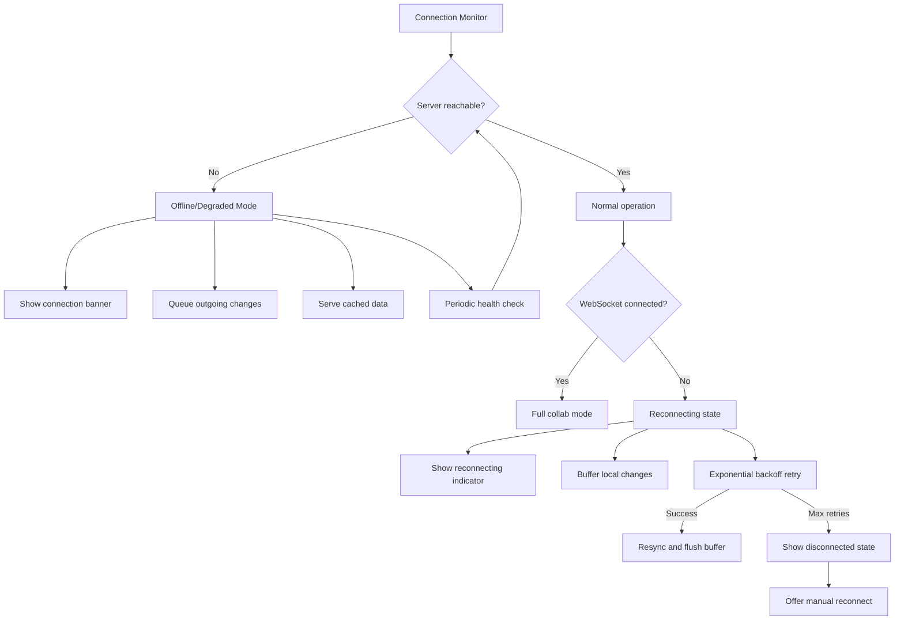
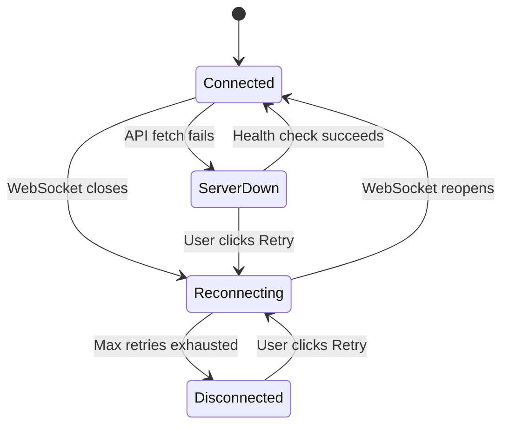

# Disconnect & Offline Handling Improvements

## Problem Analysis

### Current State

The project has **basic** reconnect logic in both the frontend and plugin WebSocket clients, but **no user-facing feedback** for most disconnect/offline scenarios and **no graceful degradation** when the server is unreachable.

#### What exists today:

| Component | What works | What's missing |
|-----------|-----------|----------------|
| **Frontend CollabClient** | 5-step exponential backoff reconnect (1s→16s), `_reconnect_failed` event after 5 attempts | No visual indicator during reconnect, no "Reconnecting..." banner, silent failure |
| **Frontend useCollab** | Sets `isConnected=false` on disconnect, `isJoined=false` on reconnect failure | No user notification, no reconnect progress UI, no "Connection lost" banner |
| **Frontend CollabPopover** | Green/orange dot for connected/disconnected | Only visible when popover is open; no persistent indicator |
| **Frontend Viewer** | Error page for failed drawing fetch | No retry button, no distinction between "not found" and "server down", no offline cached drawing fallback |
| **Frontend DrawingsBrowser** | Catches fetch errors | Shows raw error message, no retry, no offline state |
| **Plugin CollabClient** | Same 5-step reconnect as frontend | No Notice during reconnect attempts |
| **Plugin CollabManager** | `onConnectionChanged` callback, `onReconnectFailed` with persistent collab re-activation | No user feedback during reconnect, no status bar update |
| **Plugin main.ts** | Health check every 30s (collab), `catch` blocks with `new Notice()` for API errors | Health check silently ignores errors, no server reachability check on startup, no offline mode |
| **PWA Service Worker** | NetworkFirst caching for public API routes | Only caches successful responses, no offline fallback UI |

#### Key gaps:

1. **No "Connection Lost" banner** — When WebSocket disconnects during collab, users see nothing. The green dot in CollabPopover turns orange, but only if the popover is open.
2. **No "Reconnecting..." indicator** — During the 5-attempt reconnect cycle (up to ~31 seconds), users have zero feedback.
3. **No "Server Unreachable" state** — When the server is completely down, API fetches fail silently or show cryptic errors like "Failed to fetch".
4. **No retry for drawing load failures** — If a drawing fails to load (server down), the user sees an error page with no retry button.
5. **No offline drawing viewing** — PWA caches API responses but there's no UI to indicate "viewing cached version" or handle cache misses gracefully.
6. **Plugin publishes fail silently in some cases** — `requestUrl` throws on network errors, caught with generic `new Notice()`, but no retry or queue mechanism.
7. **No server health indicator in plugin** — The plugin has no way to show the user that the server is unreachable before they try to publish/sync.
8. **Collab edits lost on disconnect** — If the WebSocket disconnects and reconnect fails, any local edits made during the disconnected period are not queued or retried.

---

## Proposed Solution

### Architecture Overview



### 1. Frontend: Inline Toolbar Connection Status

Instead of a separate banner, the connection status is integrated directly into the **existing injected toolbar Island** in [`Viewer.tsx`](frontend/src/Viewer.tsx:730). This keeps the UI consistent and non-intrusive.

**States:**



**Where it appears — Frontend:**

The existing toolbar injection in [`Viewer.tsx`](frontend/src/Viewer.tsx:817) already shows a "Collaborative" badge (green dot + text on desktop, green dot on tablet) for persistent collab. The connection status replaces/augments this badge:

| State | Desktop toolbar badge | Tablet toolbar badge | Phone toolbar |
|-------|----------------------|---------------------|---------------|
| **Connected** | `🟢 Collaborative` (existing) | Green dot (existing) | 🤝 button with green dot (existing) |
| **Reconnecting** | `🟡 Reconnecting... 2/5` (pulsing yellow dot) | Pulsing yellow dot | 🤝 button with yellow dot |
| **Disconnected** | `🔴 Disconnected [↻]` (red dot + retry button) | Red dot + small ↻ | 🤝 button with red dot |
| **Offline** | `⚫ Offline` (gray dot) | Gray dot | 🤝 button with gray dot |

For **non-persistent collab sessions**, the same status appears next to the collab button (🤝) that's already injected on phone, or in the `CollabPopover` header on tablet/desktop.

**Implementation in [`Viewer.tsx`](frontend/src/Viewer.tsx:817):**
- Modify the persistent collab badge injection (lines 818-846) to be connection-state-aware
- When `collab.isJoined && !collab.isConnected`: replace "Collaborative" with "Reconnecting..." or "Disconnected"
- Add a small retry button (↻) next to the badge when disconnected
- The badge color changes: green → yellow (reconnecting) → red (disconnected) → gray (offline)
- On phone: the 🤝 button's dot color changes accordingly

**Implementation in [`useCollab.ts`](frontend/src/hooks/useCollab.ts:99):**
- Add new state: `reconnectState: 'idle' | 'reconnecting' | 'failed'`
- Add new state: `reconnectAttempt: number` (current attempt number)
- Expose these from the hook for the toolbar injection to consume
- On `_connected`: reset to `idle`
- On `_disconnected`: set to `reconnecting`
- On `_reconnect_failed`: set to `failed`

**Implementation in [`CollabClient`](frontend/src/utils/collabClient.ts:6):**
- Emit new event `_reconnecting` with attempt number: `{ attempt: number, maxAttempts: number }`
- Add `manualReconnect()` method that resets attempt counter and tries again
- Add infinite reconnect option for persistent collab (never give up, just slow down)

**Implementation in [`CollabPopover.tsx`](frontend/src/CollabPopover.tsx:155):**
- The existing green/orange dot already shows connection state
- Enhance: when disconnected, show "Reconnecting... (2/5)" text and a "Retry" button
- When fully disconnected: show "Disconnected" with "Reconnect" button

### 2. Frontend: Offline Drawing Viewing

When the server is unreachable but a drawing exists in the PWA cache or the LRU [`DrawingCache`](frontend/src/utils/cache.ts):

- **Cache hit**: Show the drawing with a "Viewing cached version" banner. Collab features disabled.
- **Cache miss**: Show a friendly "Server unreachable" page with a retry button and auto-retry every 10 seconds.

**Implementation in [`Viewer.tsx`](frontend/src/Viewer.tsx:98):**
- In [`fetchDrawing`](frontend/src/Viewer.tsx:98), distinguish between network errors (`TypeError: Failed to fetch`) and HTTP errors (404, 500)
- On network error: check [`drawingCache`](frontend/src/utils/cache.ts) for cached version
- If cached: show drawing + "offline" banner
- If not cached: show "Server unreachable" error with auto-retry
- Add `isOffline` state and `isCachedView` state

### 3. Frontend: DrawingsBrowser Offline State

**Implementation in [`DrawingsBrowser.tsx`](frontend/src/DrawingsBrowser.tsx):**
- On fetch error, distinguish network error vs server error
- Show "Server unreachable" message with retry button instead of raw error
- If previously loaded drawings exist in state, keep showing them with a "Data may be outdated" indicator
- Auto-retry every 30 seconds when in error state

### 4. Frontend: CollabClient Improvements

**Implementation in [`CollabClient`](frontend/src/utils/collabClient.ts:11):**

```
Current: RECONNECT_DELAYS = [1000, 2000, 4000, 8000, 16000]  (5 attempts, ~31s total)
```

**Changes:**
- Add `persistentMode` flag: when true, reconnect indefinitely with capped delay (max 30s between attempts)
- Emit `_reconnecting` event with `{ attempt, delay, maxAttempts }` payload
- Add `manualReconnect()` method
- Add `getReconnectState()` getter: `{ state: 'connected' | 'reconnecting' | 'disconnected', attempt: number }`
- Buffer outgoing `scene_update` messages during disconnect (up to 10 messages), flush on reconnect

### 5. Plugin: Server Health Check & Status Indicator

**New: Periodic server health check (independent of collab)**

The plugin should periodically check if the server is reachable and show the status in the toolbar and status bar.

**Implementation in [`main.ts`](obsidian-plugin/main.ts):**
- Add `serverReachable: boolean` state
- Add `checkServerHealth()` method: `GET /api/health` with 5s timeout
- Check on plugin load, then every 60 seconds
- Check before any API operation (publish, sync, collab start)
- Show status in status bar: "ExcaliShare: ✅ Connected" / "ExcaliShare: ❌ Server unreachable"

**Implementation in [`toolbar.ts`](obsidian-plugin/toolbar.ts):**
- Add `serverReachable` to `ToolbarState`
- When `serverReachable === false`:
  - Disable publish/sync/collab buttons (grayed out)
  - Show "Server unreachable" tooltip
  - Show small red indicator dot on the toolbar icon

### 6. Plugin: Publish/Sync Queue

When the server is unreachable, queue publish/sync operations and retry when the server comes back.

**Implementation in [`main.ts`](obsidian-plugin/main.ts):**
- Add `pendingOperations: Array<{ type: 'publish' | 'sync', file: TFile }>` queue
- When publish/sync fails due to network error:
  - Add to queue
  - Show Notice: "Server unreachable. Will retry when connection is restored."
- When server health check succeeds after being unreachable:
  - Process queued operations
  - Show Notice: "Server reconnected. Syncing N pending changes..."

### 7. Plugin: CollabManager Disconnect UX

**Implementation in [`collabManager.ts`](obsidian-plugin/collabManager.ts):**
- Add `onReconnecting` callback: `(attempt: number, maxAttempts: number) => void`
- Show Notice on first disconnect: "Connection to collab session lost. Reconnecting..."
- Show Notice on each retry: "Reconnecting to collab session... (attempt 2/5)"
- Show Notice on reconnect success: "Reconnected to collab session!"
- On reconnect failure for non-persistent sessions: "Collab session disconnected. Your local changes are preserved."

**Implementation in [`collabClient.ts`](obsidian-plugin/collabClient.ts:11):**
- Mirror frontend changes: `_reconnecting` event, `manualReconnect()`, persistent mode
- For persistent collab: use infinite reconnect with 30s max delay

### 8. Plugin: Toolbar Connection Status

The plugin toolbar already shows a participant count with a green/red dot at [`toolbar.ts`](obsidian-plugin/toolbar.ts:655). This should be extended to show reconnect state inline.

**Implementation in [`toolbar.ts`](obsidian-plugin/toolbar.ts):**
- Add `collabReconnectState` to `ToolbarState`: `'connected' | 'reconnecting' | 'disconnected' | null`
- Add `collabReconnectAttempt` to `ToolbarState`: `number`
- Modify the participant count header (line 655-678):
  - When `reconnecting`: yellow pulsing dot + "Reconnecting... (2/5)" replaces participant count text
  - When `disconnected`: red dot + "Disconnected" + small "↻ Retry" button
  - When `connected`: existing green dot + participant count (unchanged)
- Add `onManualReconnect` callback to `ToolbarCallbacks`
- When server is unreachable (`serverReachable === false`):
  - Disable publish/sync/collab start buttons (grayed out, `pointer-events: none`)
  - Show "Server unreachable" tooltip on disabled buttons
  - Status dot turns gray

### 9. Browser Online/Offline Detection (Frontend)

**Implementation in new `useOnlineStatus` hook:**
- Listen to `window.addEventListener('online', ...)` and `window.addEventListener('offline', ...)`
- Returns `isOnline: boolean`
- Used by [`Viewer.tsx`](frontend/src/Viewer.tsx) toolbar injection to show gray "Offline" badge
- Integrate with collab: when going offline, don't count reconnect attempts (pause reconnect timer)
- When back online: auto-trigger `manualReconnect()` if was in `failed` state

---

## Implementation Order

### Phase 1: Visual Feedback (highest impact, lowest risk)
1. Add `_reconnecting` event to frontend [`CollabClient`](frontend/src/utils/collabClient.ts:6)
2. Add `reconnectState`, `reconnectAttempt`, `manualReconnect` to [`useCollab`](frontend/src/hooks/useCollab.ts:99) hook
3. Modify toolbar injection in [`Viewer.tsx`](frontend/src/Viewer.tsx:817) to show connection status inline (replace "Collaborative" badge with state-aware badge)
4. Enhance [`CollabPopover.tsx`](frontend/src/CollabPopover.tsx:155) with reconnect state and retry button
5. Add `_reconnecting` event + `onReconnecting` callback to plugin [`CollabClient`](obsidian-plugin/collabClient.ts) and [`CollabManager`](obsidian-plugin/collabManager.ts)
6. Add reconnect Notices to plugin `CollabManager`
7. Update plugin [`toolbar.ts`](obsidian-plugin/toolbar.ts:655) with inline connection status indicator

### Phase 2: Offline Resilience
8. Improve error classification in Viewer [`fetchDrawing`](frontend/src/Viewer.tsx:98) (network vs HTTP error)
9. Add cached drawing fallback in Viewer (show cached + "offline" badge in toolbar)
10. Create `useOnlineStatus` hook for browser online/offline detection
11. Improve [`DrawingsBrowser.tsx`](frontend/src/DrawingsBrowser.tsx) error handling with retry
12. Add server health check to plugin [`main.ts`](obsidian-plugin/main.ts)

### Phase 3: Advanced Features
13. Add persistent reconnect mode for persistent collab sessions (infinite retry with 30s cap)
14. Add `manualReconnect()` to both CollabClients
15. Add publish/sync queue to plugin
16. Add outgoing message buffer to CollabClient during disconnect
17. Update plugin status bar with server health indicator

---

## Files to Modify

| File | Changes |
|------|---------|
| `frontend/src/utils/collabClient.ts` | `_reconnecting` event, `manualReconnect()`, persistent mode, message buffer |
| `frontend/src/hooks/useCollab.ts` | `reconnectState`, `reconnectAttempt` state, `manualReconnect`, expose to consumers |
| `frontend/src/Viewer.tsx` | Toolbar injection: connection-state-aware badge, offline detection, cached drawing fallback, error classification |
| `frontend/src/DrawingsBrowser.tsx` | Better error handling, retry button, stale data indicator |
| `frontend/src/CollabPopover.tsx` | Show reconnect state text, reconnect/retry button in header |
| `frontend/src/CollabStatus.tsx` | Show connection issues in pre-join state |
| `obsidian-plugin/collabClient.ts` | `_reconnecting` event, `manualReconnect()`, persistent mode |
| `obsidian-plugin/collabManager.ts` | `onReconnecting` callback, reconnect Notices |
| `obsidian-plugin/main.ts` | Server health check, publish queue, status bar updates |
| `obsidian-plugin/toolbar.ts` | Connection status indicator, server reachable state, disabled buttons |
| `obsidian-plugin/styles.ts` | Styles for disabled/offline states |

### New Files

| File | Purpose |
|------|---------|
| `frontend/src/hooks/useOnlineStatus.ts` | Browser online/offline detection hook |

---

## UX Mockups (Text)

### Frontend: Toolbar Island — Connection States (Desktop, >1400px)

The injected Island in the upper toolbar changes its badge based on connection state:

```
Connected:      [▶️] [🔒] [📂] | 🟢 Collaborative
Reconnecting:   [▶️] [🔒] [📂] | 🟡 Reconnecting 2/5
Disconnected:   [▶️] [🔒] [📂] | 🔴 Disconnected [↻]
Offline:        [▶️] [🔒] [📂] | ⚫ Offline
```

### Frontend: Toolbar Island — Connection States (Tablet, 988-1400px)

Compact: only a colored dot with tooltip

```
Connected:      [▶️] [🔒] [📂] | 🟢       (tooltip: Collaborative)
Reconnecting:   [▶️] [🔒] [📂] | 🟡       (tooltip: Reconnecting 2/5)
Disconnected:   [▶️] [🔒] [📂] | 🔴 [↻]   (tooltip: Disconnected - click to retry)
Offline:        [▶️] [🔒] [📂] | ⚫       (tooltip: Offline)
```

### Frontend: Toolbar Island — Connection States (Phone, ≤1140px)

The 🤝 collab button dot color changes:

```
Connected:      [▶️] [🔒] [📂] | [🤝•green]
Reconnecting:   [▶️] [🔒] [📂] | [🤝•yellow pulsing]
Disconnected:   [▶️] [🔒] [📂] | [🤝•red]
```

### Frontend: CollabPopover Header — Connection States

```
Connected:      🟢 Live Session          3 users
Reconnecting:   🟡 Reconnecting... 2/5   [Retry]
Disconnected:   🔴 Disconnected          [Reconnect]
```

### Frontend: Viewing Cached Drawing (server down, no collab)

When initial drawing fetch fails but cache exists, the toolbar badge shows:

```
Desktop:  [▶️] [🔒] [📂] | 📦 Cached · Server unreachable
Tablet:   [▶️] [🔒] [📂] | ⚫ (tooltip: Cached - server unreachable)
```

### Plugin: Toolbar Popover — Connection States

The participant count header in the popover panel changes:

```
Connected:      🟢 3 participants • Connected
Reconnecting:   🟡 Reconnecting... (2/5)
Disconnected:   🔴 Disconnected  [↻ Retry]
Server down:    ⚫ Server unreachable (publish/sync/collab buttons grayed out)
```

### Plugin: Status Bar

```
Normal:        ExcaliShare: ✅
Server down:   ExcaliShare: ❌ Server unreachable
Collab active: ExcaliShare: 🔴 Live · 3 users
Collab lost:   ExcaliShare: 🟡 Reconnecting...
```

---

## Edge Cases to Handle

1. **Server restarts during collab** — Session is lost (in-memory). Reconnect will fail because session ID no longer exists. Need to detect "session not found" error and show appropriate message vs generic "disconnected".

2. **Laptop sleep/wake** — WebSocket closes on sleep. On wake, `navigator.onLine` may be true but server may not be reachable yet. Need to handle the gap.

3. **Intermittent connectivity** — Rapid connect/disconnect cycles. Debounce the banner state changes to avoid flickering (e.g., don't show "reconnecting" if reconnect succeeds within 1 second).

4. **Persistent collab after server restart** — Server scans for persistent collab drawings on startup. Client should detect "session not found" and try to re-activate via `/api/persistent-collab/activate/{id}`.

5. **Multiple tabs** — If user has multiple browser tabs open, each has its own WebSocket. Reconnect behavior should be independent per tab.

6. **Plugin publish during offline** — Queue the operation, but warn the user that the drawing won't be available until the server is back.

7. **Stale cache** — Cached drawing may be outdated. Show "last updated" timestamp when viewing cached version.
