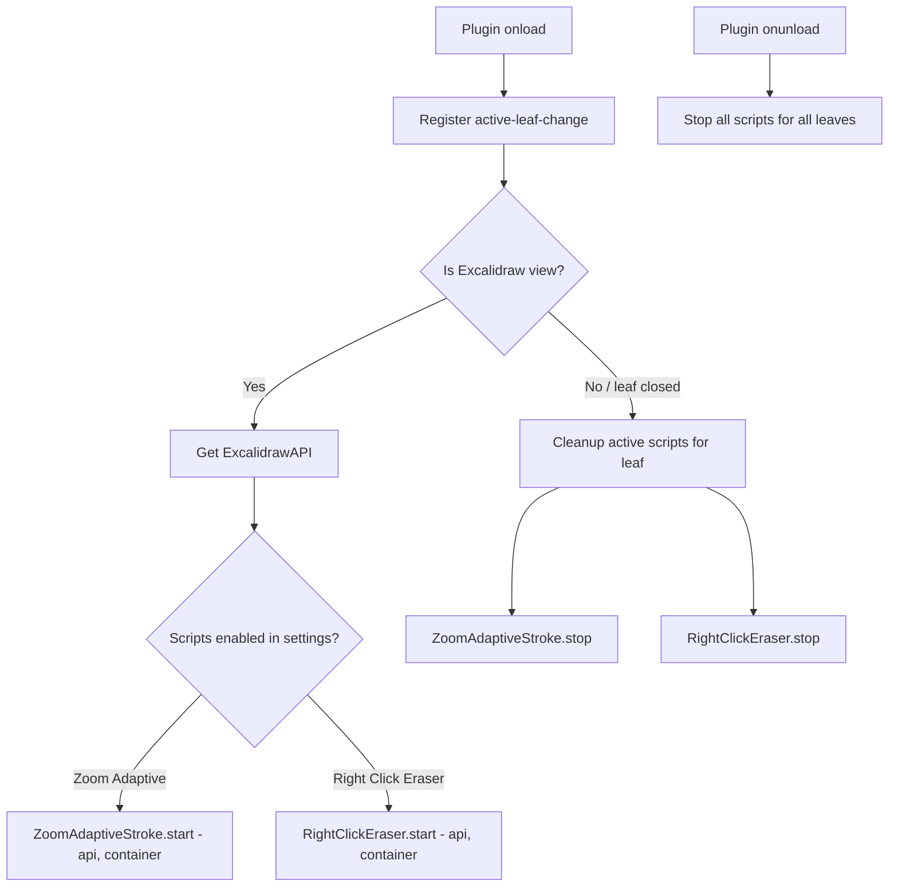

# Plan: Embed Excalidraw Scripts into ExcaliShare Plugin

## Goal

Integrate two Excalidraw scripts — **Zoom-Adaptive Stroke Width** and **Toggle Eraser on Right Click in Freedraw** — directly into the ExcaliShare Obsidian plugin so they activate automatically on every Excalidraw drawing without needing manual script files in the vault.

## Background

Currently these scripts live as `.md` files in the Excalidraw scripts folder and must be manually activated per drawing and copied to every new vault. By embedding them into the plugin, they run automatically whenever an Excalidraw view opens.

### Script 1: Zoom-Adaptive Stroke Width + No Smoothing
- Polls the Excalidraw API every N ms
- Adjusts `currentItemStrokeWidth` based on zoom level: `BASE_STROKE_WIDTH / zoom`
- Disables `currentItemStreamline` and `currentItemSmoothing` once
- Uses `ea.viewUpdateScene({ appState: {...} })` — which maps to `excalidrawAPI.updateScene({ appState: {...} })`

### Script 2: Toggle Eraser on Right Click in Freedraw
- Attaches pointer event listeners to the Excalidraw canvas container
- On right-click/S Pen button in freedraw mode: switches to eraser tool
- On release: restores freedraw tool
- Uses `api.setActiveTool({ type: ... })` and `api.getAppState()`
- Dispatches synthetic pointer events to start the eraser stroke

## Architecture

### Approach: New `excalidrawScripts.ts` Module

Create a dedicated module that encapsulates both scripts as classes with `start()`/`stop()` lifecycle methods. The plugin's [`handleLeafChange()`](obsidian-plugin/main.ts:641) method — which already fires on every Excalidraw view open — will activate/deactivate scripts per leaf.



### Key Design Decisions

1. **Per-leaf script instances** — Each Excalidraw leaf gets its own script instances, stored in a `Map<string, ScriptInstances>` keyed by leaf ID. This supports split views with multiple drawings open.

2. **Delayed API acquisition** — The Excalidraw API may not be ready when the leaf first opens. Use the same pattern as the toolbar injection: try immediately, then retry with a short delay. The scripts already handle missing API gracefully via try/catch.

3. **Reuse existing `ExcalidrawAPI` interface** — Extend [`ExcalidrawAPI`](obsidian-plugin/collabTypes.ts:94) with `setActiveTool` method. The `updateScene` method already supports `appState`.

4. **Settings-driven** — Each script and its parameters are controlled via plugin settings with sensible defaults.

## Detailed Changes

### 1. Settings (`obsidian-plugin/settings.ts`)

Add to [`ExcaliShareSettings`](obsidian-plugin/settings.ts:4) interface:

```typescript
// ── Excalidraw Scripts ──
/** Enable zoom-adaptive stroke width script */
enableZoomAdaptiveStroke: boolean;
/** Base stroke width at 100% zoom */
zoomAdaptiveBaseStrokeWidth: number;
/** Polling interval in ms for zoom detection */
zoomAdaptivePollIntervalMs: number;
/** Enable right-click eraser toggle in freedraw mode */
enableRightClickEraser: boolean;
```

Add to [`DEFAULT_SETTINGS`](obsidian-plugin/settings.ts:23):

```typescript
enableZoomAdaptiveStroke: true,
zoomAdaptiveBaseStrokeWidth: 0.6,
zoomAdaptivePollIntervalMs: 200,
enableRightClickEraser: true,
```

Add settings UI section in [`ExcaliShareSettingTab.display()`](obsidian-plugin/settings.ts:53):

```
── Excalidraw Scripts ──
[Toggle] Enable Zoom-Adaptive Stroke Width
  "Automatically adjusts stroke width based on zoom level and disables smoothing/streamline."
[Slider] Base Stroke Width (0.1 - 5.0, step 0.1, default 0.6)
[Slider] Poll Interval (50 - 1000 ms, step 50, default 200)
[Toggle] Enable Right-Click Eraser in Freedraw
  "Hold right mouse button or S Pen side button in freedraw mode to temporarily switch to eraser."
```

### 2. New Module (`obsidian-plugin/excalidrawScripts.ts`)

Two classes:

#### `ZoomAdaptiveStroke`
- **Constructor**: `(api: ExcalidrawAPI, settings: { baseStrokeWidth: number; pollIntervalMs: number })`
- **`start()`**: Sets up `setInterval` polling. On each tick:
  - Gets `appState.zoom.value`
  - If zoom changed: calls `api.updateScene({ appState: { currentItemStrokeWidth: base / zoom } })`
  - Once: sets `currentItemStreamline: 0, currentItemSmoothing: 0`
- **`stop()`**: Clears the interval
- **`updateSettings()`**: Updates base stroke width / poll interval without restart

#### `RightClickEraser`
- **Constructor**: `(api: ExcalidrawAPI, container: HTMLElement)`
- **`start()`**: Attaches `pointerdown`, `pointermove`, `pointerup`, `pointercancel`, `contextmenu` listeners to the container element using capture phase
- **`stop()`**: Removes all event listeners
- Logic is a direct port of the existing script, using `api.getAppState()` and `api.setActiveTool()`

#### `ExcalidrawScriptManager`
- Manages per-leaf script instances
- **`activateForLeaf(leafId, api, container, settings)`** — Creates and starts script instances
- **`deactivateForLeaf(leafId)`** — Stops and removes script instances
- **`deactivateAll()`** — Stops all instances across all leaves
- **`updateSettings(settings)`** — Propagates setting changes to running instances

### 3. Interface Extension (`obsidian-plugin/collabTypes.ts`)

Add to [`ExcalidrawAPI`](obsidian-plugin/collabTypes.ts:94):

```typescript
/** Set the active tool. Available on Excalidraw 0.17+ */
setActiveTool?: (tool: { type: string; [key: string]: unknown }) => void;
```

Also extend the [`ExcalidrawPlugin`](obsidian-plugin/main.ts:180) interface in `main.ts` to expose `setActiveTool` from `getExcalidrawAPI()`.

### 4. Plugin Integration (`obsidian-plugin/main.ts`)

#### New instance variable:
```typescript
private scriptManager: ExcalidrawScriptManager = new ExcalidrawScriptManager();
```

#### In [`handleLeafChange()`](obsidian-plugin/main.ts:641):

After the existing toolbar injection logic, when `viewType === 'excalidraw'`:

```typescript
// ── Excalidraw Scripts Activation ──
this.activateScriptsForLeaf(leafId, view.containerEl);
```

When `viewType !== 'excalidraw'` or leaf is cleaned up:

```typescript
this.scriptManager.deactivateForLeaf(leafId);
```

#### New private method `activateScriptsForLeaf()`:

```typescript
private activateScriptsForLeaf(leafId: string, containerEl: HTMLElement): void {
  // Skip if neither script is enabled
  if (!this.settings.enableZoomAdaptiveStroke && !this.settings.enableRightClickEraser) return;

  // Get the Excalidraw API (may need retry like toolbar injection)
  const excalidrawPlugin = this.getExcalidrawPlugin();
  if (!excalidrawPlugin?.ea) return;

  try {
    excalidrawPlugin.ea.setView('active');
    const api = excalidrawPlugin.ea.getExcalidrawAPI();
    if (!api) return;

    const container = containerEl.querySelector('.excalidraw') 
      || containerEl.querySelector('.excalidraw-wrapper')
      || containerEl.querySelector('[class*="excalidraw"]')
      || containerEl;

    this.scriptManager.activateForLeaf(leafId, api, container as HTMLElement, {
      enableZoomAdaptive: this.settings.enableZoomAdaptiveStroke,
      baseStrokeWidth: this.settings.zoomAdaptiveBaseStrokeWidth,
      pollIntervalMs: this.settings.zoomAdaptivePollIntervalMs,
      enableRightClickEraser: this.settings.enableRightClickEraser,
    });
  } catch (e) {
    console.error('ExcaliShare: Failed to activate scripts', e);
  }
}
```

#### In [`onunload()`](obsidian-plugin/main.ts:561):

```typescript
// Stop all Excalidraw scripts
this.scriptManager.deactivateAll();
```

### 5. API Acquisition Timing

The Excalidraw API may not be immediately available when a leaf opens. The scripts need the API to function. Two strategies:

1. **Retry with delay** — If `getExcalidrawAPI()` returns null, retry after 500ms, 1s, 2s (exponential backoff). This mirrors the existing toolbar injection pattern.

2. **Lazy start for ZoomAdaptiveStroke** — The polling script already handles missing API gracefully (try/catch in the interval). So it can start immediately and will self-heal when the API becomes available.

3. **Delayed start for RightClickEraser** — This script needs the container element to be in the DOM. Use the same MutationObserver pattern as toolbar injection to wait for `.excalidraw-wrapper`.

## File Summary

| File | Change |
|------|--------|
| [`obsidian-plugin/settings.ts`](obsidian-plugin/settings.ts) | Add 4 new settings + UI section |
| `obsidian-plugin/excalidrawScripts.ts` | **New file** — ZoomAdaptiveStroke, RightClickEraser, ExcalidrawScriptManager |
| [`obsidian-plugin/collabTypes.ts`](obsidian-plugin/collabTypes.ts) | Add `setActiveTool` to ExcalidrawAPI interface |
| [`obsidian-plugin/main.ts`](obsidian-plugin/main.ts) | Add scriptManager, activateScriptsForLeaf(), cleanup in onunload/handleLeafChange |

## Risk Assessment

- **API compatibility**: `setActiveTool` and `updateScene({ appState })` are available in Excalidraw 0.17+. The plugin already targets this version. Add optional chaining for safety.
- **Performance**: The zoom polling at 200ms is lightweight (just reads appState.zoom). The eraser script only adds passive event listeners.
- **Collab interaction**: During active collab sessions, the zoom-adaptive stroke width changes are local-only (appState is not synced). No conflict expected.
- **Multiple views**: Per-leaf tracking ensures split views work correctly with independent script instances.
