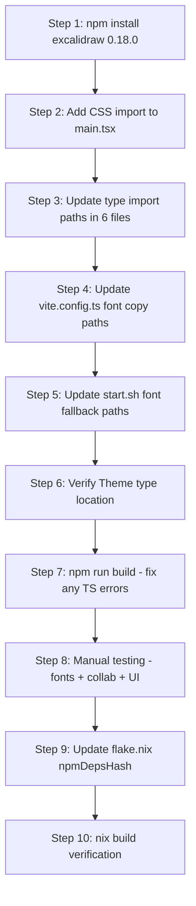

# Plan: Upgrade Excalidraw from 0.17.6 to 0.18.0

## Context & Problem Discovery

During the font embedding investigation, we discovered the **real root cause** of the ugly default font rendering:

### Font Family ID Mismatch

The **Obsidian Excalidraw plugin** (by zsviczian) uses `@zsviczian/excalidraw` fork internally (currently at `0.18.0-70`), which has **new font families**:

| ID | 0.17.6 Font | 0.18.0 Font |
|----|-------------|-------------|
| 1 | Virgil (hand-drawn) | Virgil (legacy) |
| 2 | Helvetica (normal) | Helvetica (legacy) |
| 3 | Cascadia (code) | Cascadia (legacy) |
| 4 | Assistant | Assistant (legacy) |
| **5** | ❌ **Unknown** | **Excalifont** (new hand-drawn) |
| 6 | ❌ Unknown | Nunito (new normal) |
| 7 | ❌ Unknown | Comic Shanns (new code) |
| 8 | ❌ Unknown | Liberation Sans (new normal) |

Drawings published from Obsidian use `fontFamily: 5` (Excalifont), but our frontend's Excalidraw 0.17.6 doesn't recognize ID 5 and falls back to the browser default font.

### What We Already Fixed (Font Self-Hosting)

We already implemented font self-hosting for 0.17.6:
- Added `vite-plugin-static-copy` to copy `.woff2` fonts to `dist/excalidraw-assets/` and `dist/`
- Updated `flake.nix` with new `npmDepsHash`
- Updated `start.sh` with fallback font copy
- Fonts load correctly (200 OK) — but the wrong font is rendered because of the ID mismatch

---

## Research Findings

### 1. Excalidraw 0.18.0 Breaking Changes (Confirmed)

From the [CHANGELOG](https://github.com/excalidraw/excalidraw/blob/master/packages/excalidraw/CHANGELOG.md) and [releases page](https://github.com/excalidraw/excalidraw/releases):

#### Breaking Change 1: UMD → ESM Bundle (#7441, #9127)
- The package no longer ships UMD bundles
- New `dist` folder contains only bundled ESM source files
- All dependencies are tree-shakable
- **Impact on us**: Minimal — we already use Vite with ESM imports. No UMD usage.

#### Breaking Change 2: Deprecated `excalidraw-assets` and `excalidraw-assets-dev` folders (#8012, #9127)
- Old: `dist/excalidraw-assets-dev/*.woff2`
- New: `dist/prod/fonts/*.woff2`
- **Impact on us**: Must update `vite.config.ts` font copy paths and `start.sh` fallback paths

#### Breaking Change 3: New CSS Import Required
- Must add `import '@excalidraw/excalidraw/index.css'` in the entry point
- In 0.17.6, styles were bundled automatically
- **Impact on us**: Must add CSS import to [`main.tsx`](../frontend/src/main.tsx) or [`Viewer.tsx`](../frontend/src/Viewer.tsx)

#### Breaking Change 4: Type Import Paths Changed
Old → New mapping:
| Old Path | New Path |
|----------|----------|
| `@excalidraw/excalidraw/types/element/types` | `@excalidraw/excalidraw/element/types` |
| `@excalidraw/excalidraw/types/types` | `@excalidraw/excalidraw/types` |
| `@excalidraw/excalidraw/types/data/types` | `@excalidraw/excalidraw/data/types` |
| `@excalidraw/excalidraw/types/utility-types` | `@excalidraw/excalidraw/common/utility-types` |

Drop the `.js` extension. These are `import type` only paths.

**Impact on us**: Must update 6 files (see File-by-File Changes below)

#### Breaking Change 5: New Font Families
- Excalifont (ID 5), Nunito (ID 6), Comic Shanns (ID 7), Liberation Sans (ID 8) are new defaults
- Old fonts (Virgil, Helvetica, Cascadia, Assistant) are still supported as legacy (IDs 1-4)
- **Impact on us**: This is the **primary reason** for the upgrade — fixes the font rendering issue

### 2. What Did NOT Change (Confirmed Still Working in 0.18.0)

Based on Context7 docs and release notes analysis:

| API | Status | Notes |
|-----|--------|-------|
| `excalidrawAPI` prop | ✅ Still works in 0.18.0 | Renamed to `onExcalidrawAPI` only in **unreleased** (post-0.18.0) |
| `LiveCollaborationTrigger` | ✅ Still exported | Same API, same usage pattern |
| `updateScene` | ✅ Same signature | `{ elements, collaborators, appState }` |
| `getSceneElements` / `getAppState` | ✅ Still available | Same API object methods |
| `getSceneElementsIncludingDeleted` | ✅ Still available | Used in our merge logic |
| `onChange` callback | ✅ Same signature | `(elements, appState, files)` |
| `onPointerUpdate` callback | ✅ Same signature | `{ pointer, button, pointersMap }` |
| `viewModeEnabled` / `zenModeEnabled` | ✅ Still supported | Same props |
| `isCollaborating` | ✅ Still supported | Same prop |
| `UIOptions.canvasActions` | ✅ Same structure | Same config object |
| `theme` prop | ✅ Same | `'light'` or `'dark'` |
| `initialData` | ✅ Same | `{ elements, appState, files }` |
| `renderTopRightUI` | ✅ Same | Render callback |
| `window.EXCALIDRAW_ASSET_PATH` | ✅ Still used | Same mechanism for font self-hosting |

### 3. React Compatibility (Confirmed)

- **0.18.0 peer dependencies**: `react: ^17.0.2 || ^18.2.0`, `react-dom: ^17.0.2 || ^18.2.0`
- **Our React version**: `^18.3.1`
- ✅ **Fully compatible** — no React upgrade needed
- The `.npmrc` `legacy-peer-deps=true` should still be kept for any transitive dependency conflicts

### 4. Obsidian Plugin Compatibility (Confirmed)

- The Obsidian Excalidraw plugin by zsviczian uses `@zsviczian/excalidraw` (a fork), currently at **0.18.0-70**
- This fork tracks the official 0.18.x branch closely and uses the same font family IDs (5-8)
- Upgrading our frontend to official `@excalidraw/excalidraw@0.18.0` will ensure full font compatibility
- No custom font IDs beyond the standard 1-8 range

### 5. Font Self-Hosting in 0.18.0

- Font files moved from `dist/excalidraw-assets-dev/` to `dist/prod/fonts/`
- `window.EXCALIDRAW_ASSET_PATH` still works the same way
- New font files include both legacy (Virgil, Cascadia, Assistant) and new (Excalifont, Nunito, Comic Shanns, Liberation Sans)
- CDN default: `https://esm.run/@excalidraw/excalidraw/dist/prod`

---

## Implementation Plan

### Phase 1: Package Upgrade

#### Step 1.1: Update [`frontend/package.json`](../frontend/package.json)

```diff
-    "@excalidraw/excalidraw": "^0.17.6",
+    "@excalidraw/excalidraw": "^0.18.0",
```

Then run `npm install` (with `legacy-peer-deps=true` from `.npmrc`).

#### Step 1.2: Update [`frontend/package-lock.json`](../frontend/package-lock.json)

Auto-generated by `npm install`.

### Phase 2: CSS Import

#### Step 2.1: Add CSS import to [`frontend/src/main.tsx`](../frontend/src/main.tsx)

```diff
 import React from 'react'
 import ReactDOM from 'react-dom/client'
 import App from './App'
+import '@excalidraw/excalidraw/index.css'
 import './index.css'
 import { registerSW } from 'virtual:pwa-register'
```

**Note**: The Excalidraw CSS must be imported **before** our custom `index.css` so our overrides take precedence.

### Phase 3: Type Import Path Migration

Update all 6 files that import from `@excalidraw/excalidraw/types/...`:

#### Step 3.1: [`frontend/src/types/index.ts`](../frontend/src/types/index.ts) (line 1-2)

```diff
-import type { AppState, BinaryFiles } from '@excalidraw/excalidraw/types/types'
-import type { ExcalidrawElement } from '@excalidraw/excalidraw/types/element/types'
+import type { AppState, BinaryFiles } from '@excalidraw/excalidraw/types'
+import type { ExcalidrawElement } from '@excalidraw/excalidraw/element/types'
```

#### Step 3.2: [`frontend/src/Viewer.tsx`](../frontend/src/Viewer.tsx) (line 4)

```diff
-import type { Theme, ExcalidrawElement } from '@excalidraw/excalidraw/types/element/types'
+import type { Theme, ExcalidrawElement } from '@excalidraw/excalidraw/element/types'
```

**Note**: Verify that `Theme` is still exported from `element/types`. If not, it may have moved to `@excalidraw/excalidraw/types`. Check after install.

#### Step 3.3: [`frontend/src/hooks/useCollab.ts`](../frontend/src/hooks/useCollab.ts) (lines 8-9)

```diff
-import type { ExcalidrawElement } from '@excalidraw/excalidraw/types/element/types';
-import type { Collaborator, UserIdleState } from '@excalidraw/excalidraw/types/types';
+import type { ExcalidrawElement } from '@excalidraw/excalidraw/element/types';
+import type { Collaborator, UserIdleState } from '@excalidraw/excalidraw/types';
```

#### Step 3.4: [`frontend/src/PasswordDialog.tsx`](../frontend/src/PasswordDialog.tsx) (line 2)

```diff
-import type { Theme } from '@excalidraw/excalidraw/types/element/types';
+import type { Theme } from '@excalidraw/excalidraw/element/types';
```

#### Step 3.5: [`frontend/src/CollabPopover.tsx`](../frontend/src/CollabPopover.tsx) (line 2)

```diff
-import type { Theme } from '@excalidraw/excalidraw/types/element/types';
+import type { Theme } from '@excalidraw/excalidraw/element/types';
```

#### Step 3.6: [`frontend/src/CollabStatus.tsx`](../frontend/src/CollabStatus.tsx) (line 2)

```diff
-import type { Theme } from '@excalidraw/excalidraw/types/element/types';
+import type { Theme } from '@excalidraw/excalidraw/element/types';
```

### Phase 4: Font Self-Hosting Path Update

#### Step 4.1: Update [`frontend/vite.config.ts`](../frontend/vite.config.ts)

```diff
     viteStaticCopy({
       targets: [
         {
-          // Excalidraw 0.17.6 loads fonts from two paths:
-          // 1. Webpack chunks: {ASSET_PATH}/excalidraw-assets/Virgil.woff2
-          // 2. CSS @font-face (SVG export): {ASSET_PATH}/Virgil.woff2
-          // Copy to excalidraw-assets/ for webpack chunk loading (canvas rendering)
-          src: 'node_modules/@excalidraw/excalidraw/dist/excalidraw-assets-dev/*.woff2',
-          dest: 'excalidraw-assets'
-        },
-        {
-          // Copy to root for CSS @font-face loading (SVG export)
-          src: 'node_modules/@excalidraw/excalidraw/dist/excalidraw-assets-dev/*.woff2',
-          dest: '.'
+          // Excalidraw 0.18.0 loads fonts from {ASSET_PATH}/
+          // Copy all font files from dist/prod/fonts/ to the root of dist/
+          src: 'node_modules/@excalidraw/excalidraw/dist/prod/fonts/*',
+          dest: '.'
         }
       ]
     }),
```

Also update the PWA workbox `globIgnores`:

```diff
-        globIgnores: ['excalidraw-assets/**', '*.woff2'],
+        globIgnores: ['*.woff2'],
```

#### Step 4.2: Update [`start.sh`](../start.sh) (font fallback section)

```diff
-	if [ -d "$PROJECT_ROOT/frontend/node_modules/@excalidraw/excalidraw/dist/excalidraw-assets-dev" ]; then
-		if [ ! -f "$FRONTEND_DIR/excalidraw-assets/Virgil.woff2" ]; then
+	if [ -d "$PROJECT_ROOT/frontend/node_modules/@excalidraw/excalidraw/dist/prod/fonts" ]; then
+		# Check for any of the new 0.18.0 font files
+		if [ ! -f "$FRONTEND_DIR/Excalifont-Regular.woff2" ] && [ ! -f "$FRONTEND_DIR/Virgil.woff2" ]; then
 			log_info "Copying Excalidraw font assets to frontend dist..."
-			mkdir -p "$FRONTEND_DIR/excalidraw-assets"
-			cp "$PROJECT_ROOT/frontend/node_modules/@excalidraw/excalidraw/dist/excalidraw-assets-dev/"*.woff2 "$FRONTEND_DIR/excalidraw-assets/" 2>/dev/null || true
-			cp "$PROJECT_ROOT/frontend/node_modules/@excalidraw/excalidraw/dist/excalidraw-assets-dev/"*.woff2 "$FRONTEND_DIR/" 2>/dev/null || true
+			cp "$PROJECT_ROOT/frontend/node_modules/@excalidraw/excalidraw/dist/prod/fonts/"* "$FRONTEND_DIR/" 2>/dev/null || true
 		fi
 	fi
```

### Phase 5: Nix Build Update

#### Step 5.1: Update [`flake.nix`](../flake.nix)

After running `npm install` with the new package, the `npmDepsHash` will change:

```diff
-            npmDepsHash = "sha256-JU4ZSOpcurTMGIa0gSGpLDgs9oqumTFoR1SFVmDP8w4=";
+            npmDepsHash = "sha256-XXXXXXXXXXXXXXXXXXXXXXXXXXXXXXXXXXXXXXXXXXXXXXX=";
```

To get the new hash:
1. Set `npmDepsHash = ""` temporarily
2. Run `nix build` — it will fail and print the correct hash
3. Replace with the correct hash

### Phase 6: Verify & Clean Up

#### Step 6.1: Remove old font references

Check if any CSS in [`frontend/index.html`](../frontend/index.html) references old font class names (`.excalidraw-assets`). Currently it doesn't, so no changes needed.

#### Step 6.2: Remove the interim font mapping (if applied)

If the quick-fix font mapping from the original plan was applied, remove it — 0.18.0 natively supports font IDs 5-8.

---

## Summary: Files to Modify

| # | File | Changes |
|---|------|---------|
| 1 | [`frontend/package.json`](../frontend/package.json) | Bump `@excalidraw/excalidraw` to `^0.18.0` |
| 2 | [`frontend/src/main.tsx`](../frontend/src/main.tsx) | Add `import '@excalidraw/excalidraw/index.css'` |
| 3 | [`frontend/src/types/index.ts`](../frontend/src/types/index.ts) | Update type import paths |
| 4 | [`frontend/src/Viewer.tsx`](../frontend/src/Viewer.tsx) | Update type import paths |
| 5 | [`frontend/src/hooks/useCollab.ts`](../frontend/src/hooks/useCollab.ts) | Update type import paths |
| 6 | [`frontend/src/PasswordDialog.tsx`](../frontend/src/PasswordDialog.tsx) | Update type import paths |
| 7 | [`frontend/src/CollabPopover.tsx`](../frontend/src/CollabPopover.tsx) | Update type import paths |
| 8 | [`frontend/src/CollabStatus.tsx`](../frontend/src/CollabStatus.tsx) | Update type import paths |
| 9 | [`frontend/vite.config.ts`](../frontend/vite.config.ts) | Update font copy paths from `excalidraw-assets-dev` to `dist/prod/fonts` |
| 10 | [`start.sh`](../start.sh) | Update font fallback copy paths |
| 11 | [`flake.nix`](../flake.nix) | Update `npmDepsHash` after npm install |
| 12 | `frontend/package-lock.json` | Auto-generated by npm install |

**Files that do NOT need changes:**
- [`frontend/index.html`](../frontend/index.html) — no Excalidraw-specific references
- [`frontend/.npmrc`](../frontend/.npmrc) — `legacy-peer-deps=true` still needed
- [`frontend/tsconfig.json`](../frontend/tsconfig.json) — `moduleResolution: "bundler"` already handles the new export maps
- [`frontend/src/App.tsx`](../frontend/src/App.tsx) — no Excalidraw imports
- [`frontend/src/DrawingsBrowser.tsx`](../frontend/src/DrawingsBrowser.tsx) — no Excalidraw imports
- [`frontend/src/AdminPage.tsx`](../frontend/src/AdminPage.tsx) — no Excalidraw imports
- [`frontend/src/utils/cache.ts`](../frontend/src/utils/cache.ts) — no Excalidraw imports
- [`frontend/src/utils/collabClient.ts`](../frontend/src/utils/collabClient.ts) — no Excalidraw imports
- Backend files — no changes needed
- Obsidian plugin files — no changes needed (uses its own `@zsviczian/excalidraw` fork)

---

## Risk Assessment

### Low Risk ✅
- **Type import path changes** — Mechanical find-and-replace, well-documented migration path
- **CSS import** — Simple addition, well-documented requirement
- **Font path changes** — Clear old→new mapping, `EXCALIDRAW_ASSET_PATH` still works
- **React compatibility** — React 18.3.1 is within the peer dependency range

### Medium Risk ⚠️
- **`Theme` type location** — Need to verify `Theme` is still exported from `element/types` in 0.18.0. If moved, may need to import from `@excalidraw/excalidraw/types` instead.
- **`Collaborator` and `UserIdleState` types** — Need to verify these are still exported from the new `@excalidraw/excalidraw/types` path.
- **CSS conflicts** — The new `index.css` import may conflict with our custom styles in `index.html` (`.excalidraw`, `.Island`, `.App-toolbar` overrides). Need to test visually.
- **Nix build** — `npmDepsHash` change is routine but requires a build cycle to get the correct hash.

### Low-Medium Risk
- **`vite-plugin-static-copy` glob pattern** — The new path `dist/prod/fonts/*` may include non-font files. Need to verify the directory only contains font files, or use `*.woff2` glob.

### No Risk ✅
- **`excalidrawAPI` prop** — NOT renamed in 0.18.0 (only in unreleased/post-0.18.0)
- **`LiveCollaborationTrigger`** — Still exported, same API
- **`updateScene` / `getSceneElements` / `getAppState`** — Same signatures
- **`onChange` / `onPointerUpdate`** — Same signatures
- **`viewModeEnabled` / `zenModeEnabled` / `isCollaborating`** — Same props

---

## Testing Checklist

### Build & Startup
- [ ] `cd frontend && npm install` succeeds
- [ ] `cd frontend && npm run build` succeeds (TypeScript + Vite)
- [ ] `nix build` succeeds with updated `npmDepsHash`
- [ ] `./start.sh` starts successfully

### Font Rendering
- [ ] Drawings with `fontFamily: 1` (Virgil/legacy) render correctly
- [ ] Drawings with `fontFamily: 5` (Excalifont) render correctly — **this is the main fix**
- [ ] Drawings with `fontFamily: 6` (Nunito) render correctly
- [ ] Drawings with `fontFamily: 7` (Comic Shanns) render correctly
- [ ] Font files load with 200 OK (check Network tab)
- [ ] No font loading errors in console

### Core Viewer Functionality
- [ ] View mode works (read-only, zen mode)
- [ ] Edit mode works (press `w` twice)
- [ ] Present mode works (press `p`/`q`)
- [ ] Theme toggle works (light/dark)
- [ ] Drawing loads from server correctly
- [ ] Password-protected drawings work

### Collaboration
- [ ] Collab status banner appears when session is active
- [ ] Join collab session works
- [ ] Real-time element sync works
- [ ] Cursor/pointer display works
- [ ] Follow mode works
- [ ] `LiveCollaborationTrigger` button renders
- [ ] Collab popover shows participants
- [ ] Session end notification works

### UI/Styling
- [ ] Excalidraw toolbar renders correctly (not broken by CSS import)
- [ ] Mobile layout works (toolbar injection)
- [ ] Custom CSS overrides in `index.html` still apply
- [ ] PWA still works (service worker, offline)

### Browse & Admin
- [ ] DrawingsBrowser works
- [ ] Admin panel works

---

## Quick Fix Option (Interim — NOT Recommended)

Since the upgrade is **low complexity** (mostly mechanical import path changes), the full upgrade is recommended over the interim font mapping fix. The upgrade directly solves the root cause.

However, if the upgrade needs to be deferred, the interim fix from the original plan can be applied in [`Viewer.tsx`](../frontend/src/Viewer.tsx):

```typescript
// Map new Excalidraw 0.18.x font IDs to 0.17.6 equivalents
const mapFontFamily = (elements: ExcalidrawElement[]) =>
  elements.map(el => {
    if ('fontFamily' in el) {
      const fontMap: Record<number, number> = {
        5: 1, // Excalifont → Virgil (hand-drawn)
        6: 2, // Nunito → Helvetica (normal)
        7: 3, // Comic Shanns → Cascadia (code)
        8: 2, // Liberation Sans → Helvetica (normal)
      };
      return fontMap[el.fontFamily]
        ? { ...el, fontFamily: fontMap[el.fontFamily] }
        : el;
    }
    return el;
  });
```

**Recommendation**: Skip the interim fix and proceed directly with the 0.18.0 upgrade.

---

## Execution Order


