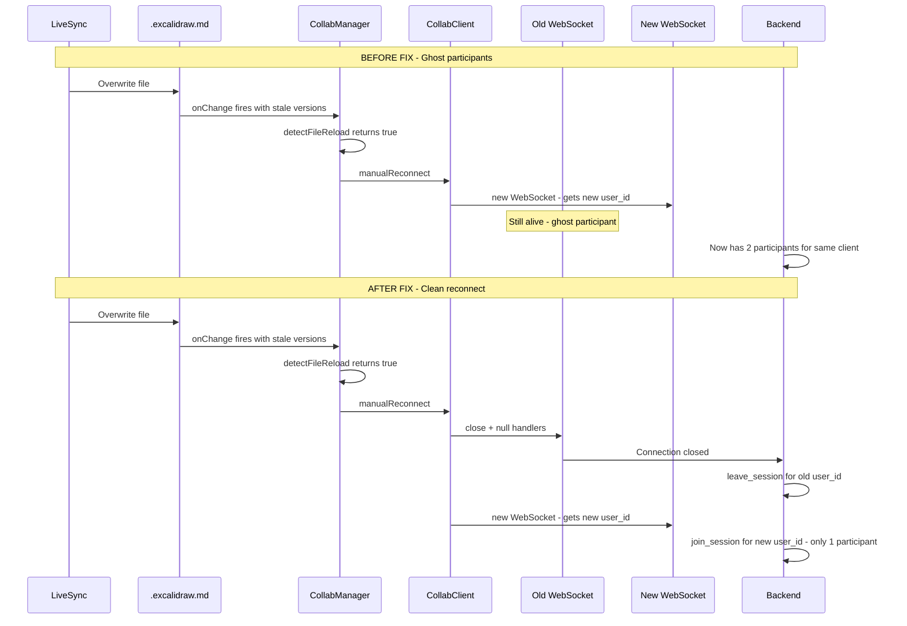

# Plan: External File Change Detection — Disable by Default + Fix Duplicate Participants Bug

## Summary

Two changes:
1. **Disable the "External changes detected" feature by default** and make it configurable in settings under "Live Collaboration" (advanced)
2. **Fix the duplicate participants bug** caused by `manualReconnect()` not closing the old WebSocket before opening a new one

---

## Problem Analysis

### Feature: External File Change Detection

The `detectFileReload()` method in `collabManager.ts` (line 854) detects when an external tool (e.g., LiveSync) overwrites the `.excalidraw.md` file during an active collab session. When >30% of tracked elements have regressed versions, it triggers `handleFileReloadDuringCollab()` (line 892) which:
1. Shows a Notice: *"ExcaliShare: External file change detected. Restoring collab state..."*
2. Calls `client.manualReconnect()` to get a fresh snapshot from the server

This feature should be **disabled by default** because:
- It's only relevant when using LiveSync or similar file-sync plugins alongside collab
- It can cause false positives and disruptive reconnects
- The reconnect itself has a bug (see below)

### Bug: Duplicate Participants on Reconnect

When `manualReconnect()` is called, it calls `_connect()` which creates a **new** WebSocket at line 116 of `collabClient.ts`:
```typescript
this.ws = new WebSocket(url);  // Old WS reference is overwritten, NOT closed
```

The old WebSocket connection is never explicitly closed. On the server side (`ws.rs` line 123), each new WebSocket connection generates a **new** `user_id` via `Uuid::new_v4()`. The server's `leave_session()` (line 277) is only called when the WS connection actually closes — but the orphaned old connection stays alive until TCP timeout.

**Result**: Each `manualReconnect()` call creates a new ghost participant. If `detectFileReload()` triggers repeatedly (e.g., LiveSync writing multiple times), many duplicate participants accumulate.

This bug exists in **both** `CollabClient` implementations:
- `obsidian-plugin/collabClient.ts` — `_connect()` at line 102
- `frontend/src/utils/collabClient.ts` — `_connect()` at line 125

---

## Implementation Plan

### 1. Add Setting: `detectExternalFileChanges`

**File: `obsidian-plugin/settings.ts`**

Add to `ExcaliShareSettings` interface:
```typescript
/** Detect external file changes (e.g., from LiveSync) during collab and auto-restore from server.
 *  Enable this if you use file-sync plugins alongside live collaboration. */
detectExternalFileChanges: boolean;
```

Add to `DEFAULT_SETTINGS`:
```typescript
detectExternalFileChanges: false,
```

Add toggle in the "Live Collaboration" section (after "Pause LiveSync during collab"):
```typescript
new Setting(containerEl)
  .setName('Detect external file changes')
  .setDesc('Detect when external tools (e.g., LiveSync) overwrite the drawing file during a collab session and automatically restore the authoritative state from the server. Only needed if you use file-sync plugins alongside live collaboration.')
  .addToggle(toggle => {
    toggle.setValue(this.pluginRef.settings.detectExternalFileChanges)
      .onChange(value => {
        this.pluginRef.settings.detectExternalFileChanges = value;
        this.pluginRef.saveSettings();
      });
  });
```

### 2. Guard `detectFileReload()` with the Setting

**File: `obsidian-plugin/collabManager.ts`**

The `CollabManager` needs access to the setting. It already receives callbacks from `main.ts` — we need to pass the setting value. The simplest approach: add a `getSettings` callback or check the setting at the call site.

In `handleLocalSceneChange()` (line 924-928), wrap the detection:
```typescript
// Detect file reload from external sync (e.g., LiveSync overwrote the file)
// This must be checked BEFORE version tracking is updated
if (this.detectExternalFileChanges && this.detectFileReload(elements)) {
  this.handleFileReloadDuringCollab();
  return;
}
```

The `detectExternalFileChanges` property should be set on `CollabManager` from `main.ts` when creating/configuring it, reading from `this.settings.detectExternalFileChanges`.

### 3. Fix: Close Old WebSocket Before Creating New One

**File: `obsidian-plugin/collabClient.ts`** — `_connect()` method (line 102):

Add at the beginning of `_connect()`:
```typescript
private _connect(): void {
  // Close any existing WebSocket to prevent ghost participants on the server.
  // The old connection would stay alive until TCP timeout, causing duplicate
  // participants because each new WS connection gets a new user_id.
  if (this.ws) {
    // Remove event handlers to prevent onclose from triggering reconnect
    this.ws.onopen = null;
    this.ws.onmessage = null;
    this.ws.onclose = null;
    this.ws.onerror = null;
    try {
      this.ws.close();
    } catch (_) {
      // Ignore errors on close (e.g., already closed)
    }
    this.ws = null;
  }

  // ... rest of _connect()
}
```

**File: `frontend/src/utils/collabClient.ts`** — `_connect()` method (line 125):

Same fix — add the same cleanup block at the beginning of `_connect()`.

**Why null the event handlers first?** Because calling `ws.close()` triggers the `onclose` handler, which would call `_scheduleReconnect()` and emit `_disconnected` — causing unwanted side effects during a deliberate reconnect.

---

## Architecture Diagram



---

## Files to Modify

| File | Change |
|------|--------|
| `obsidian-plugin/settings.ts` | Add `detectExternalFileChanges` to interface + defaults + settings UI |
| `obsidian-plugin/collabManager.ts` | Add `detectExternalFileChanges` property; guard `detectFileReload()` call |
| `obsidian-plugin/main.ts` | Pass `detectExternalFileChanges` setting to `CollabManager` |
| `obsidian-plugin/collabClient.ts` | Close old WS in `_connect()` before creating new one |
| `frontend/src/utils/collabClient.ts` | Close old WS in `_connect()` before creating new one |
| `AGENTS.md` | Document new setting and bug fix |

---

## Risk Assessment

- **Low risk**: The setting change is purely additive — default `false` means the feature is off unless explicitly enabled
- **Low risk**: The WS cleanup fix is defensive — it only adds a `close()` call before creating a new connection, which is the correct behavior
- **Edge case**: If `ws.close()` is slow, the new connection might briefly overlap. This is acceptable because the server will clean up the old participant when the close frame arrives.
