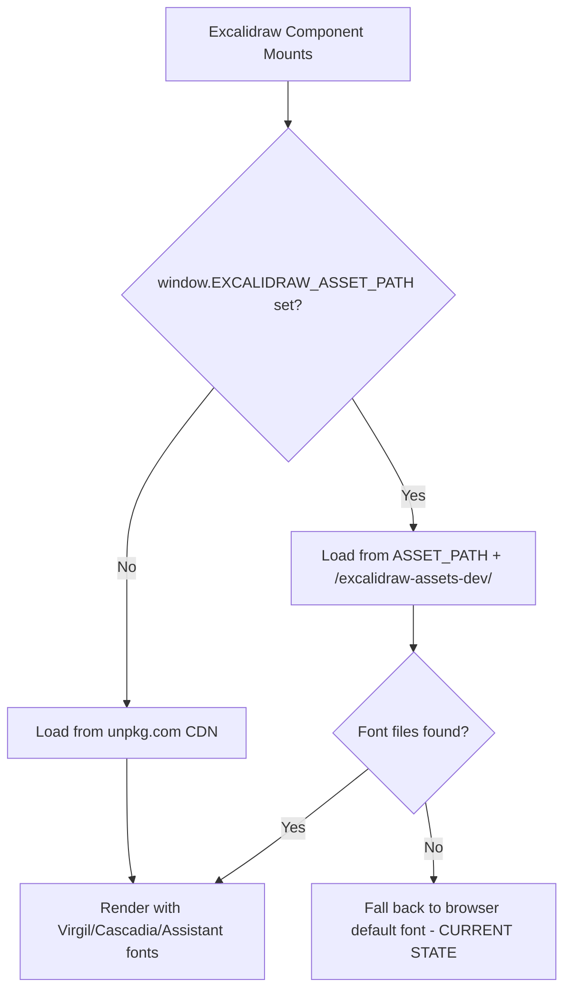

# Plan: Embed Excalidraw Fonts for Self-Hosted Deployment

## Problem

The ExcaliShare frontend viewer shows the **ugly default browser font** instead of Excalidraw's signature hand-drawn fonts (Virgil, Cascadia, Assistant). This happens because:

1. `window.EXCALIDRAW_ASSET_PATH = '/'` is set in [`main.tsx`](frontend/src/main.tsx:9), telling Excalidraw to load fonts from the local server
2. But **no font files exist** in `frontend/public/` or `frontend/dist/` — only PWA icons
3. Excalidraw 0.17.6 expects fonts at `{EXCALIDRAW_ASSET_PATH}/excalidraw-assets-dev/{font}.woff2` (dev mode) or `{EXCALIDRAW_ASSET_PATH}/excalidraw-assets/{font}.woff2` (prod mode)
4. The font files **do exist** in `node_modules/@excalidraw/excalidraw/dist/excalidraw-assets-dev/` but were never copied to the public/dist directory

### Fonts Available in the Package

| Font File | Size | Purpose |
|-----------|------|---------|
| `Virgil.woff2` | ~58 KB | Hand-drawn/handwriting font (Excalidraw signature look) |
| `Cascadia.woff2` | ~82 KB | Monospace/code font |
| `Assistant-Regular.woff2` | ~19 KB | Normal text font |
| `Assistant-Medium.woff2` | ~19 KB | Medium weight text |
| `Assistant-SemiBold.woff2` | ~19 KB | Semi-bold text |
| `Assistant-Bold.woff2` | ~19 KB | Bold text |

### How Excalidraw 0.17.6 Loads Fonts



> **Note:** In version 0.17.6, the production bundle references `excalidraw-assets-dev/` for font loading (not `excalidraw-assets/`). The `excalidraw-assets/` folder only contains locale files. This is a quirk of this version — newer versions (0.18+) use `dist/prod/fonts/`.

## Solution

### Approach: Vite Plugin to Auto-Copy Font Assets at Build Time

Use `vite-plugin-static-copy` to automatically copy the Excalidraw font files from `node_modules` into the build output during `npm run build`. This ensures fonts are always in sync with the installed Excalidraw version.

### Steps

#### 1. Install `vite-plugin-static-copy`

```bash
cd frontend && npm install -D vite-plugin-static-copy
```

#### 2. Update `vite.config.ts`

Add the copy plugin to copy both `excalidraw-assets` and `excalidraw-assets-dev` directories:

```typescript
import { viteStaticCopy } from 'vite-plugin-static-copy'

// Inside plugins array:
viteStaticCopy({
  targets: [
    {
      src: 'node_modules/@excalidraw/excalidraw/dist/excalidraw-assets/*',
      dest: 'excalidraw-assets'
    },
    {
      src: 'node_modules/@excalidraw/excalidraw/dist/excalidraw-assets-dev/*',
      dest: 'excalidraw-assets-dev'
    }
  ]
})
```

This copies:
- `excalidraw-assets/` → locale files (for production i18n)
- `excalidraw-assets-dev/` → **font files** + locale files + vendor JS

#### 3. Verify `EXCALIDRAW_ASSET_PATH` in `main.tsx`

The current setting `window.EXCALIDRAW_ASSET_PATH = '/'` is correct. With fonts at `/excalidraw-assets-dev/Virgil.woff2`, Excalidraw will find them.

No changes needed to `main.tsx`.

#### 4. Update `start.sh` (Optional Fallback)

As a safety net, add a font copy step to `start.sh` in case someone builds without the Vite plugin:

```bash
# Copy Excalidraw font assets
log_info "Copying Excalidraw font assets..."
cp -r "$PROJECT_ROOT/frontend/node_modules/@excalidraw/excalidraw/dist/excalidraw-assets" "$FRONTEND_DIR/" 2>/dev/null || true
cp -r "$PROJECT_ROOT/frontend/node_modules/@excalidraw/excalidraw/dist/excalidraw-assets-dev" "$FRONTEND_DIR/" 2>/dev/null || true
```

#### 5. No Backend Changes Needed

The backend already serves all files from `FRONTEND_DIR` via `ServeDir`:

```rust
let frontend_service = ServeDir::new(&config.frontend_dir)
    .not_found_service(ServeFile::new(&index_file));
```

This will automatically serve `/excalidraw-assets-dev/Virgil.woff2` from `frontend/dist/excalidraw-assets-dev/Virgil.woff2`.

#### 6. No NixOS Module Changes Needed

The NixOS module serves the frontend dist directory, which will now include the font files.

#### 7. No Obsidian Plugin Changes Needed

The Obsidian plugin uses the Obsidian Excalidraw plugin's built-in fonts — it doesn't load fonts from our server. The font issue only affects the **web viewer** (frontend).

### Alternative Approach: Copy to `public/` Instead

Instead of using a Vite plugin, we could manually copy the font directories to `frontend/public/`:

```bash
cp -r node_modules/@excalidraw/excalidraw/dist/excalidraw-assets frontend/public/
cp -r node_modules/@excalidraw/excalidraw/dist/excalidraw-assets-dev frontend/public/
```

**Pros:** Simpler, no extra dependency
**Cons:** Font files would be committed to git (~200 KB), need manual update when upgrading Excalidraw

### Recommended Approach

**Use `vite-plugin-static-copy`** — it's the cleanest solution:
- Fonts stay in sync with the Excalidraw npm package version
- No binary files committed to git
- Automatic during `npm run build`
- Standard Vite ecosystem approach

## Verification

After implementation, verify by:
1. Run `cd frontend && npm run build`
2. Check that `frontend/dist/excalidraw-assets-dev/Virgil.woff2` exists
3. Start the server and open a drawing in the browser
4. Open DevTools Network tab — confirm fonts load from local server (not unpkg.com)
5. Text should render in the hand-drawn Virgil font instead of the browser default

## Impact

- **Frontend**: `vite.config.ts` updated, `vite-plugin-static-copy` added as dev dependency
- **Build output**: ~200 KB larger (font files + vendor JS)
- **No breaking changes**: Purely additive fix
- **PWA**: Font files will be cached by the service worker for offline use
