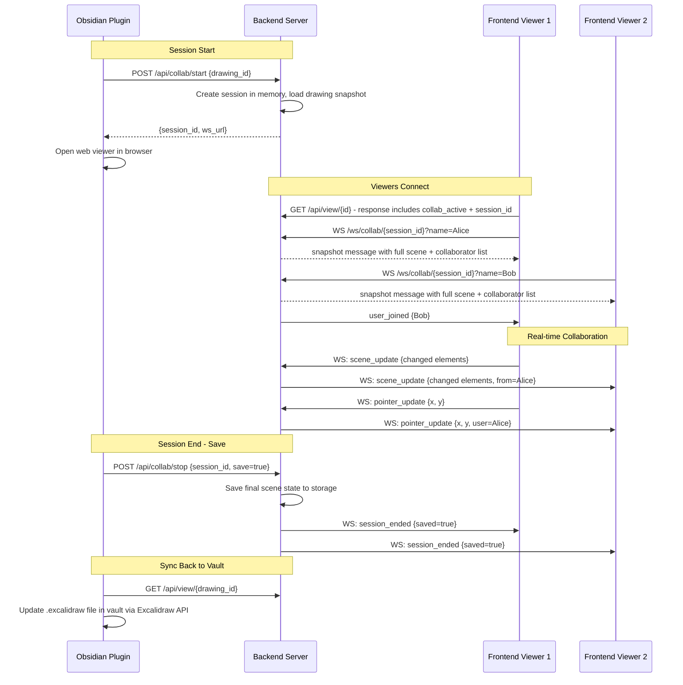
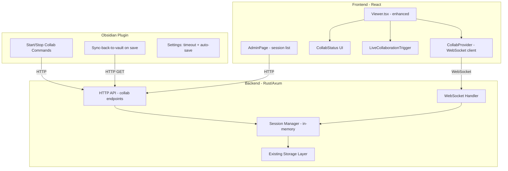

# Live Collaboration Feature - Architecture Plan

## 1. Feature Overview

Enable real-time collaborative editing on shared Excalidraw drawings. The Obsidian user (host) initiates a live session, and all visitors on the shared drawing page can collaboratively edit in real-time. At the end of the session, the host decides whether to persist the changes. If saved, changes are synced back to the Obsidian vault.

## 2. Analysis of Current Architecture

### Current State
- **Backend** (`backend/src/`): Rust/Axum HTTP-only server. No WebSocket support. Stateless request/response model. Storage is filesystem-based JSON files.
- **Frontend** (`frontend/src/Viewer.tsx`): Uses `@excalidraw/excalidraw` v0.17.6. Has view/edit/present modes. Edit mode is local-only (changes lost on refresh). Already uses `onChange` callback for theme tracking.
- **Obsidian Plugin** (`obsidian-plugin/main.ts`): Publishes/syncs drawings via HTTP POST. Uses Excalidraw plugin API to extract scene data. Stores `excalishare-id` in frontmatter.

### Excalidraw Collaboration API
The Excalidraw component natively supports collaboration through:
- **`isCollaborating`** prop - enables collaboration mode UI
- **`updateScene({ collaborators })`** - shows collaborator avatars/cursors
- **`onPointerUpdate`** - broadcasts cursor positions
- **`onChange`** - broadcasts element/state changes
- **`LiveCollaborationTrigger`** - built-in UI button component for collab

These APIs handle the **rendering** side. We need to build the **transport layer** (WebSocket) and **session management** ourselves.

## 3. Design Decisions

| Aspect | Decision |
|--------|----------|
| Session start | From Obsidian plugin via authenticated API call |
| Who can join | Anyone with the drawing URL while session is active |
| Session end | From Obsidian plugin; choose save or discard |
| Host participation | Host opens web viewer in browser to draw collaboratively |
| Save behavior | Server saves to storage AND provides a pull endpoint for Obsidian to sync back to vault |
| Auto-timeout | Session auto-ends after configurable timeout if host disconnects (default 2h) |
| Cursor visibility | Live cursors of all participants with display names |
| Participant names | Auto-generated names; visitors can set a custom display name |
| Session indicator | Visual "Live Session" badge with participant count on drawing page |
| Join flow | Viewers see a "Join" button; can watch or actively participate |
| Conflict resolution | Handled by Excalidraw natively (element-level last-write-wins) |
| Session state | In-memory on server; lost on server restart (acceptable for live sessions) |
| Multiple sessions | Only one active session per drawing at a time |
| Max participants | Configurable, default 20 |
| Admin visibility | Active sessions visible on `/admin` page |
| Concurrent Obsidian edits | Not supported in v1 (too complex); host should not edit in Obsidian during session |

## 4. Architecture



### Component Architecture



## 5. Implementation Plan

### Phase 1: Backend WebSocket Infrastructure

#### 1.1 Add dependencies to `backend/Cargo.toml`
- Add `futures` (for WebSocket stream handling - axum has built-in WS support)

#### 1.2 Create `backend/src/collab.rs` - Session Manager
- `CollabSession` struct: `session_id`, `drawing_id`, `created_at`, `host_token`, `participants` (HashMap of user_id -> name), `current_scene` (latest full scene JSON), `timeout_duration`
- `SessionManager` struct: `HashMap<session_id, CollabSession>` wrapped in `Arc<RwLock<...>>`
- Methods: `create_session()`, `get_session()`, `end_session()`, `get_sessions_for_admin()`, `cleanup_expired()`
- Background task: periodic cleanup of expired sessions (check every 60s)
- On session create: load current drawing from storage as initial snapshot
- On session end with save=true: write current_scene back to storage

#### 1.3 Create `backend/src/ws.rs` - WebSocket Handler
- Handle WS upgrade at `/ws/collab/{session_id}`
- Query param `?name=DisplayName` for participant name
- On connect: validate session exists, assign user_id (UUID), send full snapshot, broadcast `user_joined` to others
- On message: update `current_scene` in session state, relay to all other participants
- On disconnect: remove from participants, broadcast `user_left`
- Message types defined as Rust enums with serde serialization

#### 1.4 Add Collab API Routes to `backend/src/routes.rs`
- `POST /api/collab/start` (auth required) - Start session for a drawing_id. Returns `{session_id, ws_url}`. Fails if session already active for that drawing.
- `POST /api/collab/stop` (auth required) - End session. Body: `{session_id, save: bool}`. If save=true, persist current_scene to storage.
- `GET /api/collab/status/{drawing_id}` (public) - Returns `{active: bool, session_id?: string, participant_count?: number}`
- `GET /api/collab/sessions` (auth required) - List all active sessions (for admin page)

#### 1.5 Modify `backend/src/main.rs`
- Initialize `SessionManager` and add to `AppState`
- Add WebSocket route `/ws/collab/{session_id}`
- Add collab API routes (public and protected)
- Spawn background task for session cleanup

#### 1.6 Modify `backend/src/routes.rs` - Existing Endpoints
- Modify `get_drawing` response: add `_collab_active` and `_collab_session_id` fields when a session exists for the drawing

#### 1.7 Modify `backend/src/error.rs`
- Add error variants: `SessionNotFound`, `SessionAlreadyExists`, `SessionFull`

### Phase 2: Frontend Collaboration Client

#### 2.1 Create `frontend/src/utils/collabClient.ts`
- `CollabClient` class managing WebSocket lifecycle
- Auto-reconnect with exponential backoff (max 5 retries)
- Message serialization/deserialization (JSON)
- Event emitter pattern: `on('scene_update')`, `on('pointer_update')`, `on('user_joined')`, `on('user_left')`, `on('session_ended')`, `on('snapshot')`
- `sendSceneUpdate(elements)` - debounced, batches changes every ~100ms
- `sendPointerUpdate(x, y, button)` - throttled to ~20/sec
- `sendSetName(name)` - set display name
- `disconnect()` - clean close

#### 2.2 Create `frontend/src/hooks/useCollab.ts`
- React hook wrapping `CollabClient`
- State: `isConnected`, `collaborators` (Map), `isCollabActive`, `sessionId`, `participantCount`
- Provides: `connect(sessionId, name)`, `sendSceneUpdate()`, `sendPointerUpdate()`, `disconnect()`
- Handles incoming `scene_update` -> calls `excalidrawAPI.updateScene({ elements })`
- Handles incoming `pointer_update` -> updates collaborators Map -> calls `excalidrawAPI.updateScene({ collaborators })`
- Handles `user_joined`/`user_left` -> updates collaborators Map
- Handles `session_ended` -> shows notification, disconnects, reverts to view mode
- Handles `snapshot` -> initializes scene with full data

#### 2.3 Create `frontend/src/CollabStatus.tsx`
- Floating UI component (positioned near existing floating buttons)
- When session active but not joined: shows "Live Session 🔴" badge + "Join" button
- When joined: shows participant count, participant names on hover, "Leave" button
- Name input dialog (shown on first join): text input for display name, stored in localStorage
- Adapts to light/dark theme
- Mobile-responsive (integrates with existing mobile button injection pattern)

#### 2.4 Modify `frontend/src/Viewer.tsx`
- On load: check if drawing has active collab session (from `_collab_active` in API response or separate `/api/collab/status/{id}` call)
- When collab active: render `CollabStatus` component
- When user joins session:
  - Switch to edit mode automatically
  - Set `isCollaborating={true}` on Excalidraw component
  - Wire `onChange` -> `sendSceneUpdate()` (only changed elements)
  - Wire `onPointerUpdate` -> `sendPointerUpdate()`
  - Incoming updates -> `excalidrawAPI.updateScene()`
  - Render `LiveCollaborationTrigger` in `renderTopRightUI`
- When session ends:
  - Show notification ("Session ended - changes were saved/discarded")
  - Revert to view mode
  - If saved: reload drawing from API to get persisted version
  - If discarded: reload original drawing from API

#### 2.5 Modify `frontend/src/types/index.ts`
- Add `CollabSession` interface
- Add `Collaborator` interface
- Add `ClientMessage` and `ServerMessage` union types
- Add collab-related fields to `ExcalidrawData` (optional `_collab_active`, `_collab_session_id`)

#### 2.6 Modify `frontend/src/AdminPage.tsx`
- Add "Active Sessions" section at the top of admin page
- Show list of active collab sessions: drawing ID, participant count, started at, duration
- "End Session" button per session (calls `POST /api/collab/stop` with save=false)
- Auto-refresh every 10 seconds

### Phase 3: Obsidian Plugin Integration

#### 3.1 Add Collab Commands to `obsidian-plugin/main.ts`
- `start-live-collab` command:
  - Check if file is published (has `excalishare-id`)
  - Call `POST /api/collab/start` with drawing ID
  - Store session_id in plugin state
  - Show Notice with session URL
  - Open web viewer in browser automatically
- `stop-live-collab` command:
  - Show modal: "Save changes?" with Save / Discard / Cancel buttons
  - Call `POST /api/collab/stop` with session_id and save choice
  - If saved: trigger sync-back-to-vault (see 3.4)
  - Clear session_id from plugin state
- `open-live-session` command:
  - Opens the web viewer URL for the current drawing in browser

#### 3.2 Add Context Menu Items
- For published `.excalidraw` files with no active session: "Start Live Collab" menu item
- For files with active session: "Stop Live Collab" and "Open Live Session" menu items

#### 3.3 Add Collab Settings
- Session timeout (default: 2 hours) - passed to backend on session start
- Auto-open browser on session start (default: true)

#### 3.4 Sync-Back-to-Vault
This is the mechanism to pull saved collab changes back into the Obsidian vault:
- After session ends with save=true:
  1. Fetch updated drawing from `GET /api/view/{drawing_id}`
  2. Use Excalidraw plugin API to update the file:
     - Get the ExcalidrawAutomate API
     - Update elements and appState in the vault file
  3. Show Notice: "Drawing synced back to vault"
- Also add a manual "Pull from ExcaliShare" command for on-demand sync

#### 3.5 Status Bar Indicator
- When a collab session is active, show "🔴 Live Collab" in Obsidian's status bar
- Click to open session in browser or stop session
- Periodic health check (every 30s) to detect if session is still alive on server

#### 3.6 Add Ribbon Icon
- Add a "users" icon to ribbon for quick collab start/stop toggle

### Phase 4: Polish & Edge Cases

#### 4.1 Edge Cases
- Host disconnects unexpectedly -> session stays alive for timeout period, participants can still collaborate
- Server restart -> all sessions lost, clients get WS disconnect, show "session ended" message
- Large drawings -> incremental/delta updates (only send changed elements by comparing element versions)
- Network interruptions -> auto-reconnect with state reconciliation (request fresh snapshot on reconnect)
- Drawing deleted while session active -> end session, notify participants
- Multiple browser tabs -> each tab is a separate participant (acceptable)

#### 4.2 Security
- Session IDs are UUID v4 (unguessable)
- Only authenticated users (API key) can start/stop sessions
- WebSocket connections don't require auth (matches current public viewing model)
- Rate limiting on WebSocket messages (max 30 messages/sec per client)
- Maximum participants per session (configurable, default: 20)

#### 4.3 Performance
- Delta-based scene updates: compare element `version` fields, only send elements with changed versions
- Pointer updates throttled to ~20/sec per client
- Scene updates debounced to ~10/sec per client
- Server-side: broadcast uses `tokio::sync::broadcast` channel for efficient fan-out
- Consider binary WebSocket frames (MessagePack) as future optimization

## 6. WebSocket Message Protocol

```typescript
// Client -> Server
type ClientMessage =
  | { type: 'scene_update'; elements: ExcalidrawElement[] }
  | { type: 'pointer_update'; x: number; y: number; button: 'down' | 'up' }
  | { type: 'set_name'; name: string }

// Server -> Client  
type ServerMessage =
  | { type: 'snapshot'; elements: ExcalidrawElement[]; appState: object; files: object; collaborators: Collaborator[] }
  | { type: 'scene_update'; elements: ExcalidrawElement[]; from: string }
  | { type: 'pointer_update'; x: number; y: number; button: string; userId: string; name: string }
  | { type: 'user_joined'; userId: string; name: string; collaborators: Collaborator[] }
  | { type: 'user_left'; userId: string; name: string; collaborators: Collaborator[] }
  | { type: 'session_ended'; saved: boolean }
  | { type: 'error'; message: string }

interface Collaborator {
  id: string
  name: string
}
```

## 7. New API Endpoints

| Method | Endpoint | Auth | Description |
|--------|----------|------|-------------|
| POST | `/api/collab/start` | API Key | Start a collab session for a drawing |
| POST | `/api/collab/stop` | API Key | End a session, optionally save |
| GET | `/api/collab/status/{drawing_id}` | Public | Check if drawing has active session |
| GET | `/api/collab/sessions` | API Key | List all active sessions (admin) |
| WS | `/ws/collab/{session_id}` | Public | WebSocket connection for real-time sync |

## 8. Files Overview

### New Files

| File | Purpose |
|------|---------|
| `backend/src/collab.rs` | Session manager, in-memory session state, cleanup task |
| `backend/src/ws.rs` | WebSocket handler, message routing, broadcast |
| `frontend/src/utils/collabClient.ts` | WebSocket client with reconnect logic |
| `frontend/src/hooks/useCollab.ts` | React hook for collaboration state management |
| `frontend/src/CollabStatus.tsx` | UI component for session status, join flow, name input |

### Modified Files

| File | Changes |
|------|---------|
| `backend/Cargo.toml` | Add `futures` dependency |
| `backend/src/main.rs` | Add WS route, SessionManager to AppState, spawn cleanup task |
| `backend/src/routes.rs` | Add collab handlers, modify get_drawing response |
| `backend/src/error.rs` | Add collab error variants |
| `frontend/src/Viewer.tsx` | Integrate collab hook, add collab UI, wire Excalidraw collab props |
| `frontend/src/types/index.ts` | Add collab types and WS message types |
| `frontend/src/AdminPage.tsx` | Add active sessions section with end-session controls |
| `obsidian-plugin/main.ts` | Add collab commands, context menu, status bar, sync-back-to-vault |
| `AGENTS.md` | Document new endpoints and collab architecture |

## 9. Implementation Order (Todo List)

1. Backend: Add `futures` to `Cargo.toml`
2. Backend: Create `collab.rs` with SessionManager
3. Backend: Create `ws.rs` with WebSocket handler
4. Backend: Add collab error variants to `error.rs`
5. Backend: Add collab API routes to `routes.rs`
6. Backend: Wire everything in `main.rs` (state, routes, cleanup task)
7. Backend: Modify `get_drawing` to include collab status
8. Frontend: Add collab types to `types/index.ts`
9. Frontend: Create `collabClient.ts` WebSocket client
10. Frontend: Create `useCollab.ts` React hook
11. Frontend: Create `CollabStatus.tsx` UI component
12. Frontend: Integrate collab into `Viewer.tsx`
13. Frontend: Add sessions section to `AdminPage.tsx`
14. Plugin: Add start/stop collab commands and API calls
15. Plugin: Add sync-back-to-vault mechanism
16. Plugin: Add context menu items for collab
17. Plugin: Add status bar indicator
18. Plugin: Add collab settings
19. Testing: Manual end-to-end testing
20. Docs: Update `AGENTS.md` with new endpoints and architecture
