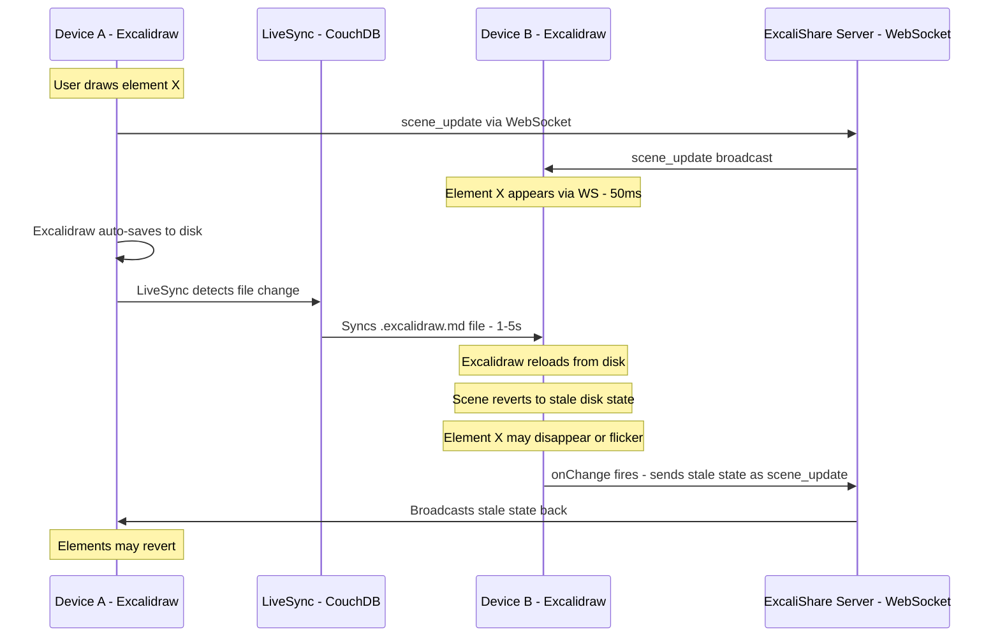
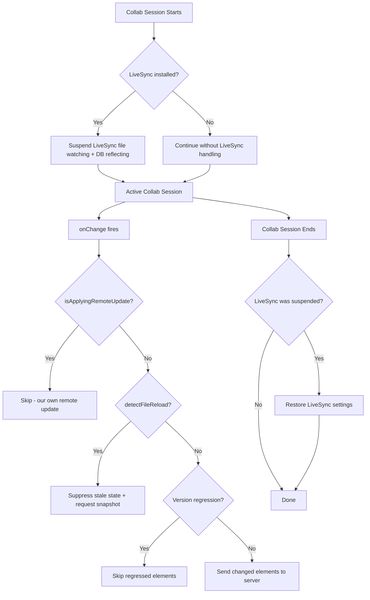

# Plan: Fix LiveSync + ExcaliShare Collab Sync Conflict

## Problem

When two Obsidian devices participate in a live ExcaliShare collab session while using **Self-hosted LiveSync** (CouchDB-based file sync), elements **flicker, revert, and disappear**. The drawing state becomes unstable and unusable.

## Root Cause

**Two sync mechanisms operate simultaneously on the same data**, creating a destructive feedback loop:

1. **WebSocket collab** (ExcaliShare): real-time element-level sync via the server (~50ms latency)
2. **File-level sync** (LiveSync): syncs the entire `.excalidraw.md` file between devices (~1-5s latency)

### The Feedback Loop



The core issue: when LiveSync writes to the `.excalidraw.md` file on Device B, the Obsidian Excalidraw plugin detects the file change and **reloads the drawing from disk**, replacing the current in-memory scene (which includes real-time WebSocket updates) with the stale disk version.

### Why This Is Hard

1. We **cannot** prevent LiveSync from syncing the file — it is a separate plugin
2. We **cannot** prevent the Excalidraw plugin from reloading when the file changes on disk — it is a separate plugin
3. The Excalidraw plugin does not expose an API to disable file-reload behavior

## Solution: Multi-Layer Defense

The fix uses **three complementary strategies**, with the primary fix being programmatic LiveSync suspension:

### Strategy 0: Programmatically Suspend LiveSync During Collab (Primary Fix — Cleanest)

**Discovery:** LiveSync exposes two "Scram Switches" in its settings:
- `suspendFileWatching` — stops LiveSync from detecting local file changes
- `suspendParseReplicationResult` — stops LiveSync from writing incoming remote changes to local files

These can be toggled programmatically from our plugin via the Obsidian plugin API:

```typescript
// Get the LiveSync plugin instance
const liveSyncPlugin = (this.app as any).plugins.getPlugin('obsidian-livesync');
if (liveSyncPlugin?.settings) {
  // Suspend both file watching and database reflecting
  liveSyncPlugin.settings.suspendFileWatching = true;
  liveSyncPlugin.settings.suspendParseReplicationResult = true;
  await liveSyncPlugin.saveSettings();
}
```

**When to suspend:**
- When joining a collab session (both regular and persistent)
- On both devices — each device suspends its own LiveSync

**When to resume:**
- When leaving a collab session
- When the collab session ends (from server)
- On plugin unload (safety net)

**Advantages:**
- Completely eliminates the root cause — no file-level sync during collab
- No complex heuristics or detection logic needed
- Works for any file sync plugin that has similar settings (not just LiveSync)
- Reversible — settings are restored when collab ends

**Risks:**
- Other files in the vault won't sync during the collab session
- If the plugin crashes without restoring settings, LiveSync stays suspended
- LiveSync may change its internal API in future versions

**Mitigations:**
- Store the original settings values before modifying, restore on collab end
- Add a safety net in `onunload()` to restore settings
- Add a periodic check (every 60s) to verify settings are still suspended during active collab
- Show a Notice to the user: "LiveSync paused during collab session"
- Gracefully handle the case where LiveSync is not installed (no-op)

### Strategy 1: Detect and Recover from File Reloads (Fallback)

Even with LiveSync suspended, other sync tools (Syncthing, Obsidian Sync, iCloud, etc.) could cause the same problem. This strategy provides a safety net.

When a file reload happens during an active collab session, detect it and immediately restore the authoritative state from the WebSocket session.

**How to detect a file reload:**
When Excalidraw reloads from disk, the `onChange` callback fires with a scene that has **many elements with lower versions** than what we are tracking. This is the signature of a disk reload — a genuine local edit would only change 1-2 elements with higher versions.

**Detection heuristic:**
```
If onChange fires AND:
  - More than 30% of tracked elements have LOWER versions than lastKnownVersions
  - OR the total element count drops significantly
  - AND we did NOT just apply a remote update
Then:
  → This is a file reload, not a local edit
  → Suppress the onChange — do NOT send stale state to server
  → Request a fresh snapshot from the server
```

### Strategy 2: Version Regression Guard (Safety Net)

In `handleLocalSceneChange()`, never send elements whose version went backwards:

```typescript
if (el.version < lastVersion) {
  // Version went BACKWARDS — stale data from file reload
  this.lastKnownVersions.set(el.id, el.version);
  continue; // Do NOT send to server
}
```

## Architecture Diagram



## Detailed Implementation Steps

### Step 1: Add LiveSync integration to ExcaliShare plugin

**File: `obsidian-plugin/main.ts`**

1. Add a new private field to track LiveSync state:
   ```typescript
   private _liveSyncSuspended = false;
   private _liveSyncOriginalSettings: {
     suspendFileWatching: boolean;
     suspendParseReplicationResult: boolean;
   } | null = null;
   ```

2. Add `suspendLiveSync()` method:
   ```typescript
   private async suspendLiveSync(): Promise<void> {
     if (this._liveSyncSuspended) return;
     
     const liveSyncPlugin = (this.app as any).plugins?.getPlugin?.('obsidian-livesync');
     if (!liveSyncPlugin?.settings) {
       console.log('ExcaliShare: LiveSync not found, skipping suspension');
       return;
     }
     
     // Save original settings
     this._liveSyncOriginalSettings = {
       suspendFileWatching: liveSyncPlugin.settings.suspendFileWatching ?? false,
       suspendParseReplicationResult: liveSyncPlugin.settings.suspendParseReplicationResult ?? false,
     };
     
     // Suspend both
     liveSyncPlugin.settings.suspendFileWatching = true;
     liveSyncPlugin.settings.suspendParseReplicationResult = true;
     
     try {
       await liveSyncPlugin.saveSettings();
       this._liveSyncSuspended = true;
       console.log('ExcaliShare: LiveSync suspended for collab session');
       new Notice('ExcaliShare: LiveSync paused during collab session');
     } catch (e) {
       console.error('ExcaliShare: Failed to suspend LiveSync', e);
     }
   }
   ```

3. Add `resumeLiveSync()` method:
   ```typescript
   private async resumeLiveSync(): Promise<void> {
     if (!this._liveSyncSuspended) return;
     
     const liveSyncPlugin = (this.app as any).plugins?.getPlugin?.('obsidian-livesync');
     if (!liveSyncPlugin?.settings || !this._liveSyncOriginalSettings) {
       this._liveSyncSuspended = false;
       return;
     }
     
     // Restore original settings
     liveSyncPlugin.settings.suspendFileWatching = this._liveSyncOriginalSettings.suspendFileWatching;
     liveSyncPlugin.settings.suspendParseReplicationResult = this._liveSyncOriginalSettings.suspendParseReplicationResult;
     
     try {
       await liveSyncPlugin.saveSettings();
       this._liveSyncSuspended = false;
       this._liveSyncOriginalSettings = null;
       console.log('ExcaliShare: LiveSync resumed after collab session');
       new Notice('ExcaliShare: LiveSync resumed');
     } catch (e) {
       console.error('ExcaliShare: Failed to resume LiveSync', e);
     }
   }
   ```

4. Call `suspendLiveSync()` when joining a collab session:
   - In `joinCollabFromObsidian()` — before connecting WebSocket
   - In `autoJoinPersistentCollab()` — before joining

5. Call `resumeLiveSync()` when leaving a collab session:
   - In `cleanupCollabState()` — when collab ends
   - In `onunload()` — safety net on plugin unload

6. Add to `onunload()`:
   ```typescript
   async onunload() {
     // ... existing cleanup ...
     await this.resumeLiveSync(); // Safety net
   }
   ```

### Step 2: Add file reload detection to CollabManager

**File: `obsidian-plugin/collabManager.ts`**

1. Add `detectFileReload()` private method:
   ```typescript
   private detectFileReload(elements: readonly ExcalidrawElement[]): boolean {
     if (this.lastKnownVersions.size < 3) return false;
     
     let regressedCount = 0;
     let checkedCount = 0;
     
     for (const el of elements) {
       if (!el.id) continue;
       const lastVersion = this.lastKnownVersions.get(el.id);
       if (lastVersion !== undefined) {
         checkedCount++;
         if (el.version < lastVersion) {
           regressedCount++;
         }
       }
     }
     
     // If >30% of known elements have regressed versions, this is a file reload
     if (checkedCount > 0 && regressedCount / checkedCount > 0.3) {
       return true;
     }
     
     // Also detect if many elements disappeared
     if (this.lastKnownVersions.size > 5 && elements.length < this.lastKnownVersions.size * 0.5) {
       return true;
     }
     
     return false;
   }
   ```

2. Modify `handleLocalSceneChange()` to call `detectFileReload()`:
   ```typescript
   private handleLocalSceneChange(elements: readonly ExcalidrawElement[]): void {
     if (this.isApplyingRemoteUpdate) return;
     if (!this.client?.isConnected) return;
     
     // Detect file reload from external sync
     if (this.detectFileReload(elements)) {
       console.warn('ExcaliShare Collab: File reload detected. Requesting fresh state from server...');
       this.handleFileReloadDuringCollab();
       return;
     }
     
     // ... existing version-diff logic ...
   }
   ```

3. Add `handleFileReloadDuringCollab()` method:
   ```typescript
   private handleFileReloadDuringCollab(): void {
     // Show notice
     new Notice('ExcaliShare: External file change detected. Restoring collab state...');
     
     // Reconnect WebSocket to get a fresh snapshot
     if (this.client) {
       this.client.manualReconnect();
     }
   }
   ```

### Step 3: Add version regression guard

**File: `obsidian-plugin/collabManager.ts`**

In `handleLocalSceneChange()`, add per-element version regression check:
```typescript
// Inside the for loop, after the existing echo check:
if (el.version < lastVersion) {
  // Version went backwards — stale data from file reload
  this.lastKnownVersions.set(el.id, el.version);
  continue; // Do NOT include in changedElements
}
```

### Step 4: Suppress handleFileModify and handleMetadataChange during collab

**File: `obsidian-plugin/main.ts`**

1. In `handleFileModify()`, add guard for active collab file:
   ```typescript
   private handleFileModify(file: TFile): void {
     // Skip ALL processing for the active collab file
     if (this.collabManager?.isJoined && this.activeCollabDrawingId) {
       const publishedId = this.getPublishedId(file);
       if (publishedId === this.activeCollabDrawingId) return;
     }
     // ... existing auto-sync logic ...
   }
   ```

2. In `handleMetadataChange()`, add guard for active collab file:
   ```typescript
   private handleMetadataChange(file: TFile): void {
     // Skip metadata change handling for the active collab file
     if (this.collabManager?.isJoined && this.activeCollabDrawingId) {
       const publishedId = this.getPublishedId(file) || this._publishedIdCache.get(file.path);
       if (publishedId === this.activeCollabDrawingId) return;
     }
     // ... existing logic ...
   }
   ```

### Step 5: Add setting for LiveSync auto-suspend

**File: `obsidian-plugin/settings.ts`**

Add a new setting:
```typescript
interface ExcaliShareSettings {
  // ... existing settings ...
  suspendLiveSyncDuringCollab: boolean; // default: true
}
```

With a toggle in the settings tab:
> **Pause LiveSync during collab** — Automatically suspend Self-hosted LiveSync file synchronization while a collaboration session is active. This prevents file-level sync from conflicting with real-time WebSocket collaboration. LiveSync is automatically resumed when the session ends.

### Step 6: Add user guidance in settings

**File: `obsidian-plugin/settings.ts`**

Add a description note under the collab section:
> **Note:** If you use a file sync plugin (LiveSync, Syncthing, iCloud, etc.), it may conflict with live collaboration. ExcaliShare can automatically pause LiveSync during collab sessions. For other sync tools, consider excluding `.excalidraw.md` files during active collaboration.

## Files to Modify

| File | Changes |
|------|---------|
| `obsidian-plugin/main.ts` | Add `suspendLiveSync()`, `resumeLiveSync()`, call them on collab join/leave, suppress `handleFileModify`/`handleMetadataChange` for active collab file |
| `obsidian-plugin/collabManager.ts` | Add `detectFileReload()`, `handleFileReloadDuringCollab()`, version regression guard |
| `obsidian-plugin/settings.ts` | Add `suspendLiveSyncDuringCollab` setting with toggle |

## Risk Assessment

- **LiveSync API stability**: LiveSync's `settings.suspendFileWatching` is a documented setting key. However, the internal API (`saveSettings()`) could change. Mitigation: wrap in try/catch, gracefully degrade to Strategy 1+2 if LiveSync API fails.
- **Other files stop syncing**: While collab is active, ALL files stop syncing via LiveSync (not just the collab file). Mitigation: show a clear Notice to the user; collab sessions are typically short-lived.
- **Plugin crash without restore**: If ExcaliShare crashes during collab, LiveSync stays suspended. Mitigation: `onunload()` safety net; user can manually toggle in LiveSync settings.
- **False positive reload detection**: The 30% threshold for version regression should be conservative enough. Normal remote updates go through `isApplyingRemoteUpdate` guard.
- **WebSocket reconnect during recovery**: Brief interruption (~100ms). Existing reconnect logic handles this.

## Testing Plan

1. **Setup**: Two Obsidian devices with LiveSync enabled, both connected to the same ExcaliShare persistent collab session
2. **Test 1**: Start collab → verify LiveSync is suspended (check LiveSync settings UI shows "Suspend file watching" enabled)
3. **Test 2**: Draw on Device A → verify Device B sees the element via WebSocket without flickering
4. **Test 3**: Draw on both devices simultaneously → verify no element loss or reversion
5. **Test 4**: End collab → verify LiveSync is resumed (check LiveSync settings UI shows "Suspend file watching" disabled)
6. **Test 5**: Crash test — force-close Obsidian during collab → reopen → verify LiveSync settings are restored on plugin load
7. **Test 6**: Verify normal collab (without LiveSync installed) still works correctly
8. **Test 7**: Disable "Pause LiveSync during collab" setting → verify file reload detection (Strategy 1) catches the problem
