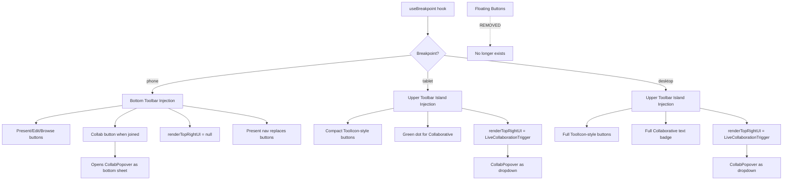

# Mobile & Tablet Responsive Redesign Plan

## Problem Analysis

### Current Issues

1. **Mobile collab session — toolbar shift**: When joining a live collab session, `renderTopRightUI` injects the `LiveCollaborationTrigger` (share button) into Excalidraw's top-right area. On mobile, this pushes the Excalidraw toolbar content, causing a visible layout shift.

2. **Tablet — "Collaborative" badge & floating buttons overlap toolbar**: On wider devices (tablets, ~731px–1024px), the floating buttons container (`floatingButtons` at `top: 1rem, left: 60px, zIndex: 100`) and the green "Collaborative" badge sit on top of Excalidraw's native toolbar. Our custom elements visually collide with it.

3. **Binary breakpoint system**: Only a single `isMobile = useMediaQuery('(max-width: 730px)')` check. No tablet tier.

4. **Inconsistent UI paradigm**: On mobile, buttons are injected into the toolbar (feels native). On desktop, they're floating overlays (feels foreign, causes overlap).

---

## Proposed Solution: Unified Toolbar Injection

### Core Idea

**Inject our custom buttons into Excalidraw's native toolbar on ALL screen sizes.** This eliminates the floating buttons overlay entirely and creates a consistent, native-feeling UI across all devices.

### Excalidraw Toolbar DOM Structure

```
section.shapes-section
  └── div.App-toolbar-container
       ├── div.Island.App-toolbar          ← Main toolbar with drawing tools
       │    └── div.Stack.Stack_horizontal  ← Tool icons + dividers
       │         ├── label.ToolIcon         ← Lock tool
       │         ├── div.App-toolbar__divider
       │         ├── label.ToolIcon.Shape   ← Hand, Selection, Rectangle, etc.
       │         ├── div.App-toolbar__divider
       │         └── button.App-toolbar__extra-tools-trigger  ← "More tools"
       └── div.Island                       ← Laser pointer (separate island)
```

### Injection Strategy

On **all screen sizes**, we inject a new `div.Island` element **after** the main toolbar Island, containing our custom buttons. This mirrors how Excalidraw itself adds the Laser Pointer as a separate Island next to the toolbar.

```
section.shapes-section
  └── div.App-toolbar-container
       ├── div.Island.App-toolbar          ← Excalidraw's toolbar (untouched)
       ├── div.Island                       ← Laser pointer (Excalidraw's)
       └── div.Island.excalishare-toolbar  ← OUR injected Island
            ├── ▶️ Present
            ├── ✏️ Edit  
            ├── 📂 Browse
            ├── 🤝 Collab (when in session)
            └── 🟢 Collaborative (when persistent)
```

### Breakpoint Tiers

```
┌─────────────────────────────────────────────────────────────┐
│  Phone: max 730px  │  Tablet: 731–1024px  │  Desktop: >1024px  │
└─────────────────────────────────────────────────────────────┘
```

| Tier | Breakpoint | Toolbar Injection Target | Collab Trigger |
|------|-----------|--------------------------|----------------|
| **Phone** | `≤ 730px` | Mobile bottom toolbar (`.App-toolbar-content`) — current behavior | Injected 🤝 button in bottom toolbar; `renderTopRightUI` = null |
| **Tablet** | `731px – 1024px` | New Island next to desktop toolbar | `renderTopRightUI` = `LiveCollaborationTrigger` (normal) |
| **Desktop** | `> 1024px` | New Island next to desktop toolbar | `renderTopRightUI` = `LiveCollaborationTrigger` (normal) |

---

## Layout Design Per Tier

### Phone Layout (≤ 730px)

```
┌──────────────────────────────────────────┐
│  [Excalidraw top area - no shift!]       │  ← renderTopRightUI = null
│                                          │
│       Drawing Canvas                     │
│                                          │
│  ┌────────────────────────────────────┐  │
│  │ [tools...] ▶️ ✏️ 📂 🤝            │  │  ← Bottom toolbar with our buttons
│  └────────────────────────────────────┘  │
└──────────────────────────────────────────┘
```

**Changes from current:**
- `renderTopRightUI` returns `null` on phone → **eliminates toolbar shift**
- **Add 🤝 collab button** to the injected bottom toolbar (only when `collab.isJoined`)
- Clicking 🤝 opens `CollabPopover` as a **bottom sheet**
- Present mode navigation (prev/counter/next) still replaces normal buttons
- Everything else stays the same as current mobile behavior

### Tablet Layout (731px – 1024px)

```
┌──────────────────────────────────────────────────────────────────┐
│  [Excalidraw toolbar] [Laser] [▶️ ✏️ 📂 🟢]          [🤝 Share]│
│                                ↑ Our Island              ↑ renderTopRightUI
│                                                                  │
│       Drawing Canvas                                             │
│                                                                  │
└──────────────────────────────────────────────────────────────────┘
```

**Changes from current:**
- **Remove floating buttons overlay** entirely
- Inject a new `div.Island` into the toolbar container with compact buttons
- "Collaborative" indicator as a small green dot with tooltip (saves space)
- Buttons are compact (ToolIcon-sized, ~28px) to match Excalidraw's native style
- `LiveCollaborationTrigger` via `renderTopRightUI` works fine at this width

### Desktop Layout (> 1024px)

```
┌──────────────────────────────────────────────────────────────────────────┐
│  [Excalidraw toolbar ........] [Laser] [▶️ ✏️ 📂 🟢 Collaborative] [🤝]│
│                                         ↑ Our Island                     │
│                                                                          │
│       Drawing Canvas                                                     │
│                                                                          │
└──────────────────────────────────────────────────────────────────────────┘
```

**Changes from current:**
- **Remove floating buttons overlay** entirely
- Inject a new `div.Island` with full-size buttons + "Collaborative" text badge
- Buttons styled to match Excalidraw's native ToolIcon aesthetic
- `LiveCollaborationTrigger` via `renderTopRightUI` as before

---

## Detailed Component Changes

### 1. New file: `frontend/src/hooks/useBreakpoint.ts`

```typescript
import { useMediaQuery } from './useMediaQuery';

export type Breakpoint = 'phone' | 'tablet' | 'desktop';

export function useBreakpoint(): Breakpoint {
  const isPhone = useMediaQuery('(max-width: 730px)');
  const isTablet = useMediaQuery('(min-width: 731px) and (max-width: 1024px)');
  if (isPhone) return 'phone';
  if (isTablet) return 'tablet';
  return 'desktop';
}
```

### 2. Modify: `frontend/src/Viewer.tsx`

#### 2a. Replace `isMobile` with `useBreakpoint`

```typescript
import { useBreakpoint } from './hooks/useBreakpoint';

const breakpoint = useBreakpoint();
const isPhone = breakpoint === 'phone';
```

#### 2b. Rewrite toolbar injection `useEffect` (lines 522–743)

The current useEffect handles only mobile. We need to expand it to handle all 3 tiers:

**Phone (≤730px):** Keep current behavior — inject into `.App-toolbar-content` (bottom toolbar). Add 🤝 collab button.

**Tablet/Desktop (>730px):** New behavior — inject a new `div.Island` after the existing toolbar Islands inside `.App-toolbar-container`.

```javascript
useEffect(() => {
  const containerClass = 'excalishare-toolbar';
  let observer: MutationObserver | null = null;

  const injectButtons = () => {
    // Remove existing
    document.querySelectorAll(`.${containerClass}`).forEach(el => el.remove());

    if (isPhone) {
      // PHONE: inject into bottom toolbar (current behavior)
      const toolbar = document.querySelector('.App-toolbar-content');
      if (!toolbar) return;
      
      const container = document.createElement('div');
      container.className = containerClass;
      // ... same as current mobile injection code
      // BUT also add collab button when collab.isJoined
      
      if (collab.isJoined) {
        const collabBtn = document.createElement('button');
        collabBtn.textContent = '🤝';
        collabBtn.title = 'Collaboration';
        collabBtn.style.cssText = getButtonStyle(true, '#4CAF50');
        collabBtn.onclick = () => setShowCollabPopover(prev => !prev);
        container.append(collabBtn);
      }
      
      toolbar.appendChild(container);
    } else {
      // TABLET/DESKTOP: inject new Island into toolbar container
      const toolbarContainer = document.querySelector('.App-toolbar-container');
      if (!toolbarContainer) return;
      
      const island = document.createElement('div');
      island.className = `Island ${containerClass}`;
      island.style.cssText = `
        margin-left: 8px;
        align-self: center;
        height: fit-content;
        padding: 4px;
        display: flex;
        gap: 4px;
        align-items: center;
      `;
      
      // Present button
      const presentBtn = createToolIconButton('▶️', 'Present mode (p/q)', ...);
      // Edit button
      const editBtn = createToolIconButton(mode === 'edit' ? '✏️' : '🔒', ...);
      // Browse button
      const browseBtn = createToolIconButton('📂', 'Browse drawings (e)', ...);
      
      island.append(presentBtn, editBtn, browseBtn);
      
      // Collaborative badge (persistent collab)
      if (collab.isPersistentCollab) {
        if (breakpoint === 'desktop') {
          // Full text badge
          const badge = document.createElement('div');
          badge.style.cssText = `
            display: flex; align-items: center; gap: 4px;
            padding: 2px 8px; border-radius: 10px;
            background: rgba(34, 197, 94, 0.1);
            border: 1px solid rgba(34, 197, 94, 0.2);
            font-size: 11px; color: #16a34a;
            font-family: system-ui, -apple-system, sans-serif;
          `;
          badge.innerHTML = '<span style="width:6px;height:6px;border-radius:50%;background:#22c55e;display:inline-block"></span> Collaborative';
          island.append(badge);
        } else {
          // Tablet: compact dot
          const dot = document.createElement('div');
          dot.title = 'Collaborative drawing';
          dot.style.cssText = `
            width: 8px; height: 8px; border-radius: 50%;
            background: #22c55e; margin-left: 4px;
          `;
          island.append(dot);
        }
      }
      
      toolbarContainer.appendChild(island);
    }
  };

  // ... MutationObserver + retry logic (same as current)
}, [breakpoint, mode, theme, collab.isJoined, collab.isPersistentCollab, ...]);
```

#### 2c. Conditional `renderTopRightUI`

```typescript
renderTopRightUI={() =>
  // Phone: don't render (collab button is in bottom toolbar)
  isPhone ? null : (
    collab.isJoined ? (
      <LiveCollaborationTrigger
        isCollaborating={true}
        onSelect={() => setShowCollabPopover(prev => !prev)}
      />
    ) : null
  )
}
```

#### 2d. Remove floating buttons section entirely

Delete the entire `{!isMobile && (<div style={styles.floatingButtons}>...)}` block (lines 1039–1125). These are replaced by the toolbar injection.

#### 2e. Remove floating button styles

Remove `floatingButtons` and `floatingButton` from the styles object.

#### 2f. Present mode navigation

- **Phone**: Already handled in toolbar injection (prev/counter/next in bottom toolbar)
- **Tablet/Desktop**: Keep the bottom-center navigation bar, but it's now the only overlay element

### 3. Modify: `frontend/src/CollabPopover.tsx`

Add bottom sheet mode for phone:

```typescript
interface CollabPopoverProps {
  // ... existing props
  isPhone?: boolean;
}

// Phone: bottom sheet with backdrop
// Tablet/Desktop: current top-right dropdown
```

**Phone bottom sheet:**
- `position: fixed; bottom: 0; left: 0; right: 0`
- Backdrop overlay (semi-transparent black)
- Drag handle at top
- `border-radius: 16px 16px 0 0`
- `max-height: 60vh; overflow-y: auto`

### 4. Modify: `frontend/src/CollabStatus.tsx`

Adjust join banner positioning:
- **Phone**: Position below the top area (`top: 52px`) to avoid overlap
- **Tablet/Desktop**: Keep current position (`top: 12px, right: 12px`)

### 5. Modify: `frontend/src/index.css`

Add styles for the injected Island to match Excalidraw's native look:

```css
/* ExcaliShare injected toolbar buttons — match Excalidraw ToolIcon style */
.excalishare-toolbar button {
  width: 28px;
  height: 28px;
  border-radius: 4px;
  display: flex;
  align-items: center;
  justify-content: center;
  font-size: 16px;
  cursor: pointer;
  border: none;
  background: transparent;
  transition: background 0.15s ease;
}

.excalishare-toolbar button:hover {
  background: var(--color-surface-mid);
}

.excalishare-toolbar button.active {
  background: var(--color-primary-light);
}

/* Phone: style adjustments for bottom toolbar injection */
@media (max-width: 730px) {
  .excalishare-toolbar {
    display: flex;
    gap: 8px;
    margin-left: auto;
    margin-right: 8px;
    padding: 4px 0;
    align-items: center;
  }
}
```

---

## Implementation Order

1. **Create `useBreakpoint` hook** — Foundation for all responsive changes
2. **Rewrite toolbar injection in `Viewer.tsx`** — Unified injection for all tiers:
   - Phone: bottom toolbar (keep current + add collab button)
   - Tablet/Desktop: new Island in upper toolbar container
3. **Remove floating buttons** — Delete the entire floating buttons section and styles
4. **Update `renderTopRightUI`** — Return null on phone
5. **Update `CollabPopover.tsx`** — Bottom sheet on phone
6. **Update `CollabStatus.tsx`** — Responsive join banner
7. **Add CSS in `index.css`** — Styles for injected toolbar buttons
8. **Test all 3 tiers** — Phone (≤730), Tablet (731–1024), Desktop (>1024)

---

## Architecture Diagram



---

## Files to Create/Modify

| File | Action | Description |
|------|--------|-------------|
| `frontend/src/hooks/useBreakpoint.ts` | **Create** | New 3-tier breakpoint hook |
| `frontend/src/Viewer.tsx` | **Modify** | Rewrite toolbar injection for all tiers; remove floating buttons; conditional renderTopRightUI |
| `frontend/src/CollabPopover.tsx` | **Modify** | Bottom sheet on phone with backdrop overlay |
| `frontend/src/CollabStatus.tsx` | **Modify** | Responsive join banner positioning |
| `frontend/src/index.css` | **Modify** | Styles for injected toolbar buttons matching Excalidraw native look |
| `frontend/src/hooks/useMediaQuery.ts` | **Keep** | Still used internally by useBreakpoint |

---

## Key Design Decisions

1. **Unified toolbar injection on all screen sizes**: Instead of two different paradigms (injection on mobile, floating overlay on desktop), we inject into the native toolbar everywhere. This creates a consistent, native-feeling UI.

2. **New Island element**: On tablet/desktop, we create a new `div.Island` inside `.App-toolbar-container`, mirroring how Excalidraw adds the Laser Pointer as a separate Island. This integrates seamlessly with Excalidraw's layout.

3. **Phone collab button in bottom toolbar**: Instead of `renderTopRightUI` (which causes toolbar shift), we inject a 🤝 button alongside Present/Edit/Browse in the bottom toolbar. `renderTopRightUI` returns null on phone.

4. **CollabPopover as bottom sheet on phone**: Better UX for touch devices — full-width panel sliding up from bottom.

5. **Remove floating buttons entirely**: No more `position: absolute` overlay elements that can overlap with the toolbar. Everything lives inside the toolbar.

6. **3 breakpoints**: Phone (≤730px) / Tablet (731–1024px) / Desktop (>1024px). Phone breakpoint matches Excalidraw's own mobile breakpoint.

7. **Excalidraw-native styling**: Injected buttons use Excalidraw's CSS variables (`--color-surface-mid`, `--color-primary-light`) and match the ToolIcon dimensions for a seamless look.
