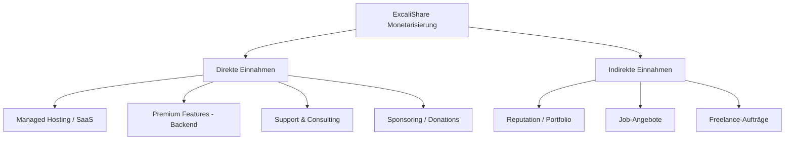
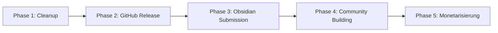

# ExcaliShare — Monetarisierung, Rechtliche Analyse & Release-Readiness

## 1. Rechtliche Analyse (Legal Aspects)

### 1.1 Lizenz-Kompatibilität der Dependencies

| Komponente | Lizenz | Kommerziell nutzbar? | Bedingungen |
|---|---|---|---|
| **Excalidraw** (@excalidraw/excalidraw) | MIT | ✅ Ja | Copyright-Notice beibehalten |
| **React / React-DOM** | MIT | ✅ Ja | Copyright-Notice beibehalten |
| **Obsidian API** | Proprietär | ⚠️ Eingeschränkt | Plugin muss Obsidian Developer Policies einhalten |
| **Axum / Tokio / Serde** (Rust) | MIT / Apache-2.0 | ✅ Ja | Standard Open-Source-Bedingungen |
| **Argon2** (Rust) | MIT / Apache-2.0 | ✅ Ja | Standard |
| **Vite / TypeScript** | MIT | ✅ Ja | Standard |
| **Alle npm-Dependencies** | MIT / ISC / Apache-2.0 | ✅ Ja | Alle permissive Lizenzen |

**Fazit:** Alle Dependencies verwenden permissive Lizenzen (MIT, Apache-2.0, ISC). Es gibt **keine GPL- oder AGPL-Abhängigkeiten**, die eine Copyleft-Pflicht auslösen würden. Das Projekt kann unter jeder beliebigen Lizenz veröffentlicht werden.

### 1.2 Obsidian Developer Policies — Wichtige Regeln

Basierend auf den [Obsidian Developer Policies](https://docs.obsidian.md/Developer+policies) und [Submission Requirements](https://docs.obsidian.md/Plugins/Releasing/Submission+requirements+for+plugins):

1. **Plugins müssen Open Source sein** — Der Quellcode muss auf GitHub öffentlich zugänglich sein
2. **`fundingUrl` nur für Spenden** — Darf nur auf Spendenplattformen verlinken (Buy Me a Coffee, GitHub Sponsors, Patreon etc.), NICHT auf kostenpflichtige Features
3. **Keine Paywalls im Plugin** — Community Plugins dürfen keine Features hinter einer Bezahlschranke verstecken
4. **Netzwerk-Requests müssen transparent sein** — Das Plugin verbindet sich zu einem vom User konfigurierten Server (self-hosted), was erlaubt ist
5. **Keine Telemetrie/Tracking** ohne explizite Zustimmung
6. **Plugin muss eigenständig funktionieren** — Darf nicht von einem externen Dienst abhängen, der jederzeit abgeschaltet werden kann (self-hosted erfüllt das, da der User die Kontrolle hat)

**⚠️ Kritischer Punkt:** Das Plugin verbindet sich zu einem externen Server. Da es sich um einen **self-hosted** Server handelt, den der User selbst betreibt, ist das grundsätzlich erlaubt. Obsidian erlaubt Plugins, die mit user-konfigurierten Servern kommunizieren (z.B. Self-hosted LiveSync, Remotely Save, etc.).

### 1.3 Markenrecht

- **"Excalidraw"** ist ein eingetragenes Projekt/Markenname. Der Name "ExcaliShare" enthält "Excali" als Bestandteil. Das könnte als Verwechslungsgefahr gewertet werden.
  - **Empfehlung:** Prüfen, ob die Excalidraw-Maintainer damit einverstanden sind, oder einen neutraleren Namen wählen (z.B. "DrawShare", "SketchShare", "ObsiShare")
  - Alternativ: Kontakt mit dem Excalidraw-Team aufnehmen und um Erlaubnis bitten
- **"Obsidian"** — Darf im Plugin-Namen nicht als Hauptbestandteil verwendet werden (Obsidian Policy). "ExcaliShare" ist hier unproblematisch.

### 1.4 Empfohlene Lizenz für das Projekt

Da alle Dependencies MIT-kompatibel sind und das README bereits "MIT" angibt:

- **MIT License** — Einfachste Option, maximale Freiheit für Nutzer
- **AGPL-3.0** — Falls du verhindern willst, dass jemand den Server als SaaS anbietet ohne den Code zu teilen (Open-Core-Modell)
- **Apache-2.0** — Wie MIT, aber mit explizitem Patent-Grant

**Empfehlung:** MIT für maximale Adoption, oder AGPL-3.0 für den Backend-Teil falls du ein Hosted-Angebot planst (siehe Monetarisierung).

---

## 2. Monetarisierungsstrategien

### 2.1 Übersicht der Optionen

### 2.2 Option A: Managed Hosting / SaaS (Höchstes Potenzial)

**Konzept:** Du bietest eine gehostete Version von ExcaliShare an, sodass Nutzer keinen eigenen Server betreiben müssen.

| Aspekt | Details |
|---|---|
| **Zielgruppe** | Obsidian-Nutzer, die keinen eigenen Server betreiben wollen/können |
| **Preismodell** | Freemium: Free Tier (z.B. 5 Drawings, kein Collab) + Paid Tier ($3-7/Monat) |
| **Vergleich** | Excalidraw+ kostet $6-7/User/Monat — ExcaliShare wäre günstiger und Obsidian-nativ |
| **Rechtlich** | ✅ Vollständig legal mit MIT-Lizenz. Auch mit AGPL legal, da du der Autor bist |
| **Aufwand** | Hoch: Multi-Tenant-Architektur, User-Management, Billing, Infrastruktur |

**Vorteile:**
- Recurring Revenue (MRR)
- Skalierbar
- Klarer Mehrwert gegenüber Self-Hosting

**Nachteile:**
- Hoher initialer Aufwand (Auth, Billing, Multi-Tenancy)
- Laufende Infrastrukturkosten
- Support-Last

### 2.3 Option B: Donations / Sponsoring (Niedrigstes Risiko)

**Konzept:** Open Source + Spendenlinks

| Plattform | Eignung |
|---|---|
| **GitHub Sponsors** | Direkt in GitHub integriert, monatliche Spenden |
| **Buy Me a Coffee** | Einmalspenden, niedrige Einstiegshürde |
| **Ko-fi** | Ähnlich wie BMAC |
| **Open Collective** | Transparente Finanzen, gut für Open-Source-Projekte |
| **Obsidian `fundingUrl`** | Direkt im Plugin-Listing sichtbar |

**Realistische Einnahmen:** $50-500/Monat bei einem erfolgreichen Plugin (basierend auf vergleichbaren Obsidian-Plugins). Ein Reddit-Post berichtet von $467 in 3 Monaten für ein self-hosted Projekt.

**Vorteile:**
- Kein zusätzlicher Aufwand
- Kompatibel mit Obsidian Policies
- Community-Goodwill

**Nachteile:**
- Unvorhersehbare Einnahmen
- Selten genug für Vollzeit

### 2.4 Option C: Premium Backend-Features (Open Core)

**Konzept:** Das Plugin und der Basis-Server sind Open Source. Premium-Features nur im Backend (nicht im Plugin!).

| Feature | Free | Premium |
|---|---|---|
| Publish & View | ✅ | ✅ |
| Live Collaboration | ✅ (begrenzt) | ✅ (unbegrenzt) |
| Persistent Collab | ❌ | ✅ |
| Password Protection | ❌ | ✅ |
| Admin Panel | Basic | Erweitert |
| S3/Cloud Storage | ❌ | ✅ |
| Custom Domain | ❌ | ✅ |
| Priority Support | ❌ | ✅ |

**⚠️ Wichtig:** Premium-Features dürfen **nicht im Obsidian Plugin** gegatekeept werden (Obsidian Policy). Sie müssen im **Backend** implementiert sein. Das Plugin selbst bleibt vollständig kostenlos und Open Source.

**Lizenz-Strategie:**
- Plugin: MIT (muss Open Source sein für Obsidian Community)
- Frontend: MIT
- Backend: AGPL-3.0 oder BSL (Business Source License) für Premium-Features
- Oder: Dual-Licensing (MIT für Community, Commercial License für Enterprise)

### 2.5 Option D: Support & Consulting

**Konzept:** Bezahlter Support für Deployment, Customization, Integration.

- Setup-Service für Unternehmen ($200-500 einmalig)
- Custom Feature Development
- SLA-basierter Support

### 2.6 Empfohlene Strategie

**Phase 1 (Sofort):** Open Source auf GitHub + Donations (GitHub Sponsors, `fundingUrl` im Plugin)
**Phase 2 (3-6 Monate):** Managed Hosting als optionaler Service
**Phase 3 (Optional):** Premium Backend-Features für Enterprise

---

## 3. Release-Readiness Checkliste

### 3.1 Fehlende Dateien für GitHub Open Source Release

| Datei | Status | Beschreibung |
|---|---|---|
| `LICENSE` | ❌ Fehlt | MIT License Datei im Root |
| `CONTRIBUTING.md` | ❌ Fehlt | Beitragsrichtlinien |
| `CODE_OF_CONDUCT.md` | ❌ Fehlt | Verhaltenskodex |
| `CHANGELOG.md` | ❌ Fehlt | Änderungsprotokoll |
| `.github/ISSUE_TEMPLATE/` | ❌ Fehlt | Bug Report & Feature Request Templates |
| `.github/PULL_REQUEST_TEMPLATE.md` | ❌ Fehlt | PR Template |
| `.github/workflows/ci.yml` | ❌ Fehlt | CI/CD Pipeline |
| `.github/workflows/release.yml` | ❌ Fehlt | Automatische Releases |
| `.github/FUNDING.yml` | ❌ Fehlt | GitHub Sponsors Konfiguration |
| `SECURITY.md` | ❌ Fehlt | Security Policy |

### 3.2 Obsidian Community Plugin Submission Requirements

| Anforderung | Status | Details |
|---|---|---|
| GitHub Repository (public) | ❌ | Muss öffentlich sein |
| `manifest.json` korrekt | ⚠️ | `author` und `authorUrl` müssen ausgefüllt werden |
| `versions.json` | ❌ Fehlt | Mapping von Plugin-Version zu min Obsidian-Version |
| LICENSE Datei | ❌ Fehlt | Muss im Repo vorhanden sein |
| README.md im Plugin-Ordner | ❌ Fehlt | Separate README für das Plugin |
| GitHub Release mit Assets | ❌ | `main.js`, `manifest.json`, `styles.css` als Release-Assets |
| Keine `node_modules` im Repo | ✅ | `.gitignore` schließt sie aus |
| Keine obfuskation | ✅ | Code ist lesbar |
| `fundingUrl` in manifest.json | ❌ Optional | Für Spendenlink |
| Plugin ID einzigartig | ⚠️ | `excalishare` — muss geprüft werden ob verfügbar |
| Kein `console.log` Spam | ⚠️ | Muss geprüft werden |
| Keine `eval()` oder `Function()` | ⚠️ | Muss geprüft werden |

### 3.3 Code-Qualität & Cleanup

| Aufgabe | Priorität | Details |
|---|---|---|
| Secrets aus Code entfernen | 🔴 Kritisch | Prüfen ob API Keys, URLs etc. hardcoded sind |
| `console.log` Statements bereinigen | 🟡 Mittel | Durch `tracing` oder bedingte Logs ersetzen |
| Hardcoded URLs entfernen | 🔴 Kritisch | Alle `localhost` Referenzen prüfen |
| Error Messages i18n-ready | 🟢 Niedrig | Optional für v1 |
| TypeScript strict mode | 🟡 Mittel | `strict: true` in tsconfig |
| ESLint/Prettier Setup | 🟡 Mittel | Konsistente Code-Formatierung |
| `main.js` aus Git entfernen | 🔴 Kritisch | Compiled output sollte nicht im Repo sein |
| `pdfUtils.js` aus Git entfernen | 🔴 Kritisch | Compiled output |

### 3.4 Dokumentation

| Dokument | Status | Priorität |
|---|---|---|
| README.md (Root) | ✅ Vorhanden | Überarbeiten für Open Source |
| README.md (Plugin) | ❌ Fehlt | 🔴 Für Obsidian Submission nötig |
| DEPLOYMENT.md | ✅ Vorhanden | Prüfen & aktualisieren |
| API Dokumentation | ⚠️ Nur in AGENTS.md | 🟡 Separate API Docs |
| Screenshots/GIFs | ❌ Fehlt | 🔴 Für Plugin-Listing essentiell |
| Demo-Video | ❌ Fehlt | 🟡 Stark empfohlen |

### 3.5 Testing & CI/CD

| Aufgabe | Status | Priorität |
|---|---|---|
| Backend Unit Tests | ❌ | 🟡 Mindestens für kritische Pfade |
| Frontend Tests | ❌ | 🟢 Optional für v1 |
| Plugin Tests | ❌ | 🟢 Optional |
| GitHub Actions CI | ❌ | 🔴 Build-Verifizierung |
| Automated Release | ❌ | 🔴 Für Obsidian Plugin Updates |
| Docker Image | ❌ | 🟡 Vereinfacht Deployment erheblich |

### 3.6 Sicherheit (vor Public Release)

| Aufgabe | Priorität | Details |
|---|---|---|
| Security Audit der API | 🔴 | Rate Limiting, Input Validation, Path Traversal |
| API Key nicht in Logs | 🔴 | Prüfen ob API Keys geloggt werden |
| CORS Konfiguration prüfen | 🔴 | Keine Wildcards |
| WebSocket Security | 🟡 | Message Size Limits, Connection Limits |
| Dependency Audit | 🔴 | `cargo audit`, `npm audit` |
| `.env.example` erstellen | 🟡 | Zeigt welche Env-Vars nötig sind |

### 3.7 Deployment & Distribution

| Aufgabe | Status | Priorität |
|---|---|---|
| Docker Compose Setup | ❌ | 🔴 Standard für Self-Hosted |
| Docker Image (Backend + Frontend) | ❌ | 🔴 Einfachste Installation |
| Helm Chart (Kubernetes) | ❌ | 🟢 Optional |
| NixOS Module | ✅ | Bereits vorhanden |
| Systemd Service | ✅ | Bereits vorhanden |
| One-Click Deploy (Railway/Fly.io) | ❌ | 🟡 Senkt Einstiegshürde |

---

## 4. Empfohlener Release-Plan

### Phase 1: Code Cleanup & Vorbereitung
- LICENSE Datei erstellen (MIT)
- Compiled files aus Git entfernen (main.js, pdfUtils.js)
- Secrets/Hardcoded URLs bereinigen
- manifest.json vervollständigen (author, authorUrl)
- versions.json erstellen
- .github Templates erstellen
- CONTRIBUTING.md, CODE_OF_CONDUCT.md, SECURITY.md
- CHANGELOG.md erstellen
- Plugin README.md erstellen
- Screenshots/GIFs erstellen
- Docker Compose Setup
- npm audit / cargo audit durchführen
- .env.example erstellen
- console.log Cleanup

### Phase 2: GitHub Public Release
- Repository auf GitHub veröffentlichen
- GitHub Actions CI/CD einrichten
- Ersten GitHub Release erstellen (v1.0.0)
- GitHub Sponsors aktivieren
- FUNDING.yml konfigurieren
- GitHub Topics/Description setzen

### Phase 3: Obsidian Community Plugin Submission
- Plugin-spezifisches README mit Screenshots
- PR an obsidianmd/obsidian-releases
- Review-Prozess durchlaufen (kann 2-8 Wochen dauern!)
- fundingUrl in manifest.json hinzufügen

### Phase 4: Community Building
- Reddit Post (r/ObsidianMD, r/selfhosted)
- Obsidian Forum Announcement
- Blog Post / Tutorial
- Demo-Instanz aufsetzen
- Discord/Matrix Community (optional)

### Phase 5: Monetarisierung
- GitHub Sponsors / Buy Me a Coffee
- Optional: Managed Hosting Service
- Optional: Premium Backend Features

---

## 5. Zusammenfassung

### Kann man damit Geld verdienen?

**Ja, aber realistisch betrachtet:**

1. **Donations:** $50-500/Monat bei gutem Community-Engagement — als Nebeneinkommen
2. **Managed Hosting:** $500-5000/Monat möglich bei 100-1000 zahlenden Nutzern — erfordert aber erheblichen Infrastruktur-Aufwand
3. **Enterprise/Consulting:** Einzelaufträge möglich, aber kein verlässliches Einkommen

**Der größte Wert** liegt wahrscheinlich in:
- Portfolio-Projekt (zeigt Full-Stack Rust + TypeScript + DevOps Kompetenz)
- Community-Reputation im Obsidian-Ökosystem
- Potenzielle Job-Angebote / Freelance-Aufträge

### Wichtigste nächste Schritte

1. **LICENSE Datei erstellen** — Ohne diese ist das Projekt rechtlich nicht nutzbar
2. **Compiled Files aus Git entfernen** — main.js, pdfUtils.js gehören nicht ins Repo
3. **manifest.json vervollständigen** — author, authorUrl ausfüllen
4. **Docker Setup** — Senkt die Einstiegshürde massiv
5. **Screenshots erstellen** — Essentiell für Plugin-Listing und GitHub README
