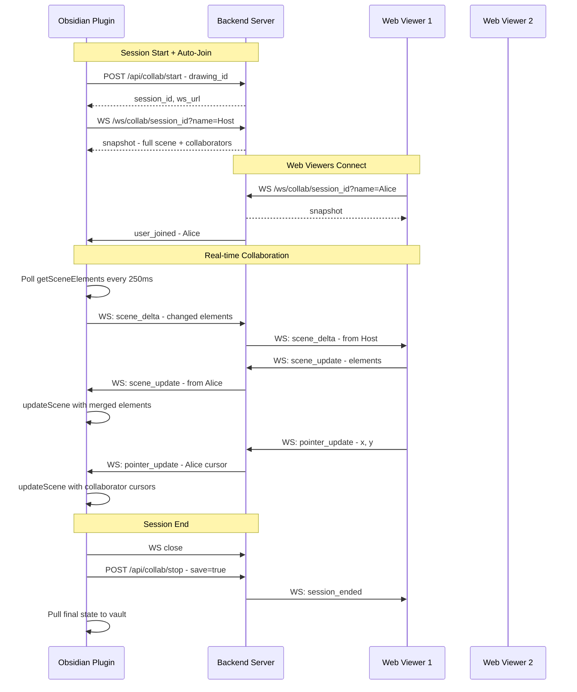
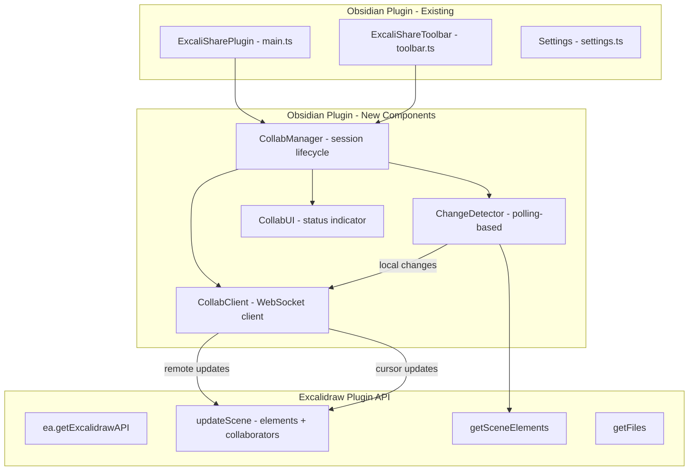

# Native Live Collaboration in Obsidian — Architecture Plan

## 1. Feature Overview

Enable the Obsidian user (host) to participate in live collaboration sessions **directly within the Obsidian Excalidraw canvas**, without needing to open a browser. The host will see other users' cursors, receive real-time element changes, and broadcast their own edits — all through a WebSocket connection from the Obsidian plugin to the ExcaliShare backend.

### Current State

- **Starting a collab session** from Obsidian calls `POST /api/collab/start` and optionally opens a browser window
- **The host cannot participate** from within Obsidian — they must use the web viewer
- **Frontend** (`useCollab.ts` + `collabClient.ts`) has a mature WebSocket collab client with delta updates, pointer tracking, collaborator cursors, follow mode, and deferred scene updates
- **Backend** (`ws.rs` + `collab.rs`) handles WebSocket connections, session management, and message relay
- **Obsidian plugin** has access to `getExcalidrawAPI()` which returns the raw Excalidraw React component API, supporting `updateScene()`, `getSceneElements()`, `getFiles()`, and more

### What Changes

The Obsidian plugin will gain a **WebSocket collab client** that mirrors the frontend's `CollabClient` functionality, connecting to the same backend WebSocket endpoint and participating as a full collaborator.

## 2. Feasibility Analysis

### Key APIs Available

| Capability | API | Available in Obsidian? |
|---|---|---|
| Get current elements | `excalidrawAPI.getSceneElements()` | ✅ via `ea.getExcalidrawAPI()` |
| Update scene with remote elements | `excalidrawAPI.updateScene({ elements })` | ✅ via `ea.getExcalidrawAPI()` |
| Show collaborator cursors | `excalidrawAPI.updateScene({ collaborators: Map })` | ✅ via `ea.getExcalidrawAPI()` |
| Detect local changes | Polling `getSceneElements()` on interval | ✅ (no native onChange hook in Obsidian wrapper) |
| WebSocket connections | Browser `WebSocket` API | ✅ (Obsidian is Electron) |
| Get scene including deleted elements | `excalidrawAPI.getSceneElementsIncludingDeleted()` | ⚠️ Needs verification, may exist |
| Get app state (dragging, etc.) | `excalidrawAPI.getAppState()` | ⚠️ Needs verification |

### Key Challenge: No `onChange` Callback

The Excalidraw Obsidian plugin does **not** expose the React `onChange` prop to external plugins. The `getExcalidrawAPI()` gives us the imperative API (ref), but we cannot register an `onChange` callback on the React component from outside.

**Solution: Polling-based change detection**
- Poll `getSceneElements()` at a configurable interval (e.g., every 200-300ms)
- Compare element versions to detect changes (each Excalidraw element has a `version` field that increments on change)
- Only send changed elements (delta updates), same as the frontend client

### Key Challenge: No `onPointerUpdate` Callback

Similarly, we cannot hook into the React `onPointerUpdate` prop from outside.

**Solution: Skip pointer broadcasting from Obsidian host**
- The Obsidian host will **not** broadcast their cursor position to other participants
- Other participants' cursors **will** be visible in Obsidian via `updateScene({ collaborators })`
- This is an acceptable trade-off: the host's cursor is less critical since they're the session owner
- Future enhancement: could potentially use DOM event listeners on the Excalidraw canvas to approximate pointer position

## 3. Architecture



### Component Architecture



## 4. Detailed Design

### 4.1 New File: `obsidian-plugin/collabClient.ts`

A WebSocket client adapted from `frontend/src/utils/collabClient.ts` but without React/browser dependencies:

```typescript
// Key differences from frontend CollabClient:
// - Uses native WebSocket (available in Electron/Obsidian)
// - Constructs WS URL from settings.baseUrl instead of window.location
// - No DOM-specific code
// - Same message protocol (ClientMessage / ServerMessage types)
// - Same delta tracking logic (lastSentVersions Map)
// - Same debounce/throttle for scene updates
```

**Message types** (shared with backend, same as frontend):
- Client → Server: `scene_update`, `scene_delta`, `pointer_update`, `set_name`
- Server → Client: `snapshot`, `scene_update`, `scene_delta`, `full_sync`, `pointer_update`, `user_joined`, `user_left`, `session_ended`, `error`

### 4.2 New File: `obsidian-plugin/collabManager.ts`

Orchestrates the full collab lifecycle within Obsidian:

```typescript
class CollabManager {
  // State
  private client: CollabClient | null;
  private changeDetector: ChangeDetectorInterval | null;
  private sessionId: string | null;
  private drawingId: string | null;
  private collaborators: Map<string, CollaboratorInfo>;
  
  // Lifecycle
  async startAndJoin(drawingId: string, sessionId: string): Promise<void>;
  async leave(): Promise<void>;
  
  // Change detection (polling)
  private startChangeDetection(): void;
  private stopChangeDetection(): void;
  private detectAndSendChanges(): void;
  
  // Incoming message handlers
  private handleSnapshot(msg: SnapshotMessage): void;
  private handleSceneUpdate(msg: SceneUpdateMessage): void;
  private handleSceneDelta(msg: SceneDeltaMessage): void;
  private handlePointerUpdate(msg: PointerUpdateMessage): void;
  private handleUserJoined(msg: UserJoinedMessage): void;
  private handleUserLeft(msg: UserLeftMessage): void;
  private handleSessionEnded(msg: SessionEndedMessage): void;
  
  // Excalidraw integration
  private getExcalidrawAPI(): ExcalidrawAPI | null;
  private applyRemoteSceneUpdate(elements: Element[]): void;
  private updateCollaboratorCursors(): void;
}
```

### 4.3 Change Detection Strategy

Since we cannot hook into `onChange`, we use a polling approach:

```
Every 250ms:
  1. Call getSceneElements() to get current elements
  2. For each element, compare element.version to lastKnownVersions[element.id]
  3. Collect changed elements (version increased)
  4. If changes found:
     a. Decide delta vs full update (same logic as frontend: delta if <50% changed)
     b. Send via WebSocket
     c. Update lastKnownVersions
```

**Optimization: Skip polling during remote updates**
- Set a flag `isApplyingRemoteUpdate` before calling `updateScene()`
- Skip the next poll cycle if the flag is set (to avoid echoing back remote changes)
- Clear the flag after a short delay (50ms)

### 4.4 Collaborator Cursor Display

When receiving `pointer_update` messages from other participants:

```typescript
// Build Excalidraw collaborator Map
const collaboratorMap = new Map();
for (const [userId, info] of this.collaborators) {
  collaboratorMap.set(userId, {
    username: info.name,
    pointer: { x: info.pointerX, y: info.pointerY },
    button: info.button,
    color: COLLAB_COLORS[info.colorIndex % COLLAB_COLORS.length],
    userState: 'active',
    selectedElementIds: [],
  });
}

// Push to Excalidraw
excalidrawAPI.updateScene({ collaborators: collaboratorMap });
```

### 4.5 Modifications to `obsidian-plugin/main.ts`

Changes to [`startCollabSession()`](obsidian-plugin/main.ts:1105):
1. After receiving `session_id` from the API, create a `CollabManager` instance
2. Call `collabManager.startAndJoin(drawingId, sessionId)` to connect via WebSocket
3. The `collabAutoOpenBrowser` setting still controls whether a browser window also opens

Changes to [`stopCollabSession()`](obsidian-plugin/main.ts:1180):
1. Call `collabManager.leave()` to disconnect WebSocket before stopping the session
2. Rest of the flow (save/discard modal, pull from server) remains the same

New property on plugin class:
```typescript
private collabManager: CollabManager | null = null;
```

### 4.6 Modifications to `obsidian-plugin/toolbar.ts`

Add a visual indicator when the host is actively participating in a collab session:
- Show participant count badge on the collab button
- Animate the collab indicator (pulsing dot) when connected

### 4.7 Modifications to `obsidian-plugin/settings.ts`

New settings:
```typescript
interface ExcaliShareSettings {
  // ... existing settings ...
  collabJoinFromObsidian: boolean;     // Default: true — auto-join from Obsidian
  collabDisplayName: string;           // Default: 'Host' — display name in collab
  collabPollIntervalMs: number;        // Default: 250 — change detection interval
}
```

### 4.8 Modifications to `obsidian-plugin/ExcalidrawPlugin` Interface

Extend the typed interface to include the additional API methods we need:

```typescript
interface ExcalidrawPlugin {
  ea: {
    setView: (view: unknown | 'first' | 'active') => unknown;
    getSceneFromFile: (file: TFile) => Promise<{ elements: unknown[]; appState: unknown }>;
    getExcalidrawAPI: () => {
      getFiles: () => Record<string, unknown>;
      updateScene: (data: { 
        elements?: unknown[]; 
        appState?: unknown;
        collaborators?: Map<string, unknown>;
      }) => void;
      getSceneElements: () => unknown[];
      getSceneElementsIncludingDeleted?: () => unknown[];
      getAppState: () => Record<string, unknown>;
    };
    isExcalidrawFile: (file: TFile) => boolean;
  };
}
```

## 5. Edge Cases & Considerations

### 5.1 File Save Conflicts
- When the host is in a collab session, the Excalidraw plugin may auto-save the file
- Remote changes applied via `updateScene()` will be included in these saves
- This is actually **desirable** — the vault file stays in sync with the collab state
- The auto-sync feature should be **disabled** during active collab to avoid uploading mid-session state

### 5.2 Obsidian View Changes
- If the user switches to a different file/tab during collab, the `getExcalidrawAPI()` may return a different view's API
- Solution: Store a reference to the specific `ExcalidrawView` when joining, and use `ea.setView(storedView)` before each API call
- If the view is closed, auto-disconnect from the collab session

### 5.3 Reconnection
- Same exponential backoff as the frontend client (1s, 2s, 4s, 8s, 16s)
- On reconnect, request a full snapshot to resync state
- Show a Notice to the user on disconnect/reconnect

### 5.4 Remote Update Merging
- Use the same merge strategy as the frontend: element-level version comparison
- For each remote element, only apply if `remote.version >= local.version`
- This prevents overwriting local in-progress changes

### 5.5 Performance
- Polling at 250ms is ~4 checks/second — lightweight for modern hardware
- Delta updates minimize WebSocket traffic (only changed elements sent)
- Collaborator cursor updates are throttled (same as frontend: 50ms)

## 6. Implementation Plan

### Phase 1: Core WebSocket Client
1. Create `obsidian-plugin/collabClient.ts` — adapted from frontend's `CollabClient`
2. Create shared types file `obsidian-plugin/collabTypes.ts` — message types matching the backend protocol
3. Unit-test the client connection logic manually

### Phase 2: Collab Manager
4. Create `obsidian-plugin/collabManager.ts` — orchestrates session lifecycle
5. Implement change detection (polling `getSceneElements()`)
6. Implement remote update application (`updateScene()` with merge logic)
7. Implement collaborator cursor display

### Phase 3: Plugin Integration
8. Modify `main.ts` — wire `CollabManager` into `startCollabSession()` / `stopCollabSession()`
9. Modify `settings.ts` — add new settings (display name, poll interval, auto-join toggle)
10. Modify `toolbar.ts` — add participant count badge and active collab indicator
11. Handle edge cases: view changes, file switches, reconnection

### Phase 4: Polish & Testing
12. Add status bar updates showing connection state and participant count
13. Add Notice messages for key events (connected, disconnected, user joined/left, session ended)
14. Test with multiple participants (Obsidian host + web viewers)
15. Test reconnection scenarios
16. Test with large drawings (performance)

## 7. Files to Create/Modify

| File | Action | Description |
|------|--------|-------------|
| `obsidian-plugin/collabClient.ts` | **Create** | WebSocket client (adapted from frontend) |
| `obsidian-plugin/collabTypes.ts` | **Create** | Shared message types for the WS protocol |
| `obsidian-plugin/collabManager.ts` | **Create** | Session lifecycle + change detection + cursor display |
| `obsidian-plugin/main.ts` | **Modify** | Wire CollabManager into start/stop, add collabManager property |
| `obsidian-plugin/settings.ts` | **Modify** | Add collabJoinFromObsidian, collabDisplayName, collabPollIntervalMs |
| `obsidian-plugin/toolbar.ts` | **Modify** | Add participant count badge, active collab indicator |
| `obsidian-plugin/styles.ts` | **Modify** | Add styles for collab indicator animations |

### No Backend Changes Required
The existing WebSocket endpoint and message protocol are fully compatible. The Obsidian plugin will connect as a regular WebSocket client, indistinguishable from a web viewer.
