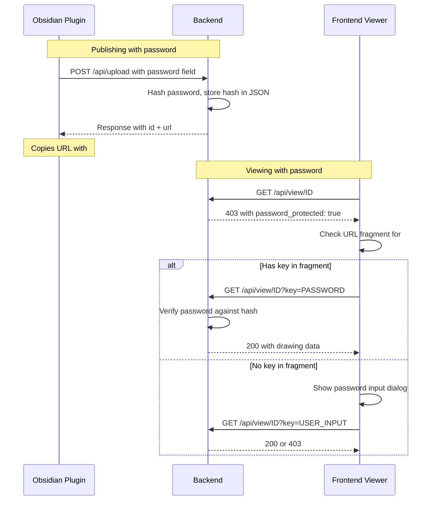
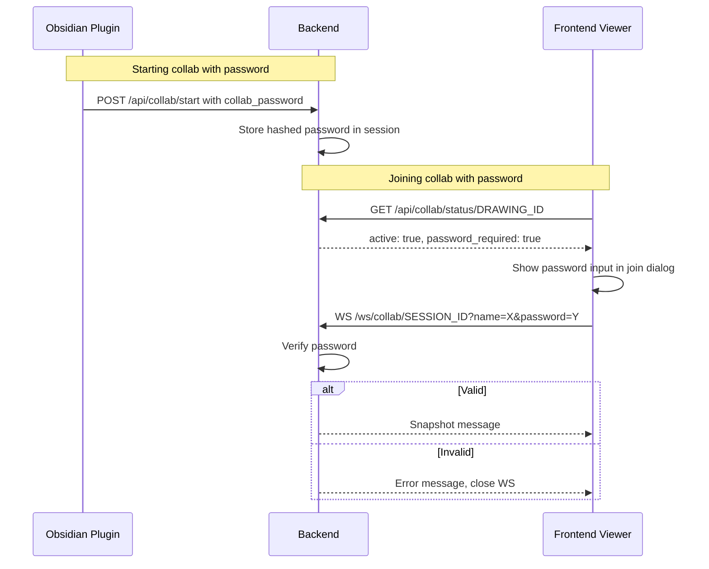

# Password Protection for Drawings & Collab Sessions

## Overview

Add optional password protection to two areas:
1. **Drawing viewing** — When publishing from Obsidian, optionally set a password. The share link includes the password as a URL fragment (`#key=...`). Users accessing the drawing without the fragment must enter the password.
2. **Collab session joining** — When starting a live collab session from Obsidian, optionally set a password. Users clicking "Join" in the frontend must enter the password before connecting.

## Design Principles

- **Zero-knowledge approach**: The server stores a **bcrypt/argon2 hash** of the password, never the plaintext. Verification happens server-side.
- **Seamless sharing**: The share link includes the password in the URL **fragment** (`#key=...`), which is never sent to the server in HTTP requests — the frontend reads it from `window.location.hash` and sends it as a header/parameter.
- **Backward compatible**: Existing drawings without passwords continue to work unchanged. Password is always optional.
- **No password = no prompt**: If a drawing has no password set, the viewer loads immediately as before.

---

## Architecture





---

## Detailed Changes by Component

### 1. Backend — Rust/Axum

#### 1.1 Password Hashing Dependency

Add `argon2` crate to [`Cargo.toml`](backend/Cargo.toml):
```toml
argon2 = "0.5"
rand = "0.8"  # for salt generation
```

Create a new utility module `backend/src/password.rs`:
- `hash_password(plain: &str) -> Result<String>` — Argon2id hash
- `verify_password(plain: &str, hash: &str) -> Result<bool>` — constant-time verification

#### 1.2 Storage Changes — [`storage.rs`](backend/src/storage.rs:1)

The password hash is stored as a metadata field `_password_hash` inside the drawing JSON file (similar to how `_source_path` is already stored).

- [`FileSystemStorage::save()`](backend/src/storage.rs:51) — Accept optional `password_hash: Option<&str>` parameter, store as `_password_hash` field
- [`FileSystemStorage::load()`](backend/src/storage.rs:74) — No change needed (returns full JSON including `_password_hash`)
- [`DrawingMeta`](backend/src/storage.rs:8) — Add `password_protected: bool` field (derived from presence of `_password_hash` in JSON)
- [`DrawingStorage` trait](backend/src/storage.rs:19) — Update `save()` signature to include password hash

#### 1.3 Route Changes — [`routes.rs`](backend/src/routes.rs:1)

**Upload endpoint** — [`upload_drawing()`](backend/src/routes.rs:109):
- Add `password: Option<String>` field to [`UploadRequest`](backend/src/routes.rs:48)
- If password is provided, hash it with Argon2id before passing to storage
- On update: if `password` is `Some("")` (empty string), **remove** the password. If `Some(value)`, set new password. If `None`, preserve existing password.
- Return `password_protected: bool` in [`UploadResponse`](backend/src/routes.rs:25)

**View endpoint** — [`get_drawing()`](backend/src/routes.rs:176):
- Accept optional `key` query parameter: `Query<ViewQuery>` with `key: Option<String>`
- If drawing has `_password_hash`:
  - If no `key` provided → return `403` with `{ "error": "Password required", "password_protected": true }`
  - If `key` provided → verify against hash. If valid, return drawing data (strip `_password_hash` from response). If invalid, return `403` with `{ "error": "Invalid password", "password_protected": true }`
- If drawing has no `_password_hash` → return data as before (strip `_password_hash` if somehow present)
- **Always strip** `_password_hash` from the response JSON (never expose the hash to clients)

**Public drawings list** — [`list_drawings_public()`](backend/src/routes.rs:200):
- Add `password_protected: bool` to [`PublicDrawingMeta`](backend/src/routes.rs:42)
- Derived from presence of `_password_hash` in the stored JSON

**Admin drawings list** — [`list_drawings()`](backend/src/routes.rs:193):
- Add `password_protected: bool` to [`DrawingMeta`](backend/src/storage.rs:8)

**Collab start** — [`start_collab()`](backend/src/routes.rs:224):
- Add `password: Option<String>` field to [`StartCollabRequest`](backend/src/routes.rs:63)
- If provided, hash and store in the `CollabSession`
- Return `password_required: bool` in [`StartCollabResponse`](backend/src/routes.rs:73)

**Collab status** — [`collab_status()`](backend/src/routes.rs:302):
- Add `password_required: bool` to [`CollabStatusResponse`](backend/src/routes.rs:92)
- Read from session metadata

#### 1.4 Error Changes — [`error.rs`](backend/src/error.rs:1)

Add new error variant:
```rust
#[error("Password required")]
PasswordRequired,

#[error("Invalid password")]
InvalidPassword,
```

Both map to `403 Forbidden` with appropriate JSON body including `password_protected: true`.

#### 1.5 Collab Session Changes — [`collab.rs`](backend/src/collab.rs:1)

- Add `password_hash: Option<String>` field to [`CollabSession`](backend/src/collab.rs:126)
- [`SessionManager::create_session()`](backend/src/collab.rs:223) — Accept optional `password_hash: Option<String>`
- Add `SessionManager::verify_session_password(session_id, password) -> Result<bool>` method
- [`SessionInfo`](backend/src/collab.rs:192) — Add `password_required: bool` for admin view
- [`get_session_status()`](backend/src/collab.rs) — Return `password_required` flag

#### 1.6 WebSocket Changes — [`ws.rs`](backend/src/ws.rs:1)

- Add `password: Option<String>` to [`WsQuery`](backend/src/ws.rs:14)
- In [`ws_collab_handler()`](backend/src/ws.rs:38): Before upgrading the WebSocket, verify the password if the session requires one
  - If session has password and no/wrong password provided → reject with HTTP 403 (before WS upgrade)
  - If valid → proceed with upgrade as normal

---

### 2. Frontend — React/TypeScript

#### 2.1 Type Changes — [`types/index.ts`](frontend/src/types/index.ts:1)

```typescript
// Update existing types
export interface PublicDrawing {
  id: string;
  created_at: string;
  source_path: string | null;
  password_protected: boolean;  // NEW
}

export interface CollabStatusResponse {
  active: boolean;
  session_id?: string;
  participant_count?: number;
  password_required?: boolean;  // NEW
}
```

#### 2.2 New Component: `PasswordDialog.tsx`

A reusable modal dialog for password entry:
- Text input with password type
- Submit button + Cancel button
- Enter key to submit, Escape to cancel
- Error state for "wrong password" feedback
- Dark/light theme support (consistent with existing dialogs)
- Used by both Viewer and CollabStatus

#### 2.3 Viewer Changes — [`Viewer.tsx`](frontend/src/Viewer.tsx:1)

**Drawing loading flow** (around [line 96-120](frontend/src/Viewer.tsx:96)):

1. Fetch `/api/view/${id}` as before
2. If response is `403` with `password_protected: true`:
   a. Check `window.location.hash` for `#key=...` fragment
   b. If found: retry fetch with `?key=PASSWORD` query parameter
   c. If not found or retry fails: show `PasswordDialog`
   d. On password submit: retry fetch with `?key=USER_INPUT`
   e. On success: store password in sessionStorage for this drawing ID (for cache invalidation/refetch)
   f. On failure: show error in dialog, let user retry
3. If response is `200`: proceed as before

New state variables:
- `passwordRequired: boolean` — whether the drawing needs a password
- `passwordError: string | null` — error message for wrong password

#### 2.4 CollabStatus Changes — [`CollabStatus.tsx`](frontend/src/CollabStatus.tsx:1)

- Accept new prop: `passwordRequired: boolean`
- In the join dialog (around [line 94-150](frontend/src/CollabStatus.tsx:94)):
  - If `passwordRequired`, add a password input field below the name input
  - Pass password to `onJoin` callback: `onJoin(name: string, password?: string)`

#### 2.5 useCollab Hook Changes — [`useCollab.ts`](frontend/src/hooks/useCollab.ts:1)

- [`refreshStatus()`](frontend/src/hooks/useCollab.ts:163) — Parse `password_required` from status response, expose as state
- [`joinSession()`](frontend/src/hooks/useCollab.ts:320) — Accept optional `password` parameter
- Pass password to `CollabClient` constructor

#### 2.6 CollabClient Changes — [`collabClient.ts`](frontend/src/utils/collabClient.ts:1)

- Constructor accepts optional `password: string`
- [`_connect()`](frontend/src/utils/collabClient.ts:34) — Append `&password=...` to WebSocket URL if password is set

#### 2.7 DrawingsBrowser Changes — [`DrawingsBrowser.tsx`](frontend/src/DrawingsBrowser.tsx:1)

- Show a 🔒 lock icon next to password-protected drawings in the list/tree view
- The `PublicDrawing` type already gets `password_protected` from the API

#### 2.8 AdminPage Changes — [`AdminPage.tsx`](frontend/src/AdminPage.tsx:1)

- Show password-protected status in the drawings list (🔒 icon)
- Show password-required status for collab sessions

#### 2.9 Cache Considerations — [`cache.ts`](frontend/src/utils/cache.ts:1)

- Password-protected drawings should still be cached after successful authentication
- Cache key remains the drawing ID (password is not part of the cache key)
- On page reload, the fragment `#key=...` is still in the URL, so re-auth happens transparently

---

### 3. Obsidian Plugin — TypeScript

#### 3.1 Publish Flow — [`main.ts`](obsidian-plugin/main.ts:884)

**Password prompt on publish:**
- When user clicks "Publish" (first time), show an Obsidian `Modal` asking:
  - "Set a password for this drawing? (optional)"
  - Password input field
  - "Publish without password" button + "Publish with password" button
- Store the password choice in frontmatter as `excalishare-password: true/false` (NOT the actual password — just whether it was set)
- On sync/re-publish: if drawing already has a password, include the password in the upload request to preserve it. Show option to change/remove password.

**Upload request** — [`publishDrawing()`](obsidian-plugin/main.ts:884):
- Add `password` field to the upload body when provided
- After successful upload, construct URL with fragment: `${result.url}#key=${encodeURIComponent(password)}`
- Copy this full URL (with fragment) to clipboard

**Frontmatter tracking:**
- Store `excalishare-password: true` in frontmatter when password is set (for UI indication)
- Do NOT store the actual password in frontmatter (security)

#### 3.2 Collab Start Flow — [`main.ts`](obsidian-plugin/main.ts:1127)

**Password prompt on collab start:**
- When user clicks "Start Live Collab", show an Obsidian `Modal`:
  - "Set a password for this collab session? (optional)"
  - Password input field
  - "Start without password" button + "Start with password" button
- Send password in the [`/api/collab/start`](obsidian-plugin/main.ts:1142) request body

**Browser URL:**
- If collab has a password, the auto-opened browser URL should NOT include the password (users must enter it manually when joining)
- This is intentional: the collab password protects who can join, and the link is shared publicly

#### 3.3 Toolbar Changes — [`toolbar.ts`](obsidian-plugin/toolbar.ts:1)

- Show a 🔒 icon in the toolbar when the drawing is password-protected
- The toolbar state `published` should indicate password protection status

#### 3.4 Settings — [`settings.ts`](obsidian-plugin/settings.ts:1)

No new global settings needed. Password is per-drawing/per-session, not a global setting.

#### 3.5 New Modal: `PasswordModal`

Create a new Obsidian Modal class (can be in `main.ts` or a new `passwordModal.ts`):
- Title: "Password Protection"
- Password input field with show/hide toggle
- Confirm password field (for new passwords)
- Buttons: "Set Password" / "Skip" / "Cancel"
- Returns the password or null via a Promise

---

### 4. Security Considerations

1. **Argon2id hashing** — Industry-standard password hashing with salt, resistant to GPU/ASIC attacks
2. **URL fragment privacy** — The `#key=...` fragment is never sent to the server in HTTP requests by browsers. The frontend explicitly reads it and sends it as a query parameter only to the view API.
3. **No password in logs** — Backend must never log plaintext passwords. Only log `password_protected: true/false`.
4. **Rate limiting** — Existing rate limiting (120 req/sec public) already protects against brute force. Consider adding a stricter limit for failed password attempts (e.g., 5 attempts per minute per IP for a specific drawing).
5. **WebSocket password** — Verified BEFORE the WebSocket upgrade, so invalid passwords never get a WebSocket connection.
6. **Password hash stripping** — The `_password_hash` field is ALWAYS stripped from API responses. It only exists in the stored JSON file.
7. **Empty password = no protection** — An empty string password is treated as "no password" (not a valid password).
8. **Collab session password is ephemeral** — It lives only in the in-memory session, not persisted to disk.

---

### 5. Migration / Backward Compatibility

- Existing drawings without `_password_hash` field work exactly as before — no password required
- The `password` field in upload requests is optional — existing plugin versions that don't send it continue to work
- The `key` query parameter on `/api/view/{id}` is optional — unprotected drawings ignore it
- The `password` field in collab start requests is optional
- The `password` query parameter on WebSocket connections is optional
- Public drawings list gains `password_protected` field — frontend versions that don't read it simply ignore it

---

## Implementation Order

The changes should be implemented in this order to maintain a working system at each step:

1. **Backend: Password utility module** — `password.rs` with hash/verify functions
2. **Backend: Storage changes** — Add `_password_hash` support to save/load
3. **Backend: Upload endpoint** — Accept and hash password on upload
4. **Backend: View endpoint** — Password verification gate
5. **Backend: Error types** — PasswordRequired, InvalidPassword
6. **Backend: Collab session** — Password hash in session, verify method
7. **Backend: Collab start endpoint** — Accept password
8. **Backend: Collab status endpoint** — Return password_required flag
9. **Backend: WebSocket handler** — Password verification before upgrade
10. **Frontend: Types** — Update shared types
11. **Frontend: PasswordDialog component** — Reusable password input modal
12. **Frontend: Viewer** — Password-gated drawing loading with fragment support
13. **Frontend: CollabStatus** — Password field in join dialog
14. **Frontend: useCollab hook** — Password state and passing
15. **Frontend: CollabClient** — Password in WebSocket URL
16. **Frontend: DrawingsBrowser** — Lock icon for protected drawings
17. **Frontend: AdminPage** — Password status display
18. **Plugin: PasswordModal** — Obsidian modal for password input
19. **Plugin: Publish flow** — Password prompt + URL fragment
20. **Plugin: Collab start flow** — Password prompt
21. **Plugin: Toolbar** — Lock icon indicator
22. **Plugin: Frontmatter** — Track password-protected status

---

## File Change Summary

| File | Change Type | Description |
|------|-------------|-------------|
| `backend/Cargo.toml` | Modify | Add `argon2`, `rand` dependencies |
| `backend/src/password.rs` | **New** | Password hash/verify utilities |
| `backend/src/storage.rs` | Modify | Add `_password_hash` support, `password_protected` in meta |
| `backend/src/routes.rs` | Modify | Password in upload, view gate, collab start, collab status |
| `backend/src/error.rs` | Modify | Add PasswordRequired, InvalidPassword variants |
| `backend/src/collab.rs` | Modify | Password hash in session, verify method |
| `backend/src/ws.rs` | Modify | Password verification before WS upgrade |
| `backend/src/main.rs` | Modify | Register password module |
| `frontend/src/types/index.ts` | Modify | Add password fields to types |
| `frontend/src/PasswordDialog.tsx` | **New** | Reusable password input dialog |
| `frontend/src/Viewer.tsx` | Modify | Password-gated loading, fragment reading |
| `frontend/src/CollabStatus.tsx` | Modify | Password field in join dialog |
| `frontend/src/hooks/useCollab.ts` | Modify | Password state, pass to client |
| `frontend/src/utils/collabClient.ts` | Modify | Password in WS URL |
| `frontend/src/DrawingsBrowser.tsx` | Modify | Lock icon for protected drawings |
| `frontend/src/AdminPage.tsx` | Modify | Password status display |
| `obsidian-plugin/main.ts` | Modify | Password prompts in publish + collab start |
| `obsidian-plugin/toolbar.ts` | Modify | Lock icon indicator |
