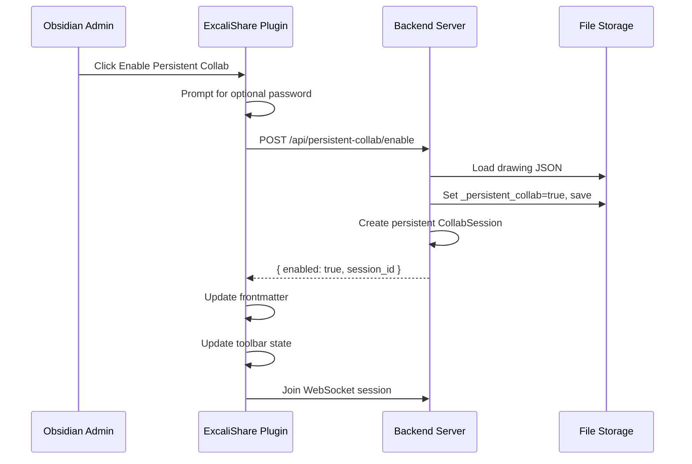
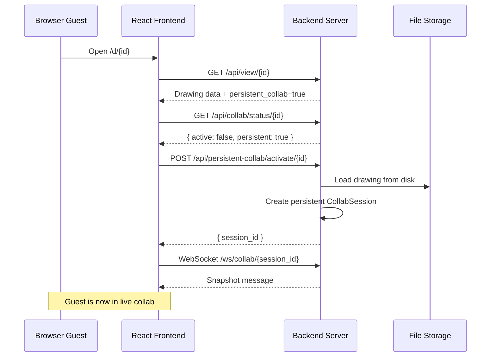
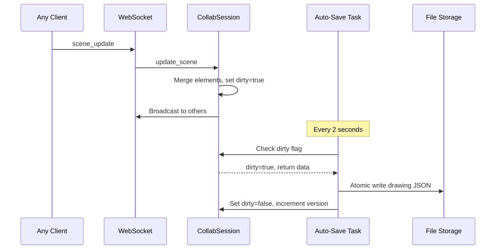
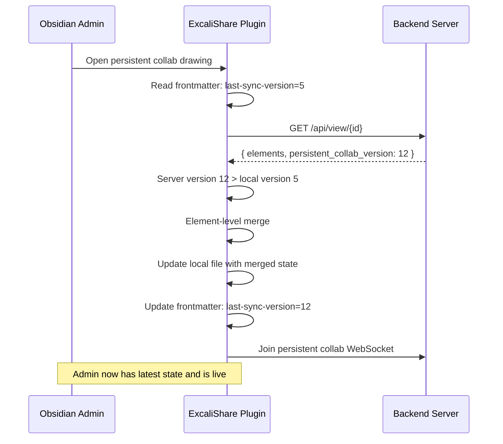

# Persistent Collaboration Mode — Architecture Plan

## 1. Overview & Motivation

### Current State (Ephemeral Collab)

The existing collaboration system is **session-based and ephemeral**:

1. The **Obsidian admin** must explicitly start a collab session via `POST /api/collab/start` (requires API key)
2. The session lives **in-memory only** in the backend's [`SessionManager`](backend/src/collab.rs:209)
3. Sessions have a **timeout** (default 2h, max 24h) — expired sessions are auto-saved by [`cleanup_expired()`](backend/src/collab.rs:746)
4. When the admin stops the session via [`stop_collab()`](backend/src/routes.rs:343), changes are optionally saved to disk
5. If the server restarts, **all sessions are lost**
6. Guests can only collaborate while the admin has an active session running

### Desired State (Persistent Collab)

A new **persistent collaboration mode** per drawing that:

1. **Always-on**: Any visitor opening the drawing URL automatically enters a live collab session — no admin action needed at that moment
2. **Server as Source of Truth**: All changes are persisted to disk in real-time — the server's stored drawing is the canonical version
3. **Offline admin sync**: When the Obsidian admin opens the drawing later, changes made by others are automatically pulled into the vault
4. **Conflict resolution**: A clear strategy for merging local vault changes with server state

### Key Distinction

| Aspect | Ephemeral Collab (current) | Persistent Collab (new) |
|--------|---------------------------|------------------------|
| Lifecycle | Admin starts/stops manually | Toggle on/off per drawing; always active while enabled |
| Session memory | In-memory only | In-memory when active, disk-persisted on every change |
| Timeout | 2h default, max 24h | No timeout — session recreated on demand |
| Server restart | Session lost | Session auto-recreated from disk on first visitor |
| Admin required | Must be online to start | Not required — guests self-activate |
| Source of truth | Obsidian vault file | Server storage |
| Save behavior | Save on stop or timeout | Continuous auto-save |

---

## 2. Data Model Changes

### 2.1 Drawing Metadata — New `_persistent_collab` Flag

Each drawing JSON file on disk already stores internal metadata fields (`_source_path`, `_password_hash`). We add a new field:

```json
{
  "type": "excalidraw",
  "elements": [...],
  "appState": {...},
  "files": {...},
  "_source_path": "Drawings/my-drawing.excalidraw",
  "_password_hash": "$argon2id$...",
  "_persistent_collab": true,
  "_persistent_collab_password_hash": "$argon2id$..."
}
```

**Fields:**
- `_persistent_collab` (`bool`): Whether persistent collab is enabled for this drawing
- `_persistent_collab_password_hash` (`Option<String>`): Optional password hash for the persistent collab session (separate from the drawing view password)

### 2.2 Sidecar Metadata Extension

The [`SidecarMeta`](backend/src/storage.rs:19) struct gets a new field:

```rust
#[derive(Debug, Clone, Serialize, Deserialize)]
struct SidecarMeta {
    pub created_at: DateTime<Utc>,
    #[serde(default)]
    pub source_path: Option<String>,
    #[serde(default)]
    pub password_protected: bool,
    #[serde(default)]
    pub persistent_collab: bool,  // NEW
}
```

### 2.3 DrawingMeta Extension

The public [`DrawingMeta`](backend/src/storage.rs:8) struct also gets the flag:

```rust
pub struct DrawingMeta {
    pub id: String,
    pub created_at: DateTime<Utc>,
    pub size_bytes: u64,
    pub source_path: Option<String>,
    pub password_protected: bool,
    pub persistent_collab: bool,  // NEW
}
```

### 2.4 Frontmatter in Obsidian

The plugin stores a new frontmatter key:

```yaml
---
excalishare-id: abc123
excalishare-password: true
excalishare-persistent-collab: true   # NEW
---
```

### 2.5 CollabSession Extension

The [`CollabSession`](backend/src/collab.rs:126) struct gets a `persistent` flag:

```rust
pub struct CollabSession {
    // ... existing fields ...
    pub persistent: bool,  // NEW — if true, no timeout, auto-save on changes
}
```

---

## 3. Architecture & Data Flow

### 3.1 Enabling Persistent Collab (Admin Flow)

```
Admin in Obsidian
       |
       | clicks "Enable Persistent Collab" in toolbar
       v
Plugin sends POST /api/persistent-collab/enable
  { drawing_id, password? }
       |
       v
Backend:
  1. Loads drawing from storage
  2. Sets _persistent_collab = true in drawing JSON
  3. Optionally stores _persistent_collab_password_hash
  4. Updates sidecar metadata
  5. Creates a persistent CollabSession in SessionManager
  6. Returns { session_id, enabled: true }
       |
       v
Plugin stores excalishare-persistent-collab: true in frontmatter
Toolbar shows persistent collab indicator
```

### 3.2 Guest Visits Drawing with Persistent Collab

```
Guest opens /d/{drawing_id} in browser
       |
       v
Frontend: Viewer.tsx loads drawing via GET /api/view/{id}
       |
       v
Frontend: useCollab checks GET /api/collab/status/{drawing_id}
       |
       +-- Response includes: { active: true/false, persistent: true, ... }
       |
       v
  If active=true:
    Session already exists in memory -> join normally via WebSocket
  If active=false AND persistent=true:
    Frontend calls POST /api/persistent-collab/activate/{drawing_id}
    (public endpoint, no auth needed)
       |
       v
  Backend:
    1. Loads drawing from disk
    2. Creates a new CollabSession (persistent=true, no timeout)
    3. Returns { session_id }
       |
       v
  Frontend joins the session via WebSocket (same as current flow)
```

### 3.3 Real-Time Persistence (Auto-Save)

```
Any client sends scene_update/scene_delta via WebSocket
       |
       v
SessionManager.update_scene() / update_scene_delta()
  1. Merges elements into in-memory session (existing logic)
  2. Increments scene_seq
  3. Broadcasts to other clients
       |
       v
NEW: Persistent save trigger
  - Debounced: after 2 seconds of no scene updates, flush to disk
  - Or: every N scene updates (e.g., every 50), flush to disk
  - Implementation: background tokio task per persistent session
       |
       v
Storage.save(drawing_id, session.elements_as_array(), ...)
  - Preserves _source_path, _password_hash, _persistent_collab flags
  - Writes to disk atomically (write to .tmp, then rename)
```

### 3.4 Admin Opens Drawing Later (Sync Flow)

```
Admin opens .excalidraw file in Obsidian
       |
       v
Plugin detects excalishare-persistent-collab: true in frontmatter
       |
       v
Plugin auto-pulls from server: GET /api/view/{drawing_id}
       |
       v
Compare server version with local version:
  - Server has _persistent_collab_version (monotonic counter)
  - Local frontmatter stores excalishare-last-sync-version
       |
       +-- If server version > local version:
       |     Apply server state to local file (server-wins)
       |     Update excalishare-last-sync-version
       |
       +-- If versions equal:
       |     No action needed
       |
       v
If admin edits locally while persistent collab is active:
  - Plugin auto-syncs changes to server (existing auto-sync mechanism)
  - If collabJoinFromObsidian is enabled, plugin joins the persistent
    session via WebSocket for real-time sync
```

### 3.5 Session Lifecycle for Persistent Collab

```
                    ┌──────────────────────────────────┐
                    │  Drawing with persistent_collab   │
                    │  = true on disk                   │
                    └──────────────┬───────────────────┘
                                   │
                    First visitor   │   Server restart
                    arrives         │   (no in-memory session)
                                   │
                    ┌──────────────v───────────────────┐
                    │  POST /api/persistent-collab/     │
                    │  activate/{drawing_id}            │
                    │  Creates in-memory session        │
                    └──────────────┬───────────────────┘
                                   │
                    ┌──────────────v───────────────────┐
                    │  Active persistent session        │
                    │  - No timeout                     │
                    │  - Auto-saves to disk             │
                    │  - Recreated on demand            │
                    └──────────────┬───────────────────┘
                                   │
                    Last participant│   Idle timeout
                    disconnects     │   (e.g., 30 min no activity)
                                   │
                    ┌──────────────v───────────────────┐
                    │  Session goes idle                 │
                    │  - Final save to disk              │
                    │  - Session removed from memory     │
                    │  - persistent_collab stays true    │
                    │  - Next visitor recreates session  │
                    └──────────────────────────────────┘
```

### 3.6 Disabling Persistent Collab

```
Admin clicks "Disable Persistent Collab" in toolbar
       |
       v
Plugin sends POST /api/persistent-collab/disable
  { drawing_id }
       |
       v
Backend:
  1. If active session exists, ends it (saves to disk)
  2. Removes _persistent_collab flag from drawing JSON
  3. Updates sidecar metadata
  4. Returns { disabled: true }
       |
       v
Plugin removes excalishare-persistent-collab from frontmatter
Plugin pulls final state from server
```

---

## 4. Conflict Resolution Strategy

### 4.1 Chosen Approach: **Server-Wins with Version Tracking**

Given the architecture constraints (no CRDT library, Excalidraw's element-based model, existing version-based merging), the most pragmatic approach is:

**Server-Wins**: The server's stored state is always the canonical truth for persistent collab drawings.

### 4.2 How It Works

```
Scenario: Admin edits offline, guests edit on server

Timeline:
  T0: Server state = V5, Admin local state = V5 (in sync)
  T1: Admin goes offline
  T2: Guest edits on server -> V6, V7, V8
  T3: Admin edits locally -> local V6' (diverged)
  T4: Admin comes online

Resolution at T4:
  1. Plugin detects persistent collab is enabled
  2. Plugin fetches server state (V8)
  3. Plugin performs element-level merge:
     a. For each element in server state:
        - If element exists locally with LOWER version -> use server version
        - If element exists locally with HIGHER version -> use local version
        - If element only exists on server -> add it locally
     b. For each element only in local state:
        - Keep it (it is a new element the admin created)
     c. Result: merged state with highest-version elements from both sides
  4. Plugin uploads merged state to server
  5. Plugin updates local file with merged state
```

### 4.3 Version Tracking

Add a `_version` counter to the drawing JSON that increments on every persistent save:

```json
{
  "_persistent_collab": true,
  "_persistent_collab_version": 42
}
```

The plugin stores the last-synced version in frontmatter:

```yaml
excalishare-last-sync-version: 42
```

This allows the plugin to detect whether the server has newer changes.

### 4.4 Element-Level Merge Algorithm

Reuse the existing [`merge_elements()`](backend/src/collab.rs:593) logic, which already does version-based conflict resolution per element ID. The same algorithm runs:

1. **On the server** during live collab (already implemented)
2. **In the plugin** when syncing offline changes (new — implement in TypeScript)

```typescript
function mergeElements(
  local: ExcalidrawElement[],
  server: ExcalidrawElement[]
): ExcalidrawElement[] {
  const merged = new Map<string, ExcalidrawElement>();
  const order: string[] = [];

  // Start with server elements (source of truth)
  for (const el of server) {
    merged.set(el.id, el);
    order.push(el.id);
  }

  // Merge local elements
  for (const el of local) {
    const existing = merged.get(el.id);
    if (!existing) {
      // New local element — add it
      merged.set(el.id, el);
      order.push(el.id);
    } else if ((el.version ?? 0) > (existing.version ?? 0)) {
      // Local has higher version — use local
      merged.set(el.id, el);
    }
    // Otherwise server version wins (already in map)
  }

  return order.map(id => merged.get(id)!);
}
```

### 4.5 Edge Cases

| Scenario | Resolution |
|----------|-----------|
| Admin deletes element locally, guest modifies it on server | Server version wins (higher version from guest edit) |
| Admin creates new element offline | Element added to merged state (not on server, so no conflict) |
| Guest deletes element, admin modifies locally | Depends on version: if guest's delete has higher version, element stays deleted |
| Both edit same element | Higher version wins; if equal, server wins |
| Admin disables persistent collab while guests are editing | Session ends, final state saved, guests see "session ended" |

---

## 5. API Changes

### 5.1 New Endpoints

#### `POST /api/persistent-collab/enable` (Protected — requires API key)

Enable persistent collab for a drawing.

**Request:**
```json
{
  "drawing_id": "abc123",
  "password": "optional-session-password"
}
```

**Response:**
```json
{
  "enabled": true,
  "drawing_id": "abc123",
  "session_id": "uuid-of-created-session"
}
```

**Logic:**
1. Verify drawing exists
2. Set `_persistent_collab = true` in drawing JSON
3. Optionally hash and store `_persistent_collab_password_hash`
4. Update sidecar metadata
5. Create a persistent `CollabSession` (no timeout)
6. Return session info

#### `POST /api/persistent-collab/disable` (Protected — requires API key)

Disable persistent collab for a drawing.

**Request:**
```json
{
  "drawing_id": "abc123"
}
```

**Response:**
```json
{
  "disabled": true,
  "drawing_id": "abc123"
}
```

**Logic:**
1. If active session exists, end it (save to disk)
2. Remove `_persistent_collab` and `_persistent_collab_password_hash` from drawing JSON
3. Update sidecar metadata
4. Broadcast `session_ended` to connected clients

#### `POST /api/persistent-collab/activate/{drawing_id}` (Public — no auth)

Activate (or get) the in-memory session for a persistent collab drawing. Called by the frontend when a visitor opens a persistent collab drawing that has no active in-memory session.

**Response:**
```json
{
  "session_id": "uuid",
  "password_required": false
}
```

**Logic:**
1. Load drawing from disk
2. Verify `_persistent_collab == true` — if not, return 404
3. Check if session already exists in `SessionManager` — if yes, return existing session_id
4. Create new persistent `CollabSession` from disk data
5. Return session info

#### `GET /api/collab/status/{drawing_id}` (Existing — Extended)

Add `persistent` field to the response:

```json
{
  "active": true,
  "session_id": "uuid",
  "participant_count": 3,
  "password_required": false,
  "persistent": true
}
```

If `active` is false but the drawing has `_persistent_collab = true`, return:

```json
{
  "active": false,
  "persistent": true,
  "password_required": false
}
```

This tells the frontend it should call `/api/persistent-collab/activate/{drawing_id}` to create the session.

#### `GET /api/view/{id}` (Existing — Extended)

Add `persistent_collab` and `persistent_collab_version` to the response (stripped of internal `_` prefix):

```json
{
  "type": "excalidraw",
  "elements": [...],
  "persistent_collab": true,
  "persistent_collab_version": 42
}
```

#### `POST /api/upload` (Existing — Extended)

Add optional `persistent_collab` field to the upload request:

```json
{
  "type": "excalidraw",
  "elements": [...],
  "persistent_collab": true,
  "persistent_collab_version": 42
}
```

When uploading to a persistent collab drawing, the server performs element-level merge if there is an active session, rather than blindly overwriting.

### 5.2 Modified Endpoints Summary

| Endpoint | Change |
|----------|--------|
| `GET /api/collab/status/{drawing_id}` | Add `persistent` field |
| `GET /api/view/{id}` | Expose `persistent_collab` and `persistent_collab_version` |
| `GET /api/public/drawings` | Add `persistent_collab` field to listing |
| `POST /api/upload` | Handle merge for persistent collab drawings |

---

## 6. Backend Implementation Details

### 6.1 Persistent Session Auto-Save

Add a background task per persistent session that debounces writes to disk:

```rust
// In SessionManager or as a separate PersistentSaveManager
struct PersistentSaveState {
    dirty: bool,
    last_save: Instant,
}

// Background task (spawned when persistent session is created):
async fn persistent_save_loop(
    session_id: String,
    session_manager: SessionManager,
    storage: FileSystemStorage,
) {
    let mut interval = tokio::time::interval(Duration::from_secs(2));
    loop {
        interval.tick().await;

        // Check if session still exists and has unsaved changes
        let save_data = session_manager
            .get_persistent_save_data(&session_id)
            .await;

        if let Some((drawing_id, data, version)) = save_data {
            // Atomic write: write to .tmp then rename
            if let Err(e) = storage.save_persistent(
                &drawing_id, &data, version
            ).await {
                tracing::error!(
                    drawing_id = %drawing_id,
                    error = %e,
                    "Failed to auto-save persistent collab"
                );
            }
        }
    }
}
```

### 6.2 Idle Session Cleanup

For persistent sessions, instead of the timeout-based cleanup, use an **idle timeout**:

```rust
// In cleanup_expired(), add logic for persistent sessions:
if session.persistent {
    // Don't expire based on creation time
    // Instead, check if session has been idle (no participants) for 30 minutes
    if session.participants.is_empty() {
        let idle_since = session.last_activity; // NEW field
        let idle_duration = (now - idle_since).num_seconds() as u64;
        if idle_duration > 1800 { // 30 minutes idle
            // Save to disk and remove from memory
            // But keep _persistent_collab = true on disk
            expired_ids.push(id.clone());
        }
    }
} else {
    // Existing timeout logic for ephemeral sessions
}
```

### 6.3 CollabSession Changes

```rust
pub struct CollabSession {
    // ... existing fields ...
    pub persistent: bool,
    pub last_activity: DateTime<Utc>,       // NEW — updated on any scene change
    pub persistent_version: u64,            // NEW — incremented on each disk save
    pub persistent_dirty: bool,             // NEW — true if unsaved changes exist
}
```

### 6.4 Storage Layer Changes

Add a new method to [`DrawingStorage`](backend/src/storage.rs:31):

```rust
pub trait DrawingStorage: Send + Sync + 'static {
    // ... existing methods ...

    /// Load only the persistent collab metadata without the full drawing
    async fn get_persistent_collab_status(&self, id: &str) -> Result<bool, AppError>;

    /// Save with version tracking for persistent collab
    async fn save_persistent(
        &self,
        id: &str,
        data: &serde_json::Value,
        version: u64,
    ) -> Result<(), AppError>;
}
```

### 6.5 Server Startup: Scan for Persistent Collab Drawings

On server startup, scan all drawings and pre-register persistent collab drawings so that `collab/status` returns `persistent: true` even before a session is created:

```rust
// In main.rs, after creating SessionManager:
let persistent_drawings = storage.list_persistent_collab_drawings().await;
for drawing_id in persistent_drawings {
    session_manager.register_persistent_drawing(drawing_id).await;
}
```

This doesn't create sessions — it just populates a `persistent_drawings: HashSet<String>` in `SessionManager` so status queries work correctly.

---

## 7. Frontend Implementation Details

### 7.1 useCollab Hook Changes

Extend [`useCollab`](frontend/src/hooks/useCollab.ts:93) to handle persistent collab:

```typescript
interface UseCollabReturn {
  // ... existing fields ...
  /** Whether this drawing has persistent collab enabled */
  isPersistentCollab: boolean;
}
```

**Key behavior change**: When `isPersistentCollab` is true and `isCollabActive` is false, the hook automatically calls `POST /api/persistent-collab/activate/{drawingId}` to create the session, then joins it.

### 7.2 Auto-Join Flow

```typescript
// In useCollab's status check effect:
useEffect(() => {
  if (!drawingId) return;

  fetch(`/api/collab/status/${drawingId}`)
    .then(res => res.json())
    .then(async (data: CollabStatusResponse) => {
      setIsPersistentCollab(data.persistent || false);

      if (data.active) {
        // Session exists — normal flow
        setIsCollabActive(true);
        setSessionId(data.session_id || null);
      } else if (data.persistent) {
        // Persistent collab but no active session — activate it
        const activateRes = await fetch(
          `/api/persistent-collab/activate/${drawingId}`,
          { method: 'POST' }
        );
        const activateData = await activateRes.json();
        setIsCollabActive(true);
        setSessionId(activateData.session_id);
        // Auto-join with stored name
        // (persistent collab auto-joins without the banner)
      }
    });
}, [drawingId]);
```

### 7.3 CollabStatus Component Changes

For persistent collab drawings, the [`CollabStatus`](frontend/src/CollabStatus.tsx:17) banner behavior changes:

- **Current**: Shows "Live collab session active! Join?" banner
- **Persistent**: Auto-joins immediately (no banner), or shows a simpler "Collaborative drawing — enter your name" prompt

### 7.4 Viewer Changes

In [`Viewer.tsx`](frontend/src/Viewer.tsx:22), add a visual indicator for persistent collab drawings:

- Small badge/icon showing "Live" or "Collaborative" status
- The edit mode (`w` key) should be disabled or redirected to collab mode for persistent collab drawings

### 7.5 Types Extension

In [`types/index.ts`](frontend/src/types/index.ts):

```typescript
export interface CollabStatusResponse {
  active: boolean;
  session_id?: string;
  participant_count?: number;
  password_required?: boolean;
  persistent?: boolean;  // NEW
}

export interface ExcalidrawData {
  // ... existing fields ...
  persistent_collab?: boolean;  // NEW
  persistent_collab_version?: number;  // NEW
}
```

---

## 8. Plugin Implementation Details

### 8.1 Toolbar Changes

Add a new toggle button to the toolbar for persistent collab:

**New toolbar states:**
- `persistentCollabEnabled` — Drawing has persistent collab active (green indicator)
- `persistentCollabDisabled` — Drawing is published but persistent collab is off

**New toolbar button:**
- When published and no persistent collab: Show "Enable Persistent Collab" button (toggle)
- When persistent collab is enabled: Show "Persistent Collab Active" indicator + "Disable" button

In [`ToolbarState`](obsidian-plugin/toolbar.ts:16):

```typescript
export interface ToolbarState {
  // ... existing fields ...
  persistentCollabEnabled?: boolean;  // NEW
}
```

In [`ToolbarCallbacks`](obsidian-plugin/toolbar.ts:36):

```typescript
export interface ToolbarCallbacks {
  // ... existing fields ...
  onEnablePersistentCollab: () => Promise<void>;   // NEW
  onDisablePersistentCollab: () => Promise<void>;  // NEW
}
```

### 8.2 Settings Changes

In [`ExcaliShareSettings`](obsidian-plugin/settings.ts:4):

```typescript
export interface ExcaliShareSettings {
  // ... existing fields ...
  /** Auto-pull server changes when opening a persistent collab drawing */
  persistentCollabAutoSync: boolean;  // default: true
  /** Persistent collab idle timeout before session is removed from memory (seconds) */
  persistentCollabIdleTimeoutSecs: number;  // default: 1800 (30 min)
}
```

### 8.3 Auto-Sync on File Open

When the plugin detects that an opened `.excalidraw` file has `excalishare-persistent-collab: true` in frontmatter:

1. Fetch `GET /api/view/{drawing_id}`
2. Compare `persistent_collab_version` with stored `excalishare-last-sync-version`
3. If server is newer: perform element-level merge and update local file
4. If local has changes not on server: upload merged state

```typescript
// In main.ts, on file open event:
async onPersistentCollabFileOpen(file: TFile, drawingId: string) {
  const serverData = await this.fetchDrawing(drawingId);

  if (!serverData.persistent_collab) return;

  const localVersion = this.getLastSyncVersion(file);
  const serverVersion = serverData.persistent_collab_version ?? 0;

  if (serverVersion > localVersion) {
    // Server has newer changes — merge
    const localElements = await this.getLocalElements(file);
    const merged = mergeElements(localElements, serverData.elements);

    // Update local file
    await this.updateLocalScene(file, merged, serverData.appState);

    // Update version tracking
    await this.setLastSyncVersion(file, serverVersion);

    new Notice('Persistent collab: synced latest changes from server');
  }

  // If collabJoinFromObsidian is enabled, join the persistent session
  if (this.settings.collabJoinFromObsidian) {
    await this.joinPersistentCollabSession(file, drawingId);
  }
}
```

### 8.4 Auto-Sync Interaction

When `autoSyncOnSave` is enabled AND persistent collab is active:

- **Current behavior**: Plugin uploads the full drawing via `POST /api/upload`
- **New behavior for persistent collab**: Plugin sends changes via WebSocket (if joined) or via upload with merge semantics

The auto-sync should be **disabled for persistent collab drawings** when the plugin is joined to the WebSocket session, since changes are already synced in real-time.

### 8.5 Frontmatter Management

```typescript
// Enable persistent collab
await this.app.fileManager.processFrontMatter(file, (fm: any) => {
  fm['excalishare-persistent-collab'] = true;
  fm['excalishare-last-sync-version'] = 0;
});

// Disable persistent collab
await this.app.fileManager.processFrontMatter(file, (fm: any) => {
  delete fm['excalishare-persistent-collab'];
  delete fm['excalishare-last-sync-version'];
});

// Update sync version after pull
await this.app.fileManager.processFrontMatter(file, (fm: any) => {
  fm['excalishare-last-sync-version'] = serverVersion;
});
```

---

## 9. Mermaid Diagrams

### 9.1 Enable Persistent Collab Flow



### 9.2 Guest Auto-Join Flow



### 9.3 Auto-Save Flow



### 9.4 Admin Offline Sync Flow



---

## 10. Implementation Plan — Step by Step

### Phase 1: Backend — Data Model & Storage

1. Extend [`SidecarMeta`](backend/src/storage.rs:19) with `persistent_collab: bool`
2. Extend [`DrawingMeta`](backend/src/storage.rs:8) with `persistent_collab: bool`
3. Extend [`DrawingStorage`](backend/src/storage.rs:31) trait with `get_persistent_collab_status()` and `save_persistent()` methods
4. Implement `save_persistent()` in [`FileSystemStorage`](backend/src/storage.rs:42) with atomic writes and version tracking
5. Add migration logic in [`migrate_sidecars()`](backend/src/storage.rs:95) for existing drawings (default `persistent_collab: false`)
6. Add `list_persistent_collab_drawings()` method to storage

### Phase 2: Backend — Session Manager Changes

7. Add `persistent`, `last_activity`, `persistent_version`, `persistent_dirty` fields to [`CollabSession`](backend/src/collab.rs:126)
8. Add `persistent_drawings: HashSet<String>` to [`SessionManager`](backend/src/collab.rs:209) for tracking which drawings have persistent collab
9. Add `register_persistent_drawing()` and `unregister_persistent_drawing()` methods
10. Modify [`create_session()`](backend/src/collab.rs:226) to accept a `persistent` flag
11. Modify [`cleanup_expired()`](backend/src/collab.rs:746) to use idle-based cleanup for persistent sessions
12. Add `get_persistent_save_data()` method that returns dirty session data for saving
13. Implement the persistent auto-save background task (debounced 2s writes)

### Phase 3: Backend — New API Endpoints

14. Add `POST /api/persistent-collab/enable` handler in [`routes.rs`](backend/src/routes.rs)
15. Add `POST /api/persistent-collab/disable` handler
16. Add `POST /api/persistent-collab/activate/{drawing_id}` handler (public)
17. Extend [`collab_status()`](backend/src/routes.rs) response with `persistent` field
18. Extend [`get_drawing()`](backend/src/routes.rs:217) response with `persistent_collab` and `persistent_collab_version`
19. Extend [`list_drawings_public()`](backend/src/routes.rs:267) with `persistent_collab` field
20. Register new routes in [`main.rs`](backend/src/main.rs:201) (activate is public, enable/disable are protected)
21. Add rate limiting for the activate endpoint

### Phase 4: Backend — Server Startup

22. On startup, scan storage for persistent collab drawings and register them in `SessionManager`
23. Ensure `collab/status` returns `persistent: true` for registered drawings even without active sessions

### Phase 5: Frontend — Types & Hook

24. Extend [`CollabStatusResponse`](frontend/src/types/index.ts:29) with `persistent` field
25. Extend [`ExcalidrawData`](frontend/src/types/index.ts:4) with `persistent_collab` and `persistent_collab_version`
26. Extend [`useCollab`](frontend/src/hooks/useCollab.ts:93) to detect persistent collab and auto-activate sessions
27. Add auto-join logic for persistent collab (skip the join banner)

### Phase 6: Frontend — UI Changes

28. Modify [`CollabStatus.tsx`](frontend/src/CollabStatus.tsx) to handle persistent collab auto-join
29. Add persistent collab visual indicator in [`Viewer.tsx`](frontend/src/Viewer.tsx)
30. Update [`DrawingsBrowser.tsx`](frontend/src/DrawingsBrowser.tsx) to show persistent collab badge
31. Update [`AdminPage.tsx`](frontend/src/AdminPage.tsx) to show persistent collab status

### Phase 7: Plugin — Core Logic

32. Add `persistentCollabAutoSync` and `persistentCollabIdleTimeoutSecs` to [`ExcaliShareSettings`](obsidian-plugin/settings.ts:4)
33. Add settings UI for new settings in [`ExcaliShareSettingTab`](obsidian-plugin/settings.ts:42)
34. Implement `enablePersistentCollab()` method in [`main.ts`](obsidian-plugin/main.ts)
35. Implement `disablePersistentCollab()` method
36. Implement `mergeElements()` utility function (TypeScript port of backend logic)
37. Implement auto-sync on file open for persistent collab drawings
38. Handle auto-sync interaction (disable upload-based sync when WebSocket is active)

### Phase 8: Plugin — Toolbar & UI

39. Extend [`ToolbarState`](obsidian-plugin/toolbar.ts:16) with `persistentCollabEnabled`
40. Extend [`ToolbarCallbacks`](obsidian-plugin/toolbar.ts:36) with `onEnablePersistentCollab` and `onDisablePersistentCollab`
41. Add persistent collab toggle button to toolbar rendering in [`ExcaliShareToolbar`](obsidian-plugin/toolbar.ts:56)
42. Add frontmatter management for `excalishare-persistent-collab` and `excalishare-last-sync-version`
43. Add commands for enable/disable persistent collab to command palette
44. Add context menu entries for persistent collab

### Phase 9: Testing & Edge Cases

45. Test: Enable persistent collab, guest joins, edits, leaves — verify disk persistence
46. Test: Server restart with persistent collab drawing — verify session recreation
47. Test: Admin offline edits + server edits — verify merge
48. Test: Disable persistent collab while guests are connected
49. Test: Password-protected persistent collab
50. Test: Multiple persistent collab drawings simultaneously
51. Test: Admin panel shows persistent collab sessions correctly

---

## 11. Risk Assessment & Mitigations

| Risk | Impact | Mitigation |
|------|--------|-----------|
| Disk I/O bottleneck from frequent auto-saves | High write load for active drawings | Debounce saves (2s), atomic writes, only save when dirty |
| Memory leak from persistent sessions that never get cleaned up | Server OOM | Idle timeout (30 min no participants), periodic cleanup scan |
| Race condition between auto-save and manual upload | Data corruption | Use file locking or version-based CAS (compare-and-swap) |
| Large drawings causing slow auto-saves | Latency spikes | Async I/O (already using tokio::fs), consider delta-only saves in future |
| Merge conflicts producing unexpected results | User confusion | Server-wins is predictable; add UI notification when merge occurs |
| Guests creating sessions for non-persistent drawings | Abuse | Activate endpoint checks `_persistent_collab` flag; rate limited |

---

## 12. Future Considerations

- **Delta-only disk saves**: Instead of writing the full drawing JSON on every save, only write changed elements (requires a more complex storage format)
- **CRDT-based merging**: For truly conflict-free offline editing, consider integrating a CRDT library (e.g., Yjs) — significant complexity increase
- **Webhook notifications**: Notify the admin (via webhook or push) when guests make changes to persistent collab drawings
- **Version history**: Store previous versions of persistent collab drawings for rollback
- **Per-element permissions**: Allow the admin to lock certain elements from guest editing
