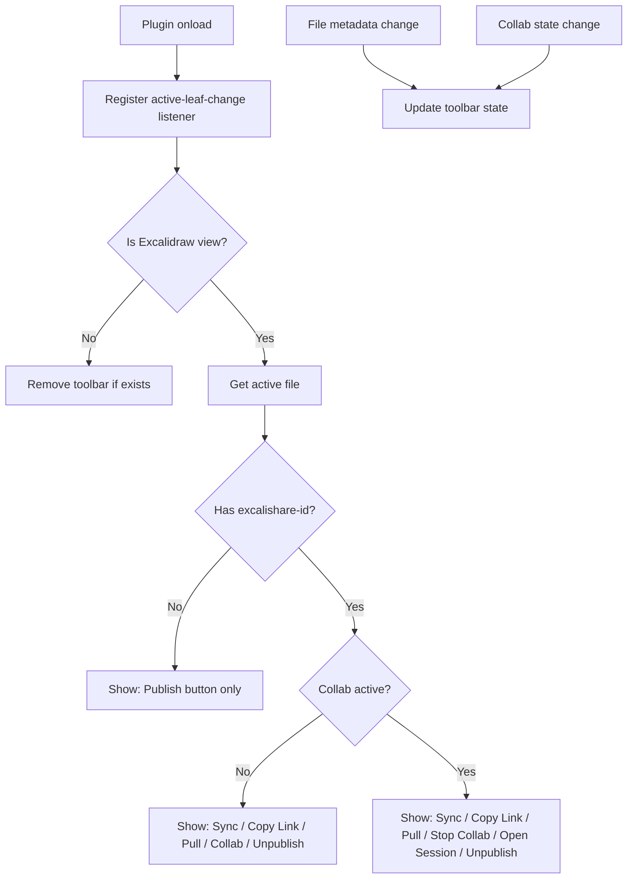
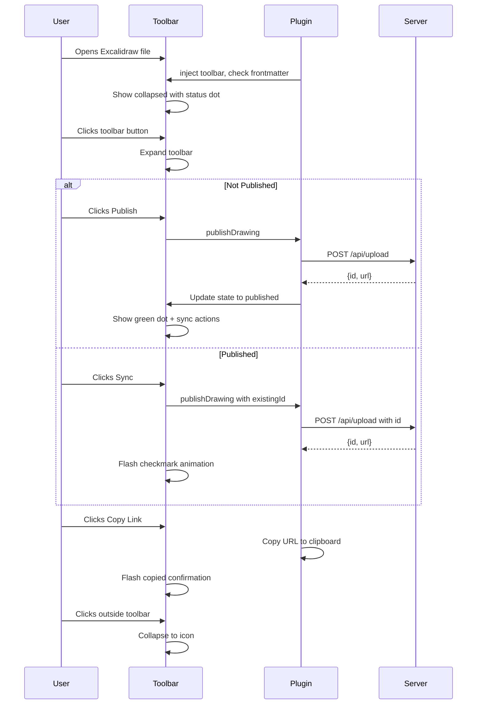

# ExcaliShare Plugin UI Upgrade Plan

## Problem Statement

Currently, the ExcaliShare Obsidian plugin provides its functionality through:
- **2 Ribbon icons** in the sidebar (Publish, Browse)
- **7 Command Palette commands** (Publish, Sync, Copy Link, Browse, Start/Stop Collab, Open Session, Pull)
- **Context menu items** on `.excalidraw` files in the file explorer
- **Status bar item** for collab status (bottom bar, easy to miss)

**Issues:**
1. Actions are scattered across multiple access points — none are directly visible while working in Excalidraw
2. Users must leave the drawing context to access commands (Command Palette, right-click, sidebar)
3. No visual feedback about publish status while editing
4. Collab status is buried in the status bar
5. No way to quickly see if a drawing is published or needs syncing

## Solution: Floating In-Canvas Toolbar

Inject a **floating toolbar** directly into the Excalidraw view that provides all ExcaliShare actions at a glance, with contextual state awareness.

## Architecture

### UI Injection Strategy

Since the Excalidraw plugin renders its own view inside Obsidian, we use the **DOM injection approach**:

1. Listen to `workspace.on('active-leaf-change')` to detect when an Excalidraw view becomes active
2. Detect the Excalidraw view by checking `leaf.view.getViewType() === 'excalidraw'`
3. Inject a floating toolbar container into the view's `containerEl`
4. The toolbar auto-updates based on the file's publish state (frontmatter `excalishare-id`)
5. Clean up the toolbar when the view changes or unloads



### Toolbar Design

The toolbar is a **floating pill-shaped container** positioned in the **top-right corner** of the Excalidraw canvas, below the Excalidraw native toolbar. It has two modes:

#### Collapsed Mode (default)
A small circular button showing the ExcaliShare logo/icon with a colored status dot:
- 🟢 Green dot = Published and synced
- 🟡 Yellow dot = Published but modified locally
- ⚪ Gray dot = Not published
- 🔴 Red dot = Live collab active

#### Expanded Mode (on click)
Expands into a vertical toolbar with icon buttons + labels:

```
┌──────────────────────────┐
│  ☁️  ExcaliShare         │  ← Header with status
├──────────────────────────┤
│  ↑  Sync to Server       │  ← Only if published
│  📋 Copy Share Link      │  ← Only if published
│  ↓  Pull from Server     │  ← Only if published
│  👥 Start Live Collab    │  ← Only if published, no active session
│  🛑 Stop Live Collab     │  ← Only if collab active
│  🌐 Open in Browser      │  ← Only if collab active
├──────────────────────────┤
│  🗑️ Unpublish            │  ← Only if published (danger zone)
└──────────────────────────┘

OR (if not published):

┌──────────────────────────┐
│  ☁️  ExcaliShare         │
├──────────────────────────┤
│  ⬆️  Publish Drawing     │
└──────────────────────────┘
```

### Visual Mockup

```
┌─────────────────────────────────────────────────────────────┐
│ Obsidian Tab Bar                                            │
├─────────────────────────────────────────────────────────────┤
│ [Excalidraw Native Toolbar: shapes, colors, etc.]           │
│                                                             │
│                                          ┌───┐              │
│                                          │ ☁ │ ← Collapsed  │
│     Excalidraw Canvas                    │ 🟢│   toolbar    │
│                                          └───┘              │
│                                                             │
│     (user's drawing here)                                   │
│                                                             │
│                                                             │
│                                                             │
│                                                             │
└─────────────────────────────────────────────────────────────┘

After clicking the collapsed button:

┌─────────────────────────────────────────────────────────────┐
│ Obsidian Tab Bar                                            │
├─────────────────────────────────────────────────────────────┤
│ [Excalidraw Native Toolbar]                                 │
│                                                             │
│                                    ┌──────────────────┐     │
│                                    │ ☁️ ExcaliShare    │     │
│     Excalidraw Canvas              ├──────────────────┤     │
│                                    │ ↑ Sync           │     │
│                                    │ 📋 Copy Link     │     │
│     (user's drawing)               │ ↓ Pull           │     │
│                                    │ 👥 Start Collab  │     │
│                                    ├──────────────────┤     │
│                                    │ 🗑️ Unpublish     │     │
│                                    └──────────────────┘     │
│                                                             │
└─────────────────────────────────────────────────────────────┘
```

## File Structure (Refactored)

```
obsidian-plugin/
├── main.ts                  # Plugin entry point (slim, delegates to modules)
├── toolbar.ts               # Floating toolbar UI component (DOM creation + styling)
├── api.ts                   # API client (publish, unpublish, pull, collab start/stop)
├── state.ts                 # Plugin state management (publish status, collab state)
├── settings.ts              # Settings tab
├── pdfUtils.ts              # PDF conversion (unchanged)
├── styles.ts                # CSS-in-JS styles for the toolbar
├── manifest.json
├── package.json
└── tsconfig.json
```

## Detailed Implementation Steps

### Step 1: Create `api.ts` — API Client Module

Extract all fetch/API logic from `main.ts` into a dedicated module:
- `publishDrawing(file, existingId?)` → returns `{id, url}`
- `unpublishDrawing(drawingId)` → returns boolean
- `pullDrawing(drawingId)` → returns drawing data
- `startCollab(drawingId, timeoutSecs)` → returns `{session_id}`
- `stopCollab(sessionId, save)` → returns void
- `checkCollabStatus(drawingId)` → returns `{active, participants}`

### Step 2: Create `state.ts` — State Management

Centralized reactive state:
- `publishedId: string | null` — current file's published ID
- `collabSessionId: string | null` — active collab session
- `collabDrawingId: string | null` — drawing in collab
- `isModifiedSinceSync: boolean` — track if file changed since last sync
- Event emitter pattern for state changes → toolbar reacts

### Step 3: Create `toolbar.ts` — Floating Toolbar Component

The core UI component:
- `ExcaliShareToolbar` class
  - `constructor(plugin)` — stores reference to plugin
  - `inject(containerEl, file)` — creates and injects the toolbar DOM
  - `remove()` — removes the toolbar from DOM
  - `updateState(state)` — updates button visibility and status indicator
  - `expand()` / `collapse()` — toggle expanded/collapsed mode
- All DOM creation uses Obsidian's `createEl` / `createDiv` API
- Styles are inline (following project convention) with CSS variables for theme compatibility
- Toolbar is `position: absolute` within the Excalidraw container
- Uses `z-index` carefully to sit above the canvas but below Obsidian modals
- Click outside to collapse
- Smooth CSS transitions for expand/collapse animation

### Step 4: Create `styles.ts` — Centralized Styles

CSS-in-JS style definitions:
- Theme-aware colors using Obsidian CSS variables (`--background-primary`, `--text-normal`, etc.)
- Hover/active states for buttons
- Status dot colors
- Transition animations
- Responsive sizing

### Step 5: Create `settings.ts` — Settings Tab

Move `ExcaliShareSettingTab` to its own file and add new settings:
- `showFloatingToolbar: boolean` (default: true) — enable/disable the floating toolbar
- `toolbarPosition: 'top-right' | 'top-left' | 'bottom-right' | 'bottom-left'` (default: 'top-right')
- `autoSyncOnSave: boolean` (default: false) — automatically sync when file is saved
- `toolbarCollapsedByDefault: boolean` (default: true)
- Keep existing settings (API key, server URL, PDF scale, collab settings)

### Step 6: Refactor `main.ts` — Slim Entry Point

- Import and wire up all modules
- `onload()`: register leaf-change listener, commands, ribbon icons, context menu, settings
- Leaf-change listener: detect Excalidraw views → inject/remove toolbar
- File metadata change listener: update toolbar state when frontmatter changes
- Auto-sync on save: listen to `vault.on('modify')` for the active file
- Keep ribbon icons and commands as fallback access points

### Step 7: Auto-Sync on Save

New feature:
- When `autoSyncOnSave` is enabled and the file has an `excalishare-id`
- Listen to `vault.on('modify', file)` with debounce (e.g., 5 seconds)
- Automatically call `publishDrawing(file, existingId)` 
- Show a subtle notification in the toolbar (checkmark animation) instead of a Notice

### Step 8: Enhanced Collab Status in Toolbar

When a collab session is active:
- The toolbar shows a pulsing red dot
- Participant count badge
- Quick-access button to open the session in browser
- Stop button with the save/discard modal

## Interaction Flow



## Theme Compatibility

The toolbar uses Obsidian CSS variables to automatically adapt to light/dark themes:

| Element | Light Theme | Dark Theme |
|---------|-------------|------------|
| Background | `var(--background-primary)` | `var(--background-primary)` |
| Text | `var(--text-normal)` | `var(--text-normal)` |
| Border | `var(--background-modifier-border)` | `var(--background-modifier-border)` |
| Hover | `var(--background-modifier-hover)` | `var(--background-modifier-hover)` |
| Accent | `var(--interactive-accent)` | `var(--interactive-accent)` |
| Danger | `#e53935` | `#ef5350` |

## Edge Cases to Handle

1. **Multiple Excalidraw views open** — Each view gets its own toolbar instance, tracked by leaf ID
2. **File not yet saved** — Disable publish until file has content
3. **No API key configured** — Show a setup prompt in the toolbar instead of actions
4. **Server unreachable** — Show error state with retry button
5. **Excalidraw plugin not installed** — Graceful degradation, toolbar not shown
6. **View mode changes** — Toolbar should hide in markdown/reading view, show in Excalidraw view
7. **Mobile** — Toolbar should be touch-friendly with larger tap targets

## Summary of Changes

| Area | Before | After |
|------|--------|-------|
| Primary access | Ribbon + Command Palette | Floating in-canvas toolbar |
| Publish status | Check frontmatter manually | Visual status dot on toolbar |
| Collab status | Status bar text | Pulsing indicator in toolbar |
| Auto-sync | Not available | Optional auto-sync on save |
| Code structure | Single 1078-line file | 6 focused modules |
| Settings | 5 settings | 9 settings with toolbar config |
| Context awareness | None while editing | Real-time state in toolbar |
