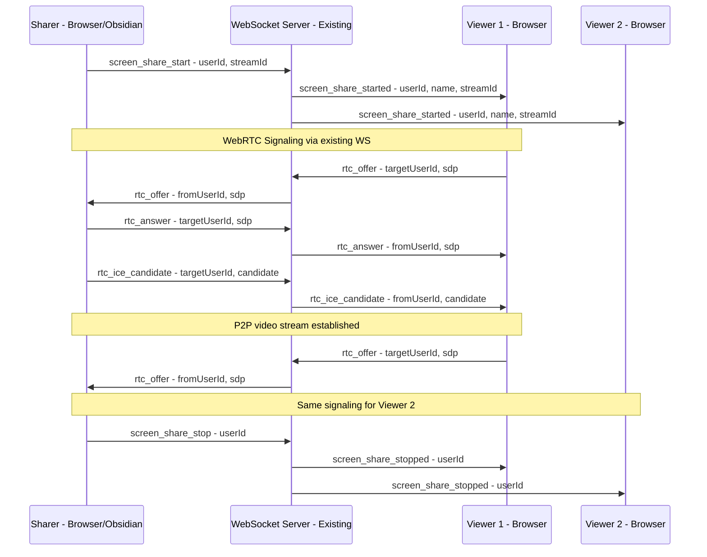
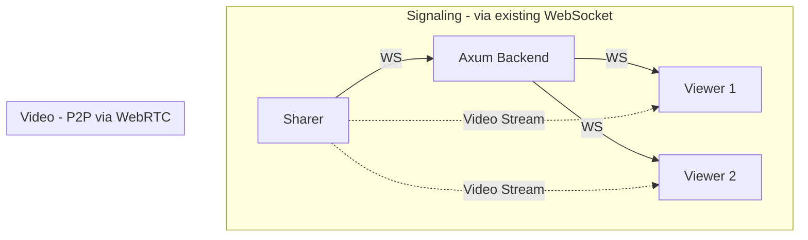

# Screen Sharing in Collab Sessions — Architecture Plan

## Overview

Add real-time screen sharing capability to ExcaliShare collab sessions, allowing any participant (browser or Obsidian) to share their screen with all other participants in the same session. Uses **WebRTC** for peer-to-peer video streaming with the existing WebSocket infrastructure as the signaling channel.

---

## Architecture

### High-Level Flow



### Why WebRTC + Existing WebSocket as Signaling

- **No new server infrastructure** — The existing WebSocket collab connection serves as the signaling channel for WebRTC offer/answer/ICE exchange
- **Peer-to-peer video** — Video data flows directly between browsers, not through the Rust backend (the server never touches video bytes)
- **Low latency** — WebRTC is optimized for real-time media with adaptive bitrate, congestion control, and hardware encoding
- **Self-hosted friendly** — No dependency on external TURN/STUN services (though a STUN server is recommended for NAT traversal)

### Connection Topology



The sharer creates one `RTCPeerConnection` per viewer. Each viewer creates one `RTCPeerConnection` to the sharer. The backend only relays signaling messages (SDP offers/answers and ICE candidates) — it never processes video data.

---

## Protocol Extension

### New WebSocket Message Types

#### Client → Server

```typescript
// Announce screen sharing started
type: 'screen_share_start'

// Announce screen sharing stopped
type: 'screen_share_stop'

// WebRTC signaling: SDP offer/answer
type: 'rtc_signal'
targetUserId: string
signal: {
  type: 'offer' | 'answer'
  sdp: string
}

// WebRTC signaling: ICE candidate
type: 'rtc_ice_candidate'
targetUserId: string
candidate: RTCIceCandidateInit
```

#### Server → Client

```typescript
// Broadcast: someone started sharing
type: 'screen_share_started'
userId: string
name: string

// Broadcast: someone stopped sharing
type: 'screen_share_stopped'
userId: string

// Relay: SDP offer/answer to specific user
type: 'rtc_signal'
fromUserId: string
signal: {
  type: 'offer' | 'answer'
  sdp: string
}

// Relay: ICE candidate to specific user
type: 'rtc_ice_candidate'
fromUserId: string
candidate: RTCIceCandidateInit
```

### Key Design Decision: Targeted Message Relay

The existing WebSocket broadcast channel sends messages to ALL participants. For WebRTC signaling, we need **targeted** messages (sharer → specific viewer). Two approaches:

**Option A: Server-side targeted relay (recommended)**
- Add a `targetUserId` field to signaling messages
- Backend checks `targetUserId` and only forwards to that specific participant
- Requires a small addition to `collab.rs`: a `HashMap<userId, broadcast::Sender>` or per-user channels

**Option B: Client-side filtering**
- Broadcast signaling messages to everyone, clients ignore messages not addressed to them
- Simpler backend, but wastes bandwidth and leaks signaling data to unrelated participants

**Recommendation: Option A** — targeted relay is more secure and efficient. The backend already has per-session participant tracking in `CollabSession.participants`.

---

## Backend Changes

### `collab.rs` — Session Manager

1. **Track screen share state** per session:
   ```rust
   struct CollabSession {
       // ... existing fields ...
       /// User ID of the participant currently sharing their screen (None if nobody is sharing)
       screen_sharer: Option<String>,
   }
   ```

2. **Add targeted message sending** — Currently `broadcast_tx` sends to all. Add a method to send to a specific user:
   ```rust
   /// Per-user sender channels for targeted WebRTC signaling
   user_senders: HashMap<String, mpsc::UnboundedSender<ServerMessage>>,
   ```
   On `join_session`, create a per-user `mpsc::unbounded_channel` alongside the broadcast subscription. The WS handler selects from both the broadcast receiver and the per-user receiver.

3. **New methods**:
   - `start_screen_share(session_id, user_id)` — Sets `screen_sharer`, broadcasts `ScreenShareStarted`
   - `stop_screen_share(session_id, user_id)` — Clears `screen_sharer`, broadcasts `ScreenShareStopped`
   - `send_to_user(session_id, target_user_id, message)` — Sends a message to a specific participant via their `mpsc` channel
   - Auto-stop screen share on `leave_session` if the leaving user was the sharer

### `ws.rs` — WebSocket Handler

1. **Handle new client message types**: `ScreenShareStart`, `ScreenShareStop`, `RtcSignal`, `RtcIceCandidate`
2. **Merge per-user channel** into the send task's `tokio::select!` loop:
   ```rust
   tokio::select! {
       result = broadcast_rx.recv() => { /* existing broadcast handling */ }
       result = user_rx.recv() => { /* targeted signaling messages */ }
       _ = ping_interval.tick() => { /* existing ping */ }
   }
   ```
3. **Message size limit**: WebRTC SDP offers are typically 2-5 KB, ICE candidates ~200 bytes — well within the existing 5 MB limit

### `main.rs` — No changes needed

Routes remain the same; all screen sharing communication happens over the existing `/ws/collab/{session_id}` WebSocket.

---

## Frontend Changes

### New Utility: `screenShareClient.ts`

A dedicated class managing WebRTC connections for screen sharing:

```typescript
class ScreenShareManager {
  private localStream: MediaStream | null = null;
  private peerConnections: Map<string, RTCPeerConnection> = new Map();
  private collabClient: CollabClient;
  private isSharing: boolean = false;

  // Sharer side
  async startSharing(): Promise<void>;  // calls getDisplayMedia
  stopSharing(): void;                   // stops tracks, closes peers
  handleViewerOffer(fromUserId: string, sdp: RTCSessionDescriptionInit): Promise<void>;

  // Viewer side
  async requestStream(sharerUserId: string): Promise<MediaStream>;
  handleSharerAnswer(fromUserId: string, sdp: RTCSessionDescriptionInit): Promise<void>;
  handleIceCandidate(fromUserId: string, candidate: RTCIceCandidateInit): Promise<void>;

  // Cleanup
  destroy(): void;
}
```

**Screen capture API**:
- Browser: `navigator.mediaDevices.getDisplayMedia({ video: true, audio: false })`
- The `getDisplayMedia` prompt lets the user choose screen/window/tab

**ICE Configuration**:
```typescript
const rtcConfig: RTCConfiguration = {
  iceServers: [
    { urls: 'stun:stun.l.google.com:19302' },  // Free Google STUN
    // Optional: self-hosted TURN server for NAT traversal
  ]
};
```

### Hook: `useScreenShare.ts`

React hook that integrates with `useCollab`:

```typescript
interface UseScreenShareReturn {
  // State
  isSharing: boolean;           // Am I sharing my screen?
  activeSharer: {               // Who is currently sharing?
    userId: string;
    name: string;
  } | null;
  remoteStream: MediaStream | null;  // The incoming video stream
  isViewerConnected: boolean;        // WebRTC connection established?

  // Actions
  startSharing: () => Promise<void>;
  stopSharing: () => void;
}
```

### Component: `ScreenShareOverlay.tsx`

Renders the incoming screen share as a video overlay:

```
┌─────────────────────────────────────────────────┐
│  Excalidraw Canvas                              │
│                                                 │
│  ┌───────────────────────────────────────────┐  │
│  │                                           │  │
│  │     Screen Share Video                    │  │
│  │     - Draggable                           │  │
│  │     - Resizable                           │  │
│  │     - Picture-in-Picture button           │  │
│  │     - Fullscreen button                   │  │
│  │     - Close/minimize button               │  │
│  │                                           │  │
│  │  ┌─────────────────────────────────────┐  │  │
│  │  │ 📺 Alice is sharing · Fullscreen ⛶ │  │  │
│  │  └─────────────────────────────────────┘  │  │
│  └───────────────────────────────────────────┘  │
│                                                 │
└─────────────────────────────────────────────────┘
```

**Features**:
- **Draggable** — Click and drag the title bar to reposition
- **Resizable** — Drag corners/edges to resize (maintains aspect ratio)
- **Picture-in-Picture** — Browser PiP API for floating window outside the tab
- **Fullscreen** — Expand to fill the viewport
- **Minimize** — Collapse to a small indicator in the corner
- **Auto-position** — Defaults to bottom-right corner, 30% of viewport width

**Styling** (inline styles, matching existing pattern):
```typescript
const overlayStyle: React.CSSProperties = {
  position: 'fixed',
  zIndex: 1100,  // Above CollabPopover (1000-1001)
  borderRadius: '12px',
  overflow: 'hidden',
  boxShadow: isDark
    ? '0 8px 32px rgba(0,0,0,0.6)'
    : '0 8px 32px rgba(0,0,0,0.2)',
  border: `2px solid ${sharerColor}`,  // Matches sharer's collab color
  backgroundColor: '#000',
};

const titleBarStyle: React.CSSProperties = {
  display: 'flex',
  alignItems: 'center',
  gap: '8px',
  padding: '6px 10px',
  backgroundColor: isDark ? 'rgba(30,30,30,0.95)' : 'rgba(255,255,255,0.95)',
  cursor: 'grab',
  fontSize: '12px',
  fontFamily: 'system-ui, -apple-system, sans-serif',
};
```

### `CollabPopover.tsx` — UI Integration

Add a "Share Screen" button and screen share status to the participant list:

```
┌──────────────────────────────┐
│ Collaboration          2 users│
│                               │
│ 🟢 Alice (you)               │
│ 🔵 Bob              👁       │
│                               │
│ ┌───────────────────────────┐│
│ │ 📺 Share Screen           ││  ← New button
│ └───────────────────────────┘│
│                               │
│ ┌───────────────────────────┐│
│ │ Leave Session             ││
│ └───────────────────────────┘│
└──────────────────────────────┘
```

When someone is sharing:

```
┌──────────────────────────────┐
│ Collaboration          2 users│
│                               │
│ 🟢 Alice (you)    📺 Sharing │  ← Sharing indicator
│ 🔵 Bob              👁       │
│                               │
│ ┌───────────────────────────┐│
│ │ 🔴 Stop Sharing           ││  ← Changes to stop button
│ └───────────────────────────┘│
│                               │
│ ┌───────────────────────────┐│
│ │ Leave Session             ││
│ └───────────────────────────┘│
└──────────────────────────────┘
```

### `Viewer.tsx` — Toolbar Integration

- **Desktop/Tablet**: Add a 📺 button to the toolbar Island (next to Present/Edit/Browse)
- **Phone**: Add 📺 button to the injected bottom toolbar
- Button states:
  - Default: `📺` (grey) — Click to start sharing
  - Sharing: `📺` (red pulse) — Click to stop
  - Viewing: `📺` (green) — Someone else is sharing, click to toggle overlay visibility

### `CollabStatus.tsx` — Join Banner

When a screen share is active, show it in the pre-join banner:
```
Live Session · 2 users · 📺 Screen sharing active · [Join]
```

---

## Obsidian Plugin Support

### Browser (Frontend) — Full Support

- `navigator.mediaDevices.getDisplayMedia()` is fully supported in all modern browsers
- Works out of the box

### Obsidian Plugin — Limited Support via Electron

Obsidian runs on Electron, which provides `desktopCapturer` API instead of `getDisplayMedia()`:

```typescript
// In Obsidian plugin context (Electron)
const { desktopCapturer } = require('electron');

async function getScreenStream(): Promise<MediaStream> {
  const sources = await desktopCapturer.getSources({
    types: ['screen', 'window']
  });

  // Show a picker dialog to the user (custom UI needed)
  const selectedSource = await showSourcePicker(sources);

  return navigator.mediaDevices.getUserMedia({
    video: {
      mandatory: {
        chromeMediaSource: 'desktop',
        chromeMediaSourceId: selectedSource.id,
      }
    } as any,
    audio: false,
  });
}
```

**Challenges for Obsidian**:
1. **No native screen picker** — Electron's `desktopCapturer` returns a list of sources but doesn't show a picker UI. We need to build a custom source picker modal in the plugin.
2. **WebRTC support** — Electron supports `RTCPeerConnection` natively (Chromium-based), so the WebRTC peer connection code works the same as in the browser.
3. **Signaling** — The plugin already has a `CollabClient` WebSocket wrapper. The same signaling messages can be sent/received.
4. **Viewing** — Obsidian can render a `<video>` element in a custom view or modal to display incoming screen shares.

### Plugin Architecture

```typescript
// New file: obsidian-plugin/screenShare.ts

class ScreenShareManager {
  private collabManager: CollabManager;
  private peerConnections: Map<string, RTCPeerConnection> = new Map();
  private localStream: MediaStream | null = null;

  // Sharer side (Electron desktopCapturer)
  async startSharing(): Promise<void>;
  stopSharing(): void;

  // Viewer side (render in Obsidian modal/leaf)
  showScreenShareView(stream: MediaStream, sharerName: string): void;
  hideScreenShareView(): void;
}
```

**Viewer UI in Obsidian**: Use an Obsidian `Modal` or a custom `ItemView` leaf to display the incoming video stream. The modal approach is simpler:

```typescript
class ScreenShareModal extends Modal {
  private videoEl: HTMLVideoElement;
  private stream: MediaStream;

  onOpen() {
    this.videoEl = this.contentEl.createEl('video', {
      attr: { autoplay: '', playsinline: '' }
    });
    this.videoEl.srcObject = this.stream;
    this.videoEl.style.width = '100%';
    this.videoEl.style.borderRadius = '8px';
  }

  onClose() {
    this.videoEl.srcObject = null;
  }
}
```

### Plugin Toolbar Integration

Add screen share button to the toolbar popover (in `toolbar.ts`):
- `📺 Share Screen` button when no one is sharing
- `📺 Sharing...` indicator when the user is sharing
- `📺 Viewing Alice's screen` when watching someone else's share

---

## STUN/TURN — What It Is, Why You Need It, and Self-Hosted Setup

### The Problem: NAT Traversal

WebRTC establishes **direct peer-to-peer connections** between browsers. But most devices sit behind a NAT (Network Address Translation) — your router assigns private IPs like `192.168.1.x` to your devices, and the outside world only sees your router's public IP. When Browser A wants to send video to Browser B, it needs to know Browser B's actual reachable address — but Browser B only knows its private IP.

```
Browser A (192.168.1.5)  <->  Router A (85.1.2.3)  <->  Internet  <->  Router B (91.4.5.6)  <->  Browser B (192.168.0.10)
```

Browser A can't just connect to `192.168.0.10` — that's a private address behind Router B. This is where STUN and TURN come in.

### STUN — "What's my public address?"

**STUN** (Session Traversal Utilities for NAT) is a lightweight protocol that answers one question: *"What is my public IP and port as seen from the outside?"*

How it works:
1. Browser A sends a UDP packet to the STUN server
2. The STUN server sees the packet arriving from `85.1.2.3:54321` (Router A's public IP + the NAT-assigned port)
3. The STUN server replies: "You appear as `85.1.2.3:54321`"
4. Browser A now knows its **ICE candidate** (public address) and shares it with Browser B via signaling
5. Browser B does the same
6. Both browsers try to connect directly using each other's public addresses

**STUN is tiny** — it's just a few UDP packets for discovery. No video data flows through it. It uses almost zero bandwidth and resources.

**When STUN alone works** (~80-85% of cases):
- Home routers with "full cone" or "restricted cone" NAT
- Most residential ISPs
- Corporate networks with permissive firewalls

**When STUN fails** (~15-20% of cases):
- Symmetric NAT (common in corporate/university networks) — the router assigns a different port for each destination, so the STUN-discovered port doesn't work for the peer
- Strict firewalls that block incoming UDP entirely

### TURN — "Relay my traffic through a server"

**TURN** (Traversal Using Relays around NAT) is the fallback when direct P2P fails. It acts as a **relay server** — all video data flows through it.

```
Browser A  ->  TURN Server  ->  Browser B
```

**TURN is expensive** — it relays the full video stream. For a 1080p screen share at ~4 Mbps, the TURN server handles 4 Mbps in + 4 Mbps out per viewer. But it's the only option when direct connections are impossible.

### Do You Actually Need This?

For your self-hosted ExcaliShare on a NixOS VPS:

| Scenario | What you need |
|----------|---------------|
| All users access via the same VPS public IP | Nothing — direct P2P works |
| Users on different home networks | STUN only — free, tiny, no relay |
| Some users behind corporate firewalls | STUN + TURN fallback |
| Maximum compatibility for all users | STUN + TURN |

**Recommendation**: Start with **STUN only**. You can run a STUN-only coturn instance with zero bandwidth cost and no new external ports. Add TURN later only if users report connection failures. The code will be written to gracefully fall back — if TURN isn't configured, it simply won't be offered as an ICE candidate.

### Self-Hosted Setup: coturn on NixOS — No New External Ports

The key insight: **coturn can listen on localhost only**, and your existing nginx reverse proxy on port 443 can forward TURN-over-TLS traffic to it. Since port 443 is already open, **no new firewall rules are needed**.

#### Architecture: TURN over TLS via nginx on Port 443

```
                          Port 443 - already open
                                  |
                    +-------------+-------------+
                    |         nginx              |
                    |                            |
                    |  HTTPS /api/* /ws/* /d/*   |
                    |    -> ExcaliShare :8184     |
                    |                            |
                    |  TLS stream - turn.leyk.me |
                    |    -> coturn :5349 local    |
                    +----------------------------+
```

Use a subdomain like `turn.leyk.me` pointing to the same server. nginx uses SNI (Server Name Indication) at the TCP stream level to route:
- `notes.leyk.me` → ExcaliShare backend (existing)
- `turn.leyk.me` → coturn TLS listener on localhost

coturn listens on `127.0.0.1:5349` only — **never exposed externally**.

#### NixOS Configuration

```nix
# In your NixOS configuration.nix

services.coturn = {
  enable = true;

  # Listen only on localhost — nginx proxies to us
  listening-ips = [ "127.0.0.1" ];
  listening-port = 3478;      # STUN/TURN UDP - local only
  tls-listening-port = 5349;  # TURN TLS - local only, nginx proxies 443 -> here

  # Your domain
  realm = "turn.leyk.me";

  # TLS certificates - same as your nginx certs
  cert = "/var/lib/acme/turn.leyk.me/fullchain.pem";
  pkey = "/var/lib/acme/turn.leyk.me/key.pem";

  # Security hardening
  no-multicast-peers = true;
  no-cli = true;
  denied-peer-ip = [
    "10.0.0.0-10.255.255.255"
    "172.16.0.0-172.31.255.255"
    "192.168.0.0-192.168.255.255"
  ];

  # HMAC time-limited credentials - shared secret with ExcaliShare backend
  static-auth-secret-file = "/etc/secrets/coturn-secret";

  # Relay port range - only used for UDP relay on localhost
  min-port = 49152;
  max-port = 49252;  # 100 ports for relay

  # Bandwidth limits
  max-bps = 10000000;  # 10 Mbps max per session
  total-quota = 100;    # Max 100 concurrent sessions
};

# nginx stream-level SNI routing for TURN TLS on port 443
services.nginx.streamConfig = ''
  upstream coturn_tls {
    server 127.0.0.1:5349;
  }

  upstream web_https {
    server 127.0.0.1:8443;  # nginx HTTPS listener for web traffic
  }

  map $ssl_preread_server_name $upstream {
    turn.leyk.me coturn_tls;
    default      web_https;
  }

  server {
    listen 443;
    ssl_preread on;
    proxy_pass $upstream;
  }
'';
```

#### HMAC Time-Limited Credentials (Secure, No Static Passwords)

Instead of static TURN credentials (which could be abused if leaked), the ExcaliShare backend generates **short-lived HMAC credentials** on demand. coturn validates them automatically when configured with the same `static-auth-secret`.

```rust
// Backend generates TURN credentials valid for 1 hour
fn generate_turn_credentials(shared_secret: &str, user_id: &str) -> TurnCredentials {
    let timestamp = SystemTime::now()
        .duration_since(UNIX_EPOCH)
        .unwrap()
        .as_secs() + 3600; // Valid for 1 hour

    let temp_username = format!("{}:{}", timestamp, user_id);
    let credential = hmac_sha1(shared_secret, &temp_username);

    TurnCredentials {
        username: temp_username,
        credential: base64_encode(credential),
        ttl: 3600,
    }
}
```

The `/api/ice-config` endpoint (authenticated) returns fresh credentials each time:
```json
{
  "iceServers": [
    { "urls": "stun:turn.leyk.me:443" },
    {
      "urls": "turns:turn.leyk.me:443",
      "username": "1712345678:user123",
      "credential": "base64hmac...",
      "credentialType": "password"
    }
  ]
}
```

### Configuration

Add ICE server configuration to:
1. **Backend CLI**: `--stun-url`, `--turn-url`, `--turn-secret-file` env vars
2. **Frontend**: Fetch ICE config from a new `/api/ice-config` endpoint (authenticated — only collab participants get TURN credentials)
3. **Plugin**: Auto-fetched from `/api/ice-config` using existing API key
4. **NixOS module**: New options `services.excalishare.stunUrl` and `services.excalishare.turnSecretFile`

```rust
// New endpoint (authenticated)
GET /api/ice-config -> {
  iceServers: [
    { urls: "stun:turn.leyk.me:443" },
    { urls: "turns:turn.leyk.me:443", username: "...", credential: "..." }
  ]
}
```

---

## Bandwidth & Performance

### Estimates

| Scenario | Bandwidth per viewer |
|----------|---------------------|
| 720p @ 15fps | ~1-2 Mbps |
| 1080p @ 30fps | ~3-5 Mbps |
| 4K @ 30fps | ~8-15 Mbps |

WebRTC automatically adapts bitrate based on network conditions. For a session with 1 sharer and 4 viewers, the sharer uploads 4-20 Mbps (one stream per viewer).

### Limits

- **Max 1 sharer per session** — Simplifies UI and prevents bandwidth explosion
- **Sharer sends N streams** (one per viewer) — This is the standard WebRTC SFU-less approach. For >5 viewers, consider adding an SFU (Selective Forwarding Unit) in the future.
- **No audio** — Screen share is video-only to reduce complexity and bandwidth
- **Auto quality reduction** — WebRTC's built-in congestion control handles this

---

## Security Considerations

1. **Session-scoped** — Screen sharing only works within an active collab session (requires valid session ID + optional password)
2. **User consent** — Browser's native `getDisplayMedia` prompt requires explicit user action
3. **No server recording** — Video streams are P2P; the backend never sees video data
4. **Signaling messages** are targeted (not broadcast) — Only the intended recipient receives SDP/ICE data
5. **DTLS encryption** — WebRTC encrypts all media streams by default

---

## Mobile Considerations

- **iOS Safari**: `getDisplayMedia` is supported since iOS 16+ but only for screen recording, not tab sharing
- **Android Chrome**: Full `getDisplayMedia` support
- **Phone layout**: Screen share overlay uses a bottom-sheet style on phone (similar to `CollabPopover`)
- **Minimize by default on phone** — Show a small floating indicator instead of the full overlay

---

## Implementation Phases

### Phase 1: Core Infrastructure
- Add new WebSocket message types to backend `ClientMessage`/`ServerMessage` enums
- Add per-user targeted message channel in `collab.rs`
- Handle signaling relay in `ws.rs`
- Track `screen_sharer` state per session

### Phase 2: Frontend Screen Sharing
- Create `ScreenShareManager` utility class
- Create `useScreenShare` hook
- Create `ScreenShareOverlay` component (draggable, resizable, PiP)
- Integrate into `CollabPopover` (share/stop button)
- Integrate into `Viewer.tsx` toolbar (📺 button)
- Add ICE config endpoint and frontend fetching

### Phase 3: Frontend Polish
- Add screen share indicator to participant list
- Add screen share status to `CollabStatus` join banner
- Handle edge cases: sharer disconnects, viewer joins mid-share, session ends during share
- Mobile responsive layout for overlay
- Picture-in-Picture support

### Phase 4: Obsidian Plugin Support
- Create `screenShare.ts` module with Electron `desktopCapturer` integration
- Build custom source picker modal for Obsidian
- Add screen share viewer modal/leaf
- Integrate with plugin toolbar
- Wire signaling through existing `CollabClient`

### Phase 5: STUN/TURN Configuration
- Add ICE server config to backend CLI args
- Create `/api/ice-config` endpoint
- Add STUN/TURN settings to plugin settings tab
- Document `coturn` setup in `DEPLOYMENT.md`

---

## Files to Create/Modify

### New Files
| File | Purpose |
|------|---------|
| `frontend/src/utils/screenShareManager.ts` | WebRTC peer connection management |
| `frontend/src/hooks/useScreenShare.ts` | React hook for screen share state |
| `frontend/src/ScreenShareOverlay.tsx` | Draggable/resizable video overlay component |
| `obsidian-plugin/screenShare.ts` | Electron desktopCapturer + WebRTC management |

### Modified Files
| File | Changes |
|------|---------|
| `backend/src/collab.rs` | Add `screen_sharer` field, per-user channels, signaling relay methods |
| `backend/src/ws.rs` | Handle new message types, merge per-user channel into send loop |
| `frontend/src/types/index.ts` | Add new `ClientMessage` and `ServerMessage` variants |
| `frontend/src/utils/collabClient.ts` | Add methods for signaling message send/receive |
| `frontend/src/hooks/useCollab.ts` | Wire screen share events, expose to components |
| `frontend/src/CollabPopover.tsx` | Add Share Screen button, sharing indicator per participant |
| `frontend/src/CollabStatus.tsx` | Show screen share active in join banner |
| `frontend/src/Viewer.tsx` | Add 📺 toolbar button, render `ScreenShareOverlay` |
| `obsidian-plugin/collabClient.ts` | Add signaling message types |
| `obsidian-plugin/collabManager.ts` | Integrate screen share lifecycle |
| `obsidian-plugin/collabTypes.ts` | Add new message type definitions |
| `obsidian-plugin/toolbar.ts` | Add screen share button to popover |
| `obsidian-plugin/main.ts` | Wire screen share commands |
| `backend/src/main.rs` | Add `/api/ice-config` route, CLI args for STUN/TURN |
| `backend/src/routes.rs` | Add `ice_config` handler |
