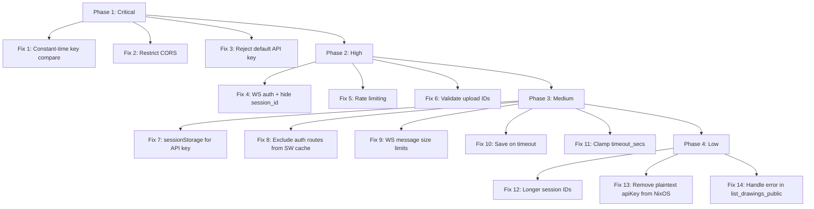

# Security Fixes Plan

This plan addresses all 14 findings from the security audit, grouped into implementation phases by priority.

---

## Phase 1: Critical Fixes (Backend Auth & CORS)

### Fix #1 — Constant-Time API Key Comparison
**File:** [`backend/src/auth.rs:28`](../backend/src/auth.rs:28)
**Finding:** String `==` is timing-attack vulnerable.

**Changes:**
1. Add `subtle` crate to `Cargo.toml`:
   ```toml
   subtle = "2"
   ```
2. In `auth.rs`, replace:
   ```rust
   if token == api_key.0 {
   ```
   with:
   ```rust
   use subtle::ConstantTimeEq;
   let token_bytes = token.as_bytes();
   let key_bytes = api_key.0.as_bytes();
   if token_bytes.len() == key_bytes.len()
       && token_bytes.ct_eq(key_bytes).into()
   {
   ```
   Note: The length check leaks the key length but not the key content. This is acceptable since the key length is not secret.

---

### Fix #2 — Restrict CORS to Configured Domain
**File:** [`backend/src/main.rs:131-136`](../backend/src/main.rs:131)
**Finding:** `allow_origin(Any)` allows any website to make cross-origin requests.

**Changes:**
1. In `main.rs`, replace the wildcard CORS with origin-restricted CORS:
   ```rust
   use tower_http::cors::AllowOrigin;

   let cors = CorsLayer::new()
       .allow_origin(AllowOrigin::exact(
           config.base_url.parse().expect("BASE_URL must be a valid origin")
       ))
       .allow_methods([Method::GET, Method::POST, Method::DELETE, Method::OPTIONS])
       .allow_headers([header::AUTHORIZATION, header::CONTENT_TYPE]);
   ```
2. This ensures only the configured `BASE_URL` origin can make cross-origin requests.

---

### Fix #3 — Reject Default API Key
**File:** [`start.sh:44`](../start.sh:44)
**Finding:** Default API key `change-me-in-production` is well-known.

**Changes:**
1. In `start.sh`, after setting the default, add a check:
   ```bash
   if [ "$API_KEY" = "change-me-in-production" ]; then
       log_warn "⚠️  Using default API key! Set API_KEY env var for production."
       if [ "$MODE" = "production" ]; then
           log_error "Cannot use default API key in production mode. Set API_KEY."
           exit 1
       fi
   fi
   ```
2. In `backend/src/main.rs`, add a startup warning:
   ```rust
   if config.api_key == "change-me-in-production" {
       tracing::warn!("⚠️  Using default API key! Set API_KEY for production use.");
   }
   ```

---

## Phase 2: High-Priority Fixes (WebSocket Auth, Rate Limiting, Input Validation)

### Fix #4 — Authenticate WebSocket Connections & Hide Session ID from Public Endpoint
**Files:** [`backend/src/ws.rs`](../backend/src/ws.rs), [`backend/src/routes.rs:287-302`](../backend/src/routes.rs:287)
**Finding:** Public `collab_status` endpoint exposes `session_id`, and WebSocket has no auth.

**Two-part fix:**

**Part A — Remove `session_id` from public status response:**
In `routes.rs`, change `collab_status` to not expose the session_id:
```rust
pub async fn collab_status(
    State(state): State<AppState>,
    Path(drawing_id): Path<String>,
) -> Json<CollabStatusResponse> {
    match state.session_manager.get_session_status(&drawing_id).await {
        Some((_session_id, participant_count)) => Json(CollabStatusResponse {
            active: true,
            session_id: None,  // Don't expose session_id publicly
            participant_count: Some(participant_count),
        }),
        None => Json(CollabStatusResponse {
            active: false,
            session_id: None,
            participant_count: None,
        }),
    }
}
```

**Part B — Add optional token-based WS auth:**
Add a `token` query parameter to the WebSocket handler. When starting a collab session, the server generates a short-lived join token. The `start_collab` response includes this token. The frontend passes it as `?token=...` on the WS URL.

Alternatively, for the simpler approach: keep session_id as the auth token but don't expose it publicly. Only the admin who starts the session (via authenticated `start_collab`) gets the session_id, and they share it intentionally.

---

### Fix #5 — Add Rate Limiting
**File:** [`backend/src/main.rs`](../backend/src/main.rs)
**Finding:** No rate limiting on any endpoint.

**Changes:**
1. Add `tower` rate limiting dependency to `Cargo.toml`:
   ```toml
   tower = { version = "0.5", features = ["limit"] }
   ```
2. Apply rate limiting layers in `main.rs`:
   ```rust
   use tower::limit::RateLimitLayer;
   use std::time::Duration;

   // Apply to protected API (upload/delete) — 30 req/min
   let protected_api = Router::new()
       // ... routes ...
       .layer(RateLimitLayer::new(30, Duration::from_secs(60)))
       .route_layer(middleware::from_fn_with_state(...));

   // Apply to public API — 120 req/min
   let public_api = Router::new()
       // ... routes ...
       .layer(RateLimitLayer::new(120, Duration::from_secs(60)));
   ```
3. For WebSocket connections, add a connection limit per IP using `tower::limit::ConcurrencyLimitLayer`:
   ```rust
   let ws_routes = Router::new()
       .route("/ws/collab/{session_id}", get(ws::ws_collab_handler))
       .layer(ConcurrencyLimitLayer::new(50))  // Max 50 concurrent WS connections
       .with_state(session_manager.clone());
   ```

---

### Fix #6 — Validate User-Supplied Upload IDs
**File:** [`backend/src/routes.rs:132-135`](../backend/src/routes.rs:132)
**Finding:** User-supplied `id` field is not validated before use.

**Changes:**
Add ID validation in `upload_drawing`:
```rust
let id = if let Some(req_id) = body.id {
    // Validate the ID format
    let valid = req_id.len() <= 64
        && !req_id.is_empty()
        && req_id.chars().all(|c| c.is_alphanumeric() || c == '-' || c == '_');
    if !valid {
        return Err(AppError::BadRequest(
            "Invalid ID: must be 1-64 alphanumeric characters, hyphens, or underscores.".into(),
        ));
    }
    is_update = true;
    req_id
} else {
    // ... existing UUID generation ...
};
```

---

## Phase 3: Medium-Priority Fixes

### Fix #7 — Use sessionStorage Instead of localStorage for API Key
**File:** [`frontend/src/AdminPage.tsx:17`](../frontend/src/AdminPage.tsx:17)
**Finding:** API key in localStorage persists indefinitely and is XSS-accessible.

**Changes:**
Replace all `localStorage.getItem('excalidraw-api-key')` / `localStorage.setItem(...)` with `sessionStorage`:
```typescript
const [apiKey, setApiKey] = useState(() => sessionStorage.getItem('excalidraw-api-key') || '')
// ...
sessionStorage.setItem('excalidraw-api-key', apiKey)
// ...
sessionStorage.removeItem('excalidraw-api-key')
```
This ensures the key is cleared when the browser tab is closed.

---

### Fix #8 — Exclude Authenticated API Routes from Service Worker Cache
**File:** [`frontend/vite.config.ts:13-21`](../frontend/vite.config.ts:13)
**Finding:** Service worker caches all `/api/*` responses including authenticated data.

**Changes:**
Restrict the URL pattern to only cache public API routes:
```typescript
runtimeCaching: [
  {
    urlPattern: /\/api\/(?:view|public|health|collab\/status)\/.*/,
    handler: 'NetworkFirst',
    options: {
      cacheName: 'api-cache',
      expiration: { maxEntries: 50, maxAgeSeconds: 60 * 60 * 24 },
      cacheableResponse: { statuses: [0, 200] }
    }
  }
]
```

---

### Fix #9 — Validate WebSocket Message Sizes and Name Length
**Files:** [`backend/src/collab.rs:524-536`](../backend/src/collab.rs:524), [`backend/src/ws.rs:142-166`](../backend/src/ws.rs:142)
**Finding:** No input validation on WS messages.

**Changes:**
1. In `ws.rs`, add a size check before parsing:
   ```rust
   Message::Text(text) => {
       let text_str: &str = &text;
       if text_str.len() > 5 * 1024 * 1024 {  // 5 MB max
           tracing::warn!(user_id = %user_id_recv, "WebSocket message too large, ignoring");
           continue;
       }
       // ... existing parsing ...
   }
   ```
2. In `collab.rs` `set_participant_name`, add length validation:
   ```rust
   pub async fn set_participant_name(&self, session_id: &str, user_id: &str, name: &str) {
       let truncated_name = if name.len() > 50 {
           &name[..50]
       } else {
           name
       };
       // ... rest of function using truncated_name ...
   }
   ```
3. Also truncate the initial `name` in `ws.rs` `ws_collab_handler`:
   ```rust
   let name = if query.name.is_empty() {
       default_name()
   } else if query.name.len() > 50 {
       query.name[..50].to_string()
   } else {
       query.name
   };
   ```

---

### Fix #10 — Save on Timeout Instead of Discarding
**File:** [`backend/src/collab.rs:578-582`](../backend/src/collab.rs:578)
**Finding:** Expired sessions silently discard all changes.

**Changes:**
This requires access to storage from the cleanup task. Modify `cleanup_expired` to save:
```rust
pub async fn cleanup_expired(&self, storage: &impl DrawingStorage) {
    // ... find expired_ids as before ...
    for session_id in expired_ids {
        tracing::info!(session_id = %session_id, "Cleaning up expired collab session (saving)");
        if let Ok(Some((drawing_id, data))) = self.end_session(&session_id, true).await {
            if let Err(e) = storage.save(&drawing_id, &data, None).await {
                tracing::error!(drawing_id = %drawing_id, error = %e, "Failed to save expired session");
            }
        }
    }
}
```
Update the background task in `main.rs` to pass storage:
```rust
let cleanup_storage = storage.clone();
tokio::spawn(async move {
    let mut interval = tokio::time::interval(Duration::from_secs(60));
    loop {
        interval.tick().await;
        cleanup_manager.cleanup_expired(&cleanup_storage).await;
    }
});
```

---

### Fix #11 — Clamp `timeout_secs` to Reasonable Range
**File:** [`backend/src/routes.rs:216-248`](../backend/src/routes.rs:216)
**Finding:** Client can set `timeout_secs` to any `u64` value.

**Changes:**
In `start_collab`, clamp the timeout:
```rust
const MIN_TIMEOUT: u64 = 300;      // 5 minutes
const MAX_TIMEOUT: u64 = 86400;    // 24 hours

let timeout = body.timeout_secs.clamp(MIN_TIMEOUT, MAX_TIMEOUT);

let session_id = state
    .session_manager
    .create_session(&body.drawing_id, &drawing_data, timeout)
    .await?;
```

---

## Phase 4: Low-Priority Fixes

### Fix #12 — Use Longer Session IDs
**File:** [`backend/src/collab.rs:185-190`](../backend/src/collab.rs:185)
**Finding:** 8-char hex IDs have only ~32 bits of entropy.

**Changes:**
Use the full UUID or at least 16 characters:
```rust
let session_id = Uuid::new_v4().to_string().replace('-', "");
// Full 32-char hex string = 128 bits of entropy
```
Apply the same change to drawing ID generation in [`routes.rs:137-142`](../backend/src/routes.rs:137):
```rust
let new_id = Uuid::new_v4()
    .to_string()
    .replace('-', "")[..16]
    .to_string();
```

---

### Fix #13 — Remove Plaintext `apiKey` Option from NixOS Module
**File:** [`nixos/module.nix:66-76`](../nixos/module.nix:66)
**Finding:** API key visible in systemd environment when using `apiKey` string option.

**Changes:**
1. Remove the `apiKey` string option
2. Make `apiKeyFile` required when `enable = true`
3. Update the `Environment` block to remove the `apiKey` fallback:
   ```nix
   apiKeyFile = lib.mkOption {
     type = lib.types.path;
     description = "Path to file containing API key (required). Use SOPS or similar.";
   };
   ```
   Remove line 156: `++ lib.optional (cfg.apiKeyFile == null) "API_KEY=${cfg.apiKey}";`
   Make `ExecStart` always use the file-based approach.

---

### Fix #14 — Handle Error in `list_drawings_public` Instead of Panicking
**File:** [`backend/src/routes.rs:195`](../backend/src/routes.rs:195)
**Finding:** `.unwrap()` crashes the server on storage errors.

**Changes:**
```rust
pub async fn list_drawings_public(
    State(state): State<AppState>,
) -> Result<Json<PublicListResponse>, AppError> {
    let drawings = state.storage.list().await?;
    let public_drawings: Vec<PublicDrawingMeta> = drawings
        .into_iter()
        .map(|d| PublicDrawingMeta {
            id: d.id,
            created_at: d.created_at,
            source_path: d.source_path,
        })
        .collect();
    Ok(Json(PublicListResponse { drawings: public_drawings }))
}
```

---

## Implementation Order



## Files Modified Per Phase

| Phase | Files |
|-------|-------|
| Phase 1 | `backend/Cargo.toml`, `backend/src/auth.rs`, `backend/src/main.rs`, `start.sh` |
| Phase 2 | `backend/Cargo.toml`, `backend/src/main.rs`, `backend/src/routes.rs`, `backend/src/ws.rs` |
| Phase 3 | `frontend/src/AdminPage.tsx`, `frontend/vite.config.ts`, `backend/src/collab.rs`, `backend/src/ws.rs`, `backend/src/routes.rs`, `backend/src/main.rs` |
| Phase 4 | `backend/src/collab.rs`, `backend/src/routes.rs`, `nixos/module.nix` |
