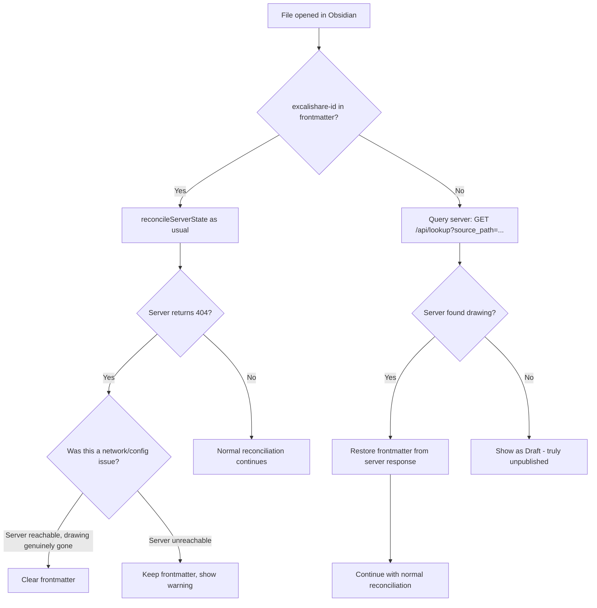

# Server as Single Source of Truth — Plan

## Problem Analysis

### Root Cause
The plugin currently uses **Obsidian frontmatter** as the primary source of truth for published state:
- `excalishare-id` — the drawing ID on the server
- `excalishare-persistent-collab` — whether persistent collab is enabled
- `excalishare-last-sync-version` — version tracking for persistent collab
- `excalishare-password` / `excalishare-password-key` — password state

When a third-party sync plugin like **Selfhosted LiveSync** synchronizes the `.excalidraw.md` file from another device, it can overwrite these frontmatter fields with stale values — or remove them entirely if the other device never published the drawing.

### Failure Scenarios

1. **LiveSync overwrites frontmatter**: Device A publishes a drawing. Device B has the old version without `excalishare-id`. LiveSync syncs B→A, removing the frontmatter. The toolbar shows "Draft" instead of "Published".

2. **Different server URLs**: Device A uses `localhost:8184`, Device B uses `notes.leyk.me`. When `reconcileServerState()` runs on Device B, it queries the wrong server, gets 404, and **destructively clears the frontmatter** — even though the drawing exists on Device A's server.

3. **Collab session conflicts**: If two Obsidian devices are both connected to the same persistent collab session via LiveSync, frontmatter writes from both devices can conflict.

### Current Architecture Weakness

```
Device A                    Device B
   │                           │
   ├─ publish ──→ Server       │
   ├─ write frontmatter        │
   │                           │
   │    ←── LiveSync ──→       │
   │                           │
   │  frontmatter overwritten  │
   │  by Device B old state    │
   │                           │
   ├─ reconcileServerState()   │
   │  reads frontmatter: null  │
   │  → shows Draft            │
```

## Proposed Solution: Server-Side Source Path Lookup

### Core Idea
The server already stores `source_path` (the vault-relative file path) with every drawing. We can add a **lookup endpoint** that maps `source_path → drawing_id`. When the plugin opens a file and finds no `excalishare-id` in frontmatter, it queries the server by `source_path` to recover the published state.

This is a **lightweight, no-database solution** — the server already has all the data it needs in the sidecar metadata files.

### Architecture



### Changes Required

#### 1. Backend: New Lookup Endpoint

**`GET /api/lookup?source_path=<path>`** (authenticated, Bearer token required)

Returns the drawing metadata for a given source path. Since `source_path` is stored in sidecar metadata, this is a simple scan of existing sidecar files — no database needed.

Response:
```json
{
  "id": "abc123",
  "source_path": "Drawings/my-drawing.excalidraw.md",
  "created_at": "2026-04-01T12:00:00Z",
  "password_protected": false,
  "persistent_collab": true,
  "persistent_collab_version": 42
}
```

Returns 404 if no drawing matches the source path.

**Implementation**: Add a `find_by_source_path()` method to `DrawingStorage` trait and `FileSystemStorage`. Scan sidecar `.meta.json` files for matching `source_path`. This is O(n) but the number of drawings is typically small, and it only runs when frontmatter is missing.

> **Note on persistent collab**: The `persistent_collab` and `persistent_collab_version` fields come from the sidecar metadata. For `persistent_collab_version`, we need to read it from the drawing JSON's `_persistent_collab_version` field (not in sidecar currently). We can either add it to the sidecar or do a single JSON read for the matched drawing. Since this endpoint is a rare fallback, reading the full JSON once is acceptable.

#### 2. Plugin: Source-Path-Based Recovery on File Open

In `handleLeafChange()`, after checking `getPublishedId(file)`:

1. If `excalishare-id` is **missing** from frontmatter:
   - Query `GET /api/lookup?source_path=<file.path>` with Bearer token
   - If found: restore `excalishare-id` (and `persistent_collab`, `password` flags) to frontmatter
   - If not found: file is genuinely unpublished → show Draft

2. This runs **before** `reconcileServerState()`, so the normal reconciliation flow works as before.

#### 3. Plugin: Protect Against Destructive 404 Handling

Currently, `reconcileServerState()` at line 2333 clears frontmatter on 404. This is dangerous when:
- The server URL is misconfigured
- The server is a different instance than the one the drawing was published to

**Fix**: Before clearing frontmatter on 404, verify that the server is the **same instance** that the drawing was published to. We can do this by:
- Storing the `baseUrl` that was used when publishing alongside the `excalishare-id` in frontmatter (new field: `excalishare-server`)
- On 404, only clear frontmatter if `settings.baseUrl === frontmatter['excalishare-server']`
- If they differ, log a warning but **do not** clear frontmatter

#### 4. Plugin: Debounce/Guard Metadata Change Handler

When LiveSync overwrites the file, `handleMetadataChange` fires and calls `refreshActiveToolbar()`. The toolbar reads `getPublishedId()` which returns null because frontmatter was just wiped. Before the source-path recovery can run, the toolbar briefly shows "Draft".

**Fix**: In `handleMetadataChange`, if the frontmatter just lost `excalishare-id` but we had it before (track in memory), trigger the source-path recovery before refreshing the toolbar.

### Detailed Implementation Steps

#### Backend Changes (`backend/src/`)

1. **`storage.rs`**: Add `find_by_source_path(&self, source_path: &str) -> Result<Option<DrawingMeta>>` to `DrawingStorage` trait and implement in `FileSystemStorage` by scanning sidecar files.

2. **`routes.rs`**: Add `lookup_by_source_path` handler:
   ```rust
   pub async fn lookup_by_source_path(
       State(state): State<AppState>,
       Query(params): Query<LookupParams>,
   ) -> Result<Json<LookupResponse>, AppError>
   ```

3. **`main.rs`**: Register the new route under protected routes (requires API key):
   ```rust
   .route("/api/lookup", get(routes::lookup_by_source_path))
   ```

#### Plugin Changes (`obsidian-plugin/main.ts`)

1. **New method `recoverPublishedState(file: TFile)`**:
   - Called when `getPublishedId(file)` returns null for an Excalidraw file
   - Queries `GET /api/lookup?source_path=<file.path>`
   - If found, restores **all** frontmatter fields from server response:
     - `excalishare-id` ← `response.id`
     - `excalishare-server` ← `this.settings.baseUrl`
     - `excalishare-persistent-collab` ← `response.persistent_collab` (if true)
     - `excalishare-last-sync-version` ← `response.persistent_collab_version` (if persistent)
     - `excalishare-password` ← `response.password_protected` (if true)
   - Returns the recovered drawing ID or null
   - After recovery, triggers `reconcileServerState()` for full collab session recovery + auto-join

2. **Modify `handleLeafChange()`**:
   - After checking `getPublishedId()`, if null, call `recoverPublishedState()`
   - If recovery succeeds, continue with normal reconciliation flow

3. **New frontmatter field `excalishare-server`**:
   - Written during `publishDrawing()` alongside `excalishare-id`
   - Contains `this.settings.baseUrl` at time of publish
   - Used in `reconcileServerState()` to guard against cross-server 404 clearing

4. **Modify `reconcileServerState()`**:
   - On 404: check if `frontmatter['excalishare-server'] === this.settings.baseUrl`
   - If different server: log warning, do NOT clear frontmatter
   - If same server: clear as before (drawing genuinely deleted)

5. **In-memory published ID cache**:
   - Track `Map<filePath, drawingId>` in memory
   - Updated on publish, unpublish, and recovery
   - In `handleMetadataChange`: if frontmatter lost `excalishare-id` but memory cache has it, trigger recovery instead of showing Draft

### What This Does NOT Change

- No database is introduced — the server continues using filesystem storage
- The existing `reconcileServerState()` flow is preserved, just made safer
- Frontmatter remains the primary local cache — the server lookup is a fallback
- No changes to the frontend or WebSocket protocol
- No changes to the collab system

### Edge Cases Handled

| Scenario | Behavior |
|----------|----------|
| LiveSync removes frontmatter | Plugin queries server by source_path, recovers ID |
| Different server URL on another device | 404 does NOT clear frontmatter (server mismatch detected) |
| Drawing genuinely deleted from server | 404 clears frontmatter (same server confirmed) |
| Server unreachable | Frontmatter preserved, toolbar shows cached state |
| File renamed in vault | source_path lookup may fail; next sync updates source_path on server |
| Two drawings with same source_path | Server returns the most recent one; unlikely in practice since source_path includes vault-relative path |
| Multiple vaults with same file paths | Different API keys / server URLs distinguish them |
