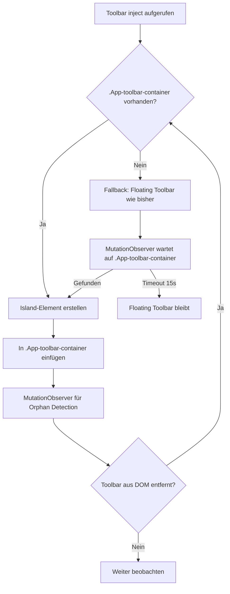

# Plan: ExcaliShare Toolbar in Excalidraw's obere Toolbar injizieren (Obsidian Plugin)

## Problem

Die aktuelle ExcaliShare Floating Toolbar im Obsidian-Plugin ist als **absolut positioniertes Overlay** implementiert (`position: absolute`, `z-index: 100`), das über dem Excalidraw-Canvas schwebt. Auf dem Desktop ist diese Platzierung nicht optimal:

- Das Icon überlappt mit dem Excalidraw-Canvas-Inhalt
- Es fühlt sich wie ein Fremdkörper an, nicht wie ein nativer Teil der Excalidraw-UI
- Die Position (konfigurierbar: top-right, top-left, bottom-right, bottom-left) kann mit Excalidraw-eigenen UI-Elementen kollidieren

## Ziel

Das ExcaliShare-Icon (collapsed state: Cloud-Icon mit Status-Dot) soll **in die obere Excalidraw-Toolbar injiziert** werden, ähnlich wie es im Frontend-Viewer bereits gemacht wird. Das expanded Panel (mit allen Actions) öffnet sich dann als Dropdown/Popover von diesem injizierten Button aus.

## Recherche-Ergebnisse

### Excalidraw DOM-Struktur in Obsidian

Aus dem Palm Guard Script (offizielle Excalidraw-Plugin-Dokumentation) kennen wir folgende DOM-Selektoren:

```
.excalidraw-wrapper
  └── .excalidraw
       ├── .App-top-bar          ← Obere Leiste (enthält Menü, Toolbar)
       │    └── .App-toolbar-container  ← Container für die Haupt-Toolbar
       │         └── .Island     ← Einzelne Toolbar-Gruppen
       ├── .App-bottom-bar       ← Untere Leiste
       ├── .sidebar-toggle       ← Sidebar-Toggle
       └── .plugins-container    ← Container für Plugin-UI
```

### Bewährte Injection-Methode (Frontend-Viewer als Referenz)

Das Frontend (`Viewer.tsx`, Zeilen 710-851) injiziert bereits erfolgreich Buttons in die Excalidraw-Toolbar:

1. **Target**: `.App-toolbar-container` (obere Toolbar, >987px)
2. **Methode**: Neues `div` mit Klasse `Island` erstellen und an `.App-toolbar-container` anhängen
3. **Timing**: `requestAnimationFrame` + `setTimeout`-Kaskade + `MutationObserver` als Fallback
4. **Cleanup**: Alle injizierten Elemente bei Dependency-Änderungen entfernen

### Excalidraw React API

- `renderTopRightUI` — React-Prop für Custom-JSX oben rechts (nur bei React-Rendering verfügbar, **nicht** für DOM-Injection von außen nutzbar)
- Keine offizielle API für Toolbar-Injection von externen Plugins
- **DOM-Injection ist der einzig gangbare Weg** für Obsidian-Plugins

### Besonderheiten im Obsidian-Kontext

- Excalidraw wird als React-App innerhalb eines Obsidian-Workspace-Leaf gerendert
- React kann den DOM-Baum jederzeit neu rendern → **Orphan Detection** nötig
- Mehrere Excalidraw-Views können gleichzeitig offen sein (Split Views)
- Die Toolbar muss pro Leaf-Instanz verwaltet werden

## Architektur-Ansatz

### Zwei-Stufen-Design: Collapsed Icon + Expanded Popover

```
┌─────────────────────────────────────────────────────────────┐
│ .App-toolbar-container                                       │
│  ┌──────────┐  ┌──────────┐  ┌──────────────────────┐       │
│  │ Excalidraw│  │ Excalidraw│  │ ExcaliShare Island   │       │
│  │ Tools     │  │ Actions   │  │ ☁️ (+ Status Dot)    │       │
│  │ Island    │  │ Island    │  │                      │       │
│  └──────────┘  └──────────┘  └──────────┬───────────┘       │
│                                          │ click             │
│                               ┌──────────▼───────────┐      │
│                               │ Expanded Panel       │      │
│                               │ (Popover/Dropdown)   │      │
│                               │ - Publish/Sync       │      │
│                               │ - Copy Link          │      │
│                               │ - Collab Actions     │      │
│                               │ - etc.               │      │
│                               └──────────────────────┘      │
└─────────────────────────────────────────────────────────────┘
```

### Fallback-Strategie

Falls `.App-toolbar-container` nicht gefunden wird (z.B. bei versteckter Toolbar, Zen-Mode, oder älterer Excalidraw-Version), fällt die Toolbar auf die **aktuelle Floating-Position** zurück.



## Implementierungsplan

### 1. Neue Injection-Logik in `toolbar.ts`

**Änderungen an `ExcaliShareToolbar.inject()`:**

- Neuer Parameter oder Auto-Detection: Versuche zuerst `.App-toolbar-container` innerhalb des `containerEl` zu finden
- Wenn gefunden: Erstelle ein `Island`-Element (wie im Frontend) mit dem Cloud-Icon + Status-Dot
- Wenn nicht gefunden: Fallback auf aktuelle `position: absolute` Floating-Methode
- MutationObserver für verzögertes Erscheinen der Toolbar

**Collapsed State (in Toolbar injiziert):**
- Kleiner Button (28x28px) im Excalidraw-Island-Stil
- Cloud-Icon + Status-Dot (wie bisher, aber kleiner)
- Hover-Effekt passend zu Excalidraw-Buttons
- Click öffnet das Expanded Panel als Popover

**Expanded State (Popover):**
- Absolut positioniert relativ zum injizierten Button
- Gleicher Inhalt wie bisher (Header, Actions, Collab-Liste, etc.)
- Click-Outside schließt das Panel
- Position: unterhalb des Buttons, rechtsbündig

### 2. Anpassungen in `styles.ts`

- Neue Styles für den injizierten Island-Button
- Popover-Positionierung relativ zum Trigger-Button
- Excalidraw-native Hover/Active-States übernehmen
- Bestehende Floating-Styles als Fallback beibehalten

### 3. Anpassungen in `main.ts`

- `injectToolbarIntoView()` muss den `.excalidraw-wrapper` oder `.excalidraw` Container finden (tut es bereits)
- Die Toolbar-Klasse entscheidet selbst, ob sie in die native Toolbar oder als Floating injiziert
- Orphan Detection muss beide Modi unterstützen

### 4. Settings-Anpassung

- `toolbarPosition` Setting könnte um eine Option `'auto'` (= in native Toolbar injizieren) erweitert werden
- Oder: `'auto'` wird der neue Default, und die 4 Positionen bleiben als Fallback/Override

## Risiken und Mitigationen

| Risiko | Mitigation |
|--------|-----------|
| Excalidraw-Plugin-Update ändert DOM-Struktur | Fallback auf Floating-Toolbar; mehrere Selektoren probieren |
| React re-rendert und entfernt injiziertes Element | Orphan Detection via MutationObserver (bereits implementiert) |
| Toolbar im Zen-Mode/versteckt | Fallback auf Floating; oder Toolbar auch verstecken |
| Popover-Positionierung bei Fenster-Resize | `getBoundingClientRect()` bei jedem Öffnen neu berechnen |
| Mehrere Split-Views | Pro-Leaf-Instanz-Verwaltung (bereits implementiert) |
| Mobile Obsidian | Auf Mobile könnte `.App-toolbar-container` fehlen → Floating Fallback |

## Betroffene Dateien

| Datei | Änderung |
|-------|----------|
| `obsidian-plugin/toolbar.ts` | Hauptänderung: Injection-Logik, Popover-Rendering |
| `obsidian-plugin/styles.ts` | Neue Styles für Island-Button und Popover |
| `obsidian-plugin/main.ts` | Minimale Anpassungen an `injectToolbarIntoView()` |
| `obsidian-plugin/settings.ts` | Optional: `'auto'` Position-Option |

## Entscheidungen

1. **Floating-Toolbar bleibt als Fallback und Alternative erhalten** — Nutzer können in den Settings zwischen `'auto'` (native Toolbar-Injection) und den 4 Floating-Positionen wählen.
2. **`toolbarPosition` wird um `'auto'` erweitert** — `'auto'` wird der neue Default. Die bestehenden Positionen (`top-right`, `top-left`, `bottom-right`, `bottom-left`) bleiben als Floating-Panel-Option erhalten.
3. **Expanded Panel erscheint als Popover** bei `'auto'`-Modus (direkt unter dem injizierten Button), und als **Floating-Panel** bei den 4 Positions-Modi (wie bisher).

## Implementierungs-Todos

### Phase 1: Settings erweitern
- [ ] `ToolbarPosition` Type um `'auto'` erweitern in `styles.ts`
- [ ] Default-Wert in `settings.ts` auf `'auto'` ändern
- [ ] Settings-Tab UI: Dropdown mit `'auto'` als erste Option + Beschreibung
- [ ] `getPositionStyles()` für `'auto'` anpassen (kein absolute positioning nötig)

### Phase 2: Toolbar-Injection-Logik
- [ ] `ExcaliShareToolbar.inject()` erweitern: bei `'auto'` versuche `.App-toolbar-container` zu finden
- [ ] Neues `Island`-Element erstellen mit Cloud-Icon + Status-Dot (28×28px, Excalidraw-native Styles)
- [ ] MutationObserver für verzögertes Erscheinen der `.App-toolbar-container`
- [ ] Fallback auf Floating-Toolbar wenn `.App-toolbar-container` nicht gefunden wird (nach Timeout)
- [ ] Orphan Detection für injiziertes Island-Element (React re-renders)

### Phase 3: Popover-Rendering
- [ ] Neuer Render-Modus: Popover statt Floating-Panel bei `'auto'`
- [ ] Popover-Positionierung: `getBoundingClientRect()` des Trigger-Buttons, Panel darunter
- [ ] Click-Outside-Handler für Popover (bereits vorhanden, anpassen)
- [ ] Popover-Styles in `styles.ts` hinzufügen (Pfeil/Schatten, max-height mit Scroll)

### Phase 4: Styles anpassen
- [ ] Island-Button-Styles (passend zu Excalidraw ToolIcon)
- [ ] Hover/Active-States für den injizierten Button
- [ ] Popover-Styles (Position, Schatten, Animation)
- [ ] Status-Dot-Styles für den kleineren Button anpassen

### Phase 5: Integration & Testing
- [ ] `main.ts`: `injectToolbarIntoView()` muss beide Modi unterstützen
- [ ] Testen: `'auto'` Modus mit verschiedenen Excalidraw-Versionen
- [ ] Testen: Fallback auf Floating wenn Toolbar nicht gefunden
- [ ] Testen: Split Views (mehrere Excalidraw-Leaves)
- [ ] Testen: Zen-Mode / versteckte Toolbar
- [ ] Testen: Settings-Wechsel zwischen `'auto'` und Floating-Positionen
